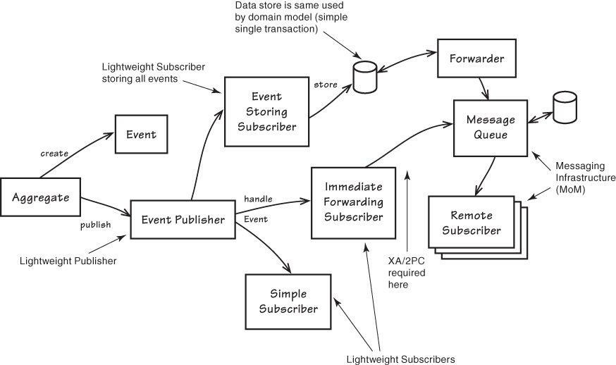

:canonical-base-url: https://dckms.github.io/system-architecture

.. index:: Domain Event

====================
Domain Events in DDD
====================

.. sectionauthor:: Ivan Zakrevsky

Существует множество спорных точек зрения среди практиков DDD по поводу реализации Domain Events.
Лучший способ понять суть вещей - это обратиться к первоисточнику, чтобы понять его мотивы и те проблемы, решение которым он стремился найти.

.. contents:: Содержание

Как сказал Bertrand Meyer,

    The zealots of an idea are often more extreme than its creators - the phase "more royalist than the King" captures that phenomenon - and you will find that foundational agile texts, such as those by Beck, Larman or Cockburn, occupy a higher plane of discourse; in particular they avoid below-the-belt hits at other approaches.

    \- "Agile!: The Good, the Hype and the Ugly" by Bertrand Meyer

Поэтому, я буду начинать всегда с первоисточников, т.е. с Eric Evans, Bertrand Meyer и др.
Но также буду делать обзор мнений их ключевых последователей - Vaughn Vernon, Jimmy Bogard, Greg Young, Udi Dahan, Kamil Grzybek, Scott Millett, Nick Tune, коллектив авторов руководств Microsoft по архитектуре и др.
К счастью, при внимательном рассмотрении, противоречий между ними практически нет.

Назначение Domain Event
=======================

    Something happened that domain experts care about.
    Model information about activity in the domain as a series of discrete events. Represent each event as a domain object.
    <...>
    A domain event is a full-fledged part of the domain model, a representation of something that happened in the domain.

    \- "Domain-Driven Design Reference" [#fndddr]_ by Eric Evans, Chapter "Domain Events"

Eventual Consistency vs Strong (Transactional) Consistency
==========================================================

Eventual Consistency - это следствие, а не причина
--------------------------------------------------

    A distinct, though related set of issues arises in distributed systems.
    The state of a distributed system cannot be kept completely consistent at all times.
    We keep the aggregates internally consistent at all times, while making other changes asynchronously.
    As changes propagate across nodes of a network, it can be difficult to resolve multiple updates arriving out of order or from distinct sources.

    \- "Domain-Driven Design Reference" [#fndddr]_ by Eric Evans, Chapter "Domain Events"

..

    It is difficult to guarantee the consistency of changes to objects in a model with complex associations.
    Objects are supposed to maintain their own internal consistent state, but they can be blindsided by changes in other objects that are conceptually constituent parts.
    Cautious database locking schemes cause multiple users to interfere pointlessly with each other and can make a system unusable.
    Similar issues arise when distributing objects among multiple servers, or designing asynchronous transactions.

    <...>

    Use the same aggregate boundaries to govern transactions and distribution.
    Within an aggregate boundary, apply consistency rules synchronously. Across boundaries, handle updates asynchronously.
    Keep an aggregate together on one server.
    Allow different aggregates to be distributed among nodes.

    \- "Domain-Driven Design Reference" [#fndddr]_ by Eric Evans, Chapter "Aggregates"

Здесь мы видим, что краеугольной причиной Eventual Consistency является распределенное хранение данных.
Это значит, что, в силу `CAP-теоремы <http://ksat.me/a-plain-english-introduction-to-cap-theorem>`__ (`перевод на Русский <https://habr.com/ru/post/130577/>`__), становится невозможно достигнуть одновременно Consistency и Availability при Partition Tolerance.
Это та самая причина, по которой концепция Агрегата лежит в основе практически любого распределенного NoSQL хранилища - агрегат просто хранится целиком на одном узле, поэтому, он всегда и доступен, и согласован одновременно.

Представьте на минутку, что узлы автомобиля хранятся на разных узлах, и они не успели прийти в согласованное состояние после обновления агрегата, в котором был заменен типоразмер шин.
Тогда у нас возникла бы вероятность получить из хранилища автомобиль с различными типоразмерами шин, что нарушило бы инвариант агрегата.

Иными словами, Eventual Consistency является не причиной, а следствием. И сохраняется агрегат одной транзакцией потому, что иное просто технически невозможно в условиях распределенности. Точнее, Агрегат является границей транзакции. И Вернон прибегает к Eventual Consistency потому что это лучше для high availability, чем Two-Phase Commit.

Таким образом, используя распределенное NoSQL хранилище или Actor Model, как правило, просто нет технической возможности сохранить более одного агрегата в одной транзакции.
Хотя, многие распределенные NoSQL хранилища и позволяют пакетировать несколько операций, транзакциями их считать нельзя.

Используя микросервисную архитектуру с RDBMS, существует техническая возможность сохранять более одного агрегата внутри `одного и того же микросервиса <https://martinfowler.com/bliki/IntegrationDatabase.html>`__ одной транзакцией.
Правда, это может ухудшить уровень параллелизма, поэтому важно стремиться достигать наименее возможных границ транзакции.
А вот синхронизация агрегатов различных сервисов может быть только асинхронной, либо же с использованием Two-Phase Commit.
То же самое справедливо и для Bounded Contexts DDD-монолита.

Стремление избежать Two-Phase Commit, в целях достижения highly scalable, подталкивает Vaughn Vernon к Eventual Consistency:

    **It can eliminate the need for two-phase commits (global transactions) and support of the rules of Aggregates (10).**
    One rule of Aggregates states that only a single instance should be modified in a single transaction, and all other dependent changes must occur in separate transactions.
    So other Aggregate instances in the local Bounded Context may be synchronized using this approach.
    We also bring remote dependencies into a consistent state with latency.
    The decoupling helps provide **a highly scalable** and peak-performing set of cooperating services.
    It also allows us to achieve loose coupling between systems.

    \-"Implementing Domain-Driven Design" [#fniddd]_ by Vaughn Vernon, Chapter "Chapter 8. Domain Events :: The When and Why of Domain Events"

Но мы видим, что, кроме проблемы достижения одновременной Согласованности и Доступности при распределенном хранении агрегатов (и устойчивости к разделению), озвучивается еще одна причина - database locking.
Означает ли проблема database locking то, что коммититься должен только один агрегат в одной транзакции при использовании RDBMS (Relational Database Management System)?
Это означает только то, что транзакция должна быть fine-grained.
"Fine-grained system transaction" != "one aggregate per transaction".

    This rationale is based on embracing **fine-grained transactions instead of transactions spanning many aggregates** or entities.
    The idea is that in the second case, the number of database locks will be substantial in large-scale applications with high scalability needs.
    Embracing the fact that **highly scalable** applications need not have instant transactional consistency between multiple aggregates helps with accepting the concept of eventual consistency.
    Atomic changes are often not needed by the business, and it is in any case the responsibility of the domain experts to say whether particular operations need atomic transactions or not.
    If an operation always needs an atomic transaction between multiple aggregates, you might ask whether your aggregate should be larger or was not correctly designed.

    \- ".NET Microservices: Architecture for Containerized .NET Applications" [#fnnetms]_ by Cesar de la Torre, Bill Wagner, Mike Rousos, Chapter "`Domain events: design and implementation :: Single transaction across aggregates versus eventual consistency across aggregates <https://docs.microsoft.com/en-us/dotnet/architecture/microservices/microservice-ddd-cqrs-patterns/domain-events-design-implementation#single-transaction-across-aggregates-versus-eventual-consistency-across-aggregates>`__"

О проблемах ухудшения параллелизма говорит и Vaughn Vernon, причем, причиной проблемы может стать даже один-единственный крупный агрегат.
Как видно, дело не столько в количестве агрегатов, сколько в размере границ транзакции.

    Smaller Aggregates not only perform and scale better, they are also biased toward transactional success, meaning that conflicts preventing a commit are rare.

    \- "Implementing Domain-Driven Design" [#fniddd]_ by Vaughn Vernon, Chapter "Chapter 10 Aggregates :: Rule: Design Small Aggregates"

Сам Eric Evans в своем известном выражении, которое многие приводят как первопричину Eventual Consistency, вовсе не требует одну транзакцию на агрегат, а говорит лишь о том, что после коммита инвариант каждого из агрегатов должен соблюдаться:

    Invariants, which are consistency rules that must be maintained whenever data changes, will involve relationships between members of the AGGREGATE.
    Any rule that **spans AGGREGATES** will **not be expected** to be up-to-date at all times.
    Through event processing, batch processing, or other update mechanisms, other dependencies can be resolved within some specified time.
    **But the invariants applied within an AGGREGATE will be enforced with the completion of each transaction.**

    \- "Domain-Driven Design: Tackling Complexity in the Heart of Software" [#fnddd]_ by Eric Evans, Chapter "Six. The Life Cycle of a Domain Object :: Aggregates"

..

    Leave transaction control to the client. Although the REPOSITORY will insert into and delete from the database, it will ordinarily not commit anything.
    It is tempting to commit after saving, for example, but the client presumably has the context to correctly initiate and commit units of work.
    Transaction management will be simpler if the REPOSITORY keeps its hands off.

    \- "Domain-Driven Design: Tackling Complexity in the Heart of Software" [#fnddd]_ by Eric Evans, Chapter "Six. The Life Cycle of a Domain Object :: Repositories"

А здесь он говорит о корне агрегата во множественном числе:

    Schemes have been developed for defining ownership relationships in the model. The following simple but rigorous system, distilled from those concepts, includes a set of rules for implementing transactions that modify the objects and their owners.

    \- "Domain-Driven Design: Tackling Complexity in the Heart of Software" [#fnddd]_ by Eric Evans, Chapter "Six. The Life Cycle of a Domain Object :: Aggregates"

Такую же причину озвучивает и Vaughn Vernon:

    **Transactions across distributed systems are not atomic.**
    **The various systems bring multiple Aggregates into a consistent state eventually.**

    \- "Implementing Domain-Driven Design" [#fniddd]_ by Vaughn Vernon, Chapter "10 Aggregates :: Rule: Reference Other Aggregates by Identity :: Scalability and Distribution"

..

    Accepting that **all Aggregate instances in a large-scale, high-traffic enterprise are never completely consistent** helps us accept that eventual consistency also makes sense in the smaller scale where just a few instances are involved.

    \- "Implementing Domain-Driven Design" [#fniddd]_ by Vaughn Vernon, Chapter "10 Aggregates :: Rule: Use Eventual Consistency Outside the Boundary"

Кстати, автором идеи агрегата является даже не Eric Evans, а David Siegel.

    Schemes have been developed for defining ownership relationships in the model.
    The following simple but rigorous system, distilled from those concepts, includes a set of rules for implementing transactions that modify the objects and their owners. [1]
    (**David Siegel devised and used this system on projects in the 1990s but has not published it.**)

    First we need an abstraction for encapsulating references within the model.
    An AGGREGATE is a cluster of associated objects that we treat as a unit for the purpose of data changes.
    Each AGGREGATE has a root and a boundary.
    The boundary defines what is inside the AGGREGATE.
    The root is a single, specific ENTITY contained in the AGGREGATE.
    The root is the only member of the AGGREGATE that outside objects are allowed to hold references to, although objects within the boundary may hold references to each other.
    ENTITIES other than the root have local identity, but that identity needs to be distinguishable only within the AGGREGATE, because no outside object can ever see it out of the context of the root ENTITY.

    \- "Domain-Driven Design: Tackling Complexity in the Heart of Software" [#fnddd]_ by Eric Evans, Chapter "Six. The Life Cycle of a Domain Object :: Aggregates"

Оригинальная работа David Siegel к сожалению, не опубликована (по крайней мере, мне ее отыскать не удалось).
Но он упоминается также в PoEAA, где определение агрегата звучит так:

    Eric Evans and David Siegel [Evans] define an **aggregate as a cluster of associated objects that we treat as a unit for data changes**.
    Each aggregate has a root that provides the only access point to members of the set and a boundary that defines what's included in the set.
    The aggregate's characteristics call for a Coarse-Grained Lock, since working with any of its members requires locking all of them. Locking an aggregate yields an alternative to a shared lock that I call a root lock (see Figure 16.4).
    By definition locking the root locks all members of the aggregate. The root lock gives us a single point of contention.

    \- "Patterns of Enterprise Application Architecture" [#fnpoeaa]_ by Martin Fowler, David Rice, Matthew Foemmel, Edward Hieatt, Robert Mee, Randy Stafford, Chapter "16. Offline Concurrency Patterns :: Coarse-Grained Lock"

Здесь говорится про единицу изменения, про бизнес-транзакцию и блокировку, но о связи бизнес-транзакции с системной транзакцией говорится только то, что "the system transaction in which you commit the business transaction", т.е. границы системной транзакции включают в себя границы бизнес-транзакции, но не ограничиваются ими.

Eventual Consistency предпочтительней
-------------------------------------

С одной стороны, Vaughn Vernon настоятельно рекомендует использовать Eventual Consistency между Агрегатами.
И тут же объясняет - агрегаты в высоконагруженных масштабируемых распределенных приложениях, устойчивых к разделению, никогда не бывают доступны и согласованы между собой одновременно.

    Thus, if executing a command on one Aggregate instance requires that additional business rules execute on one or more other Aggregates, **use eventual consistency**.
    Accepting that all **Aggregate instances in a large-scale, high-traffic enterprise are never completely consistent** helps us accept that eventual consistency also makes sense in the smaller scale where just a few instances are involved.

    \- "Implementing Domain-Driven Design" [#fniddd]_ by Vaughn Vernon, Chapter "10 Aggregates :: Rule: Use Eventual Consistency Outside the Boundary"

..

    An invariant is a business rule that must always be consistent.
    There are different kinds of consistency. One is transactional consistency, which is considered immediate and atomic.
    There is also eventual consistency. When discussing invariants, we are referring to transactional consistency.

    <...>

    The consistency boundary logically asserts that everything inside adheres to a specific set of business invariant rules no matter what operations are performed.
    The consistency of everything outside this boundary is irrelevant to the Aggregate.
    Thus, Aggregate is synonymous with transactional consistency boundary.

    <...>

    When employing a typical persistence mechanism, we use a single `transaction <https://martinfowler.com/eaaCatalog/unitOfWork.html>`__ to manage consistency.
    When the transaction commits, everything inside one boundary must be consistent.
    A properly designed Aggregate is one that can be modified in any way required by the business with its invariants completely consistent within a single transaction.
    And a properly designed Bounded Context modifies only one Aggregate instance per transaction in all cases.
    What is more, we cannot correctly reason on Aggregate design without applying transactional analysis.
    Limiting modification to one Aggregate instance per transaction may sound overly strict.
    However, it is a rule of thumb and should be the goal in most cases.
    It addresses the very reason to use Aggregates.

    \- "Implementing Domain-Driven Design" [#fniddd]_ by Vaughn Vernon, Chapter "10 Aggregates :: Rule: Model True Invariants in Consistency Boundaries"

Все решают бизнес-правила
-------------------------

С другой стороны, все решают бизнес-правила:

    The main point to remember from this section is that business rules are the drivers for determining what must be whole, complete, and consistent at the end of a single transaction.

    \-  "Domain-Driven Design Distilled" [#fndddd]_ by Vaughn Vernon, Chapter "5. Tactical Design with Aggregates :: Why Used"

Принцип "Ask Whose Job It Is"
-----------------------------

Тем не менее, Vaughn Vernon не считает вопрос Strong (Transactional) Consistency vs Eventual Consistency однозначным, и приводит четыре причины, по которым выбор может отдаваться в пользу Strong (Transactional) Consistency.
Цитировать все не буду - слишком много текста.
Кому интересно - глава "Chapter 10 Aggregates :: Rule: Use Eventual Consistency Outside the Boundary :: Ask Whose Job It Is" и далее, вплоть до главы "Gaining Insight through Discovery".
Приведу только отрывок:

    Ask Whose Job It Is

    Some domain scenarios can make it very challenging to determine whether transactional or eventual consistency should be used.
    Those who use DDD in a classic/traditional way may lean toward transactional consistency.
    Those who use CQRS may tend toward eventual consistency.
    But which is correct?
    **Frankly, neither of those tendencies provides a domain-specific answer, only a technical preference. Is there a better way to break the tie?**

    Discussing this with Eric Evans revealed a very simple and sound guideline.
    When examining the use case (or story), ask whether it's the job of the user executing the use case to make the data consistent.
    **If it is, try to make it transactionally consistent, but only by adhering to the other rules of Aggregates.**
    If it is another user's job, or the job of the system, allow it to be eventually consistent.
    That bit of wisdom not only provides a convenient tie breaker, but it helps us gain a deeper understanding of our domain.
    It exposes the real system invariants: the ones that must be kept transactionally consistent.
    That understanding is much more valuable than defaulting to a technical leaning.

    \- "Implementing Domain-Driven Design" [#fniddd]_ by Vaughn Vernon, Chapter "10 Aggregates :: Rule: Use Eventual Consistency Outside the Boundary :: Ask Whose Job It Is"

В цитате Вона Вернона видно, что Эрик Эванс не спешит разделять стремление к одному агрегату на транзакцию, и предлагает рассматривать каждый случай отдельно.

Можно заметить, что принцип "When examining the use case (or story), ask whether it's the job of the user executing the use case to make the data consistent. **If it is, try to make it transactionally consistent, but only by adhering to the other rules of Aggregates.**" не противоречит приведенному ниже принципу "developers and architects like Jimmy Bogard are okay with spanning a single transaction across several aggregates - but only **when those additional aggregates are related to side effects for the same original command**."

Здесь же Vaughn Vernon напоминает нам, что во главе угла стоит, опять же, масштабирование и распределенность:

    We'll have **consistency** where necessary [имеется ввиду CAP-theorem], and support for optimally performing and **highly scalable systems**.

    \- "Implementing Domain-Driven Design" [#fniddd]_ by Vaughn Vernon, Chapter "10 Aggregates :: Reasons to Break the Rules :: Adhering to the Rules"

Далее, в главе "Chapter 10 Aggregates :: Gaining Insight through Discovery :: Is It the Team Member's Job?" книги, он демонстрирует применение принципа "Ask Whose Job It Is" на практике.

Strong Consistency - новичкам
-----------------------------

Вот что советует новичкам Vaughn Vernon:

    There is nothing incredibly difficult about using eventual consistency.
    Still, until you can gain some experience, you may be concerned about using it.
    If so, you should still partition your model into Aggregates according to business-defined transactional boundaries.
    **However, there is nothing preventing you from committing modifications to two or more Aggregates in a single atomic database transaction.**
    You might choose to use this approach in cases that you know will succeed but use eventual consistency for all others.
    **This will allow you to get used to the techniques without taking too big an initial step.**
    **Just understand that this is not the primary way that Aggregates are meant to be used, and you may experience transactional failures as a result.**

    \- "Domain-Driven Design Distilled" [#fndddd]_ by Vaughn Vernon, Chapter "5. Tactical Design with Aggregates :: Rule 4: Update Other Aggregates Using Eventual Consistency"

Интересы performance
--------------------

Ранее упоминалось, что одной из ключевых причин fine-grained транзакций является performance.
Но всегда ли?
На самом деле, все зависит от конкретных условий.
Забегая наперед, рассмотрим такое утверждение:

    NOTE: Try not to confuse this guideline with loading or creating aggregates.
    It is perfectly fine to load multiple aggregates inside the same transaction as long as you save only one of them.
    **Equally, it is permissible to create multiple aggregates inside a single transaction because adding new aggregates should not cause concurrency issues.**

    \- "Patterns, Principles, and Practices of Domain-Driven Design" [#fnpppddd]_ by Scott Millett, Nick Tune, Chapter "19 Aggregates :: Special Cases"

Какое значение имеет это утверждение для performance?
Я обращусь к статьям двух известных организаций в области highload:

    This consistent insert throughput also persists when writing large batches of rows in single operations to TimescaleDB (instead of row-by-row).
    Such batched inserts are common practice for databases employed in more high-scale production environments, e.g., when ingesting data from a distributed queue like Kafka.
    **In such scenarios, a single Timescale server can ingest 130K rows (or 1.3M metrics) per second, approximately 15x that of vanilla PostgreSQL once the table has reached a couple 100M rows.**

    \- "`Time-series data: Why (and how) to use a relational database instead of NoSQL <https://blog.timescale.com/blog/time-series-data-why-and-how-to-use-a-relational-database-instead-of-nosql-d0cd6975e87c/>`__" by Mike Freedman, Timescale CTO and co-founder. Professor of Computer Science at Princeton.

..

    7. Insert rows in batches.

    In order to achieve higher ingest rates, you should insert your data with many rows in each INSERT call (or else use some bulk insert command, like COPY or our parallel copy tool).

    Don't insert your data row-by-row – instead try at least hundreds (or thousands) of rows per INSERT.
    This allows the database to spend less time on connection management, transaction overhead, SQL parsing, etc., and more time on data processing.

    \- "`13 tips to improve PostgreSQL Insert performance <https://blog.timescale.com/blog/13-tips-to-improve-postgresql-insert-performance/>`__" by Mike Freedman, Timescale CTO and co-founder. Professor of Computer Science at Princeton.

..

    It is of note here that each insert is a transaction.
    What this means is Postgres is doing some extra coordination to make sure the transaction is completed before returning.
    On every single write this takes some overhead.
    Instead of single row transactions, if we wrap all of our inserts in a transaction like below, we'll see some nice performance gains::

        begin;
        insert 1;
        insert 2;
        insert 3;
        ...
        commit;

    This took my inserts down from 15 minutes 30 seconds to 5 minutes and 4 seconds.
    We've suddenly boosted our throughput by 3x to about 3k inserts per second.

    <...>

    By batching our inserts into a single transaction, we saw our throughput go higher.
    But hold on, there is even more we can do. The ``\copy`` mechanism gives a way to bulk load data in an even more performant manner.

    <...>

    Running this \copy completes in 82 seconds! We're now processing over 10k writes per second on some fairly modest hardware.

    \- "`Faster bulk loading in Postgres with copy <https://www.citusdata.com/blog/2017/11/08/faster-bulk-loading-in-postgresql-with-copy/>`__" by Craig Kerstiens, CitusData

Вот что говорит по этому вопросу документация по PostgreSQL:

    When using multiple INSERTs, turn off autocommit and just do one commit at the end.
    (In plain SQL, this means issuing BEGIN at the start and COMMIT at the end. Some client libraries might do this behind your back, in which case you need to make sure the library does it when you want it done.)
    **If you allow each insertion to be committed separately, PostgreSQL is doing a lot of work for each row that is added.**

    \- "`PostgreSQL 11 Documentation :: 14.4. Populating a Database :: 14.4.1. Disable Autocommit <https://www.postgresql.org/docs/11/populate.html#DISABLE-AUTOCOMMIT>`__"

Целесообразность использования Eventual Consistency в интересах performance нужно рассматривать в каждом конкретном случае отдельно.
Универсального рецепта не существует.
Этот вопрос особенно актуален при разработке сертифицированных приложений, где свобода выбора базы данных ограничена списком сертифицированных решений (зачастую вся свобода выбора сводится к RDBMS PostgresPro).
Организовать пакетирование запросов можно на уровне `Unit of Work <https://martinfowler.com/eaaCatalog/unitOfWork.html>`__.

В контексте этого вопроса можно еще раз вспомнить утверждение Eric Evans:

    Discussing this with Eric Evans revealed a very simple and sound guideline.
    When examining the use case (or story), ask whether it's the job of the user executing the use case to make the data consistent.
    **If it is, try to make it transactionally consistent, but only by adhering to the other rules of Aggregates.**

    \- "Implementing Domain-Driven Design" [#fniddd]_ by Vaughn Vernon, Chapter "10 Aggregates :: Rule: Use Eventual Consistency Outside the Boundary :: Ask Whose Job It Is"

Обратная совместимость формата объектов событий
-----------------------------------------------

Другим достоинством Strong Consistency является отсутствие потребности в обеспечении обратной совместимости формата объектов событий, ведь их время жизни ограничено одной транзакцией.
При использовании же шины сообщений всегда сохраняется вероятность того, что обновленная версия программного обеспечения, после ее развертывания, получит из шины устаревший формат сообщения, отправленный в шину еще предыдущей версией программного обеспечения.
Кроме того, возникает потребность поддерживать оба формата сообщений для организации `blue-green deployment <https://thenewstack.io/deployment-strategies/>`__.

Подробнее о версионировании сообщений смотрите в книге "`Versioning in an Event Sourced System <https://leanpub.com/esversioning>`__" by Greg Young ("`читать online <https://leanpub.com/esversioning/read>`__", "`конспект книги <https://github.com/luque/Notes--Versioning-Event-Sourced-System>`__"), а так же в главе "`Event versioning <https://docs.microsoft.com/en-us/previous-versions/msp-n-p/jj591577(v=pandp.10)#event-versioning>`__ книги "CQRS Journey".

Рекомендации от ".NET Microservices"
------------------------------------

".NET Microservices: Architecture for Containerized .NET Applications" [#fnnetms]_ явно разделяет внутренние Domain Events (для подписчиков внутри Bounded Context) и внешние Integration Events.
Внутренние Domain Events рекомендуется использовать для синхронизации Агрегатов внутри Bounded Context.

    Domain events as a preferred way to trigger side effects across multiple aggregates within the same domain

    If executing a command related to one aggregate instance requires additional domain rules to be run on one or more additional aggregates, you should design and implement those side effects to be triggered by domain events.
    As shown in Figure 7-14, and as one of the most important use cases, a domain event should be used to propagate state changes across multiple aggregates within the same domain model.

    \- ".NET Microservices: Architecture for Containerized .NET Applications" [#fnnetms]_ by Cesar de la Torre, Bill Wagner, Mike Rousos, Chapter "`Domain events: design and implementation :: Domain events as a preferred way to trigger side effects across multiple aggregates within the same domain <https://docs.microsoft.com/en-us/dotnet/architecture/microservices/microservice-ddd-cqrs-patterns/domain-events-design-implementation#domain-events-as-a-preferred-way-to-trigger-side-effects-across-multiple-aggregates-within-the-same-domain>`__"

Причем, Strong Consistency является приемлемым для внутренних Domain Events, синхронизирующих Агрегаты внутри Bounded Context:

    Be aware that transactional boundaries come into significant play here.
    **If your unit of work and transaction can span more than one aggregate (as when using EF Core and a relational database), this can work well.**
    But if the transaction cannot span aggregates, such as when you are using a NoSQL database like Azure CosmosDB, you have to implement additional steps to achieve consistency.

    \- ".NET Microservices: Architecture for Containerized .NET Applications" [#fnnetms]_ by Cesar de la Torre, Bill Wagner, Mike Rousos, Chapter "`Domain events: design and implementation :: Implement domain events :: The deferred approach to raise and dispatch events <https://docs.microsoft.com/en-us/dotnet/architecture/microservices/microservice-ddd-cqrs-patterns/domain-events-design-implementation#the-deferred-approach-to-raise-and-dispatch-events>`__"

Оба подхода, и Strong Consistency, и Eventual Consistency, являются приемлемыми для синхронизации Агрегатов внутри Bounded Context:

    **Actually, both approaches (single atomic transaction and eventual consistency) can be right.**
    It really depends on your domain or business requirements and what the domain experts tell you.
    It also depends on how scalable you need the service to be (more granular transactions have less impact with regard to database locks).
    And it depends on how much investment you are willing to make in your code, since eventual consistency requires more complex code in order to detect possible inconsistencies across aggregates and the need to implement compensatory actions.
    Consider that if you commit changes to the original aggregate and afterwards, when the events are being dispatched, if there is an issue and the event handlers cannot commit their side effects, you will have inconsistencies between aggregates.

    A way to allow compensatory actions would be to store the domain events in additional database tables so they can be part of the original transaction.
    Afterwards, you could have a batch process that detects inconsistencies and runs compensatory actions by comparing the list of events with the current state of the aggregates.
    The compensatory actions are part of a complex topic that will require deep analysis from your side, which includes discussing it with the business user and domain experts.

    In any case, you can choose the approach you need.
    But the initial deferred approach—raising the events before committing, so you use a single transaction—is the simplest approach when using EF Core and a relational database.
    It is easier to implement and valid in many business cases.
    It is also the approach used in the ordering microservice in eShopOnContainers.

    \- ".NET Microservices: Architecture for Containerized .NET Applications" [#fnnetms]_ by Cesar de la Torre, Bill Wagner, Mike Rousos, Chapter "`Domain events: design and implementation :: Implement domain events :: Single transaction across aggregates versus eventual consistency across aggregates <https://docs.microsoft.com/en-us/dotnet/architecture/microservices/microservice-ddd-cqrs-patterns/domain-events-design-implementation#single-transaction-across-aggregates-versus-eventual-consistency-across-aggregates>`__"

Мнение Scott Millett и Nick Tune
--------------------------------

    **Sometimes it is actually good practice to modify multiple aggregates within a transaction.**
    But it's important to understand why the guidelines exist in the first place so that you can be aware of the consequences of ignoring them.

    **When the cost of eventual consistency is too high, it's acceptable to consider modifying two objects in the same transaction.**
    Exceptional circumstances will usually be when the business tells you that the customer experience will be too unsatisfactory.
    You shouldn't just accept the business's decision, though; it never wants to accept eventual consistency.
    You should elaborate on the scalability, performance, and other costs involved when not using eventual consistency so that the business can make an informed, customer‐focused decision.

    **Another time it's acceptable to avoid eventual consistency is when the complexity is too great.**
    You will see later in this chapter that robust eventually consistent implementations often utilize asynchronous, out‐of‐process workflows that add more complexity and dependencies.

    **To summarize, saving one aggregate per transaction is the default approach.**
    But you should collaborate with the business, assess the technical complexity of each use case, and consciously ignore the guideline if there is a worthwhile advantage, such as a better user experience.

    NOTE: Try not to confuse this guideline with loading or creating aggregates.
    It is perfectly fine to load multiple aggregates inside the same transaction as long as you save only one of them.
    **Equally, it is permissible to create multiple aggregates inside a single transaction because adding new aggregates should not cause concurrency issues.**

    <...>

    **You should try to align your aggregate boundaries with transactions, because the higher the number of aggregates being modified in a single transaction, the greater the chance of a concurrency failure.**
    Therefore, strive to modify a single aggregate per use case to keep the system performant.

    <...>

    If you find that you are modifying more than one aggregate in a transaction, it may be a sign that your aggregate boundaries can be better aligned with the problem domain.

    <...>

    In a typical business use case there are often multiple actions that need to succeed or fail together inside a transaction.
    By managing transactions in application services, you have full control over which operations that you request of the domain will live inside the same transaction boundary.

    This can be demonstrated using an updated RecommendAFriendService.
    Imagine the business has decided that if the referral policy cannot be applied, it should not create the new account.
    Therefore, the transactional boundary encapsulates creating the new account and applying the referral policy to both accounts, as shown in Figure 25-3.

    \- "Patterns, Principles, and Practices of Domain-Driven Design" [#fnpppddd]_ by Scott Millett, Nick Tune, Chapter "19 Aggregates :: Special Cases"

Мнение Jimmy Bogard
-------------------

Вот что говорит ".NET Microservices: Architecture for Containerized .NET Applications" со ссылкой на Jimmy Bogard:

    However, other developers and architects like Jimmy Bogard are **okay with spanning a single transaction across several aggregates - but only when those additional aggregates are related to side effects for the same original command**.
    For instance, in `A better domain events pattern <https://lostechies.com/jimmybogard/2014/05/13/a-better-domain-events-pattern/>`__, Bogard says this:

        Typically, I want the side effects of a domain event to occur within the same logical transaction, but not necessarily in the same scope of raising the domain event [...] Just before we commit our transaction, we dispatch our events to their respective handlers.

    \- ".NET Microservices: Architecture for Containerized .NET Applications" [#fnnetms]_ by Cesar de la Torre, Bill Wagner, Mike Rousos, Chapter "`Domain events: design and implementation :: Single transaction across aggregates versus eventual consistency across aggregates <https://docs.microsoft.com/en-us/dotnet/architecture/microservices/microservice-ddd-cqrs-patterns/domain-events-design-implementation#single-transaction-across-aggregates-versus-eventual-consistency-across-aggregates>`__"

Сам Jimmy Bogard говорит следующее:

    Domain events are similar to messaging-style eventing, with one key difference.
    With true messaging and a service bus, a message is fired and handled to asynchronously.
    With domain events, the response is synchronous

    \- "Strengthening your domain: Domain Events" [#fnjbde1]_ by Jimmy Bogard

..

    Transactions are handled in our unit of work wrapping each HTTP request.
    Since our domain events are synchronous and on the same thread, they are part of the same transaction as the entity that first raised the event.

    \- "`Strengthening your domain: Domain Events <https://lostechies.com/jimmybogard/2010/04/08/strengthening-your-domain-domain-events/#comment-173067283>`__", comment of Jimmy Bogard

..

    With our domain event in place, we can ensure that our entire **domain model stays consistent with the business rules applied, even when we need to notify other aggregate roots** in our system when something happens.
    We've also locked down all the ways the risk status could change (charged a new fee), so **we can keep our Customer aggregate consistent even in the face of changes in a separate aggregate (Fee)**.

    This pattern isn't always applicable.
    If I need to do something like send an email, notify a web service or any other potentially blocking tasks, I should revert back to normal asynchronous messaging.
    But for synchronous messaging across disconnected aggregates, **domain events are a great way to ensure aggregate root consistency across the entire model**.
    The alternative would be transaction script design, where consistency is enforced not by the domain model but by some other (non-intuitive) layer.

    \- "Strengthening your domain: Domain Events" [#fnjbde1]_ by Jimmy Bogard

..

    Typically, I want the side effects of a domain event to occur within the same logical transaction, but not necessarily in the same scope of raising the domain event. If I cared enough to have the side effects occur, I would instead just couple myself directly to that other service as an argument to my domain's method.

    Instead of dispatching to a domain event handler immediately, what if instead we recorded our domain events, and before committing our transaction, dispatch those domain events at that point? This will have a number of benefits, besides us not tearing our hair out. Instead of raising domain events, let's define a container for events on our domain object:

    <...>

    Just before we commit our transaction, we dispatch our events to their respective handlers.

    \- "A better domain events pattern" [#fnjbde2]_ by Jimmy Bogard

Мнение Kamil Grzybek
--------------------

Вот что говорит Kamil Grzybek:

    The way of handling of domain events depends indirectly on publishing method.
    If you use DomainEvents static class, you have to handle event immediately.
    In other two cases you control when events are published as well handlers execution – in or outside existing transaction.

    In my opinion **it is good approach to always handle domain events in existing transaction** and treat aggregate method execution and handlers processing as atomic operation.
    This is good because if you have a lot of events and handlers you do not have to think about initializing connections, transactions and what should be treat in "all-or-nothing" way and what not.

    \- "How to publish and handle Domain Events" [#fnkgde1]_ by Kamil Grzybek

..

    Thanks for question Andreas!

    I know both books of Vaughn Vernon - they are great and must read for every DDD practitioner. From the DDD Distlled book (chapter 5 about aggregates):

        **...business rules are the drivers for determining what must be whole, complete, and consistent at the end of a single transaction.**

    So in general this is good rule to have separate transactions, but sometimes it is impossible or very hard to achieve.

    My approach is similar to Vaughn Vernon - I try always handle event in separate transaction if it is possible.
    To do that I have two types of events: **Domain Events (private, handled in the same transaction)** and **Domain Events Notifications (handled outside transaction)**.
    Domain Event Notification often becomes an Integration Event which is send to Events Bus to other Bounded Context.
    This way I support all cases - immediate consistency, eventual consistency and integrations scenarios.

    \- "`How to publish and handle Domain Events <http://www.kamilgrzybek.com/design/how-to-publish-and-handle-domain-events/#comment-4602236620>`__" [#fnkgde1]_, comment of Kamil Grzybek

..

    Aggregates can publish multiple Domain Events, and for each Domain Event there can be many handlers responsible for different behavior.
    This behavior can be communication with an external system or **executing a Command on another Aggregate**, which will again publish its events to which another part of our system will subscribe.

    \- "`Handling Domain Events: Missing Part <http://www.kamilgrzybek.com/design/handling-domain-events-missing-part/>`__" [#fnkgde2]_ by Kamil Grzybek

..

    Let's assume that in this particular case **both Order placement and Payment creation should take place in the same transaction**.
    If transaction is successful, we need to send 2 emails – about the Order and Payment.

    <...>

    1. **Command Handler defines transaction boundary. Transaction is started when Command Handler is invoked and committed at the end.**
    2. **Each Domain Event handler is invoked in context of the same transaction boundary.**
    3. If we want to process something outside the transaction, we need to create a **public event** based on the Domain Event. I call it Domain Event Notification, `some people call it a public event <http://verraes.net/2019/05/patterns-for-decoupling-distsys-explicit-public-events/>`__, but the concept is the same.

    The second most important thing is when to publish and process Domain Events? Events may be created after each action on the Aggregate, so we must publish them:

    - after each Command handling (but BEFORE committing transaction)
    - after each Domain Event handling (but WITHOUT committing transaction)

    <...>

    The second thing we have to do is to save notifications about Domain Events that we want to process outside of the transaction.

    \- "`Handling Domain Events: Missing Part <http://www.kamilgrzybek.com/design/handling-domain-events-missing-part/>`__" [#fnkgde2]_ by Kamil Grzybek

Обратите внимание, что, по приведенной им ссылке, под термином "public event" понимается сообщение, выходящее за пределы Bounded Context (к этому вопросу мы еще вернемся):

    Set up separate messaging channels for inside the Bounded Context and outside. Keep all events private by default, and indicate the ones you want to make public with an explicit @Public annotation, a marker interface, or an isPublic():bool method. When emitting events, the event publishing mechanism knows to read the annotation and either send the event on the private channel only, or on both the private and the public channel.

    -- "`Patterns for Decoupling in Distributed Systems: Explicit Public Events <https://verraes.net/2019/05/patterns-for-decoupling-distsys-explicit-public-events/>`__" by Mathias Verraes

И, в своем демонстрационном приложении sample-dotnet-core-cqrs-api, `он демонстрирует обработку Domain Event в одной транзакции с агрегатом <https://github.com/kgrzybek/sample-dotnet-core-cqrs-api/blob/01a1d6517bc88773f004abc0cb9c6d79f537e575/src/SampleProject.Application/Orders/PlaceCustomerOrder/OrderPlacedDomainEventHandler.cs#L22>`__.

Мнение Udi Dahan
----------------

    > This might be a bit of a late question. But shouldn't domain events be handled after the transaction ends?
    Is there any specific reason for handle domain events within the same transaction scoping DoSomething?

    Domain events get handled by service layer objects in the same process which usually send out other messages – as such, we want those messages to be sent (or not) in the same transactional context.

    \- "`Domain Events – Salvation <http://udidahan.com/2009/06/14/domain-events-salvation/#comment-4723>`__" [#fnudde3]_ comment of Udi Dahan

..

    > In message number 120 above, Lars asks about how to access the data if the event is fired before the commit.
    I didn't understand your response.
    Maybe my situation is different so I'll explain.

    > I have 2 BCs.
    One context deals with the merging of employee information.
    I'd like to fire a domain event specifying that the employee was merged.
    I'd like the 2nd BC to react to this event.
    The issue is that the data won't be committed at that point, and this data that changed is vital to the 2nd BC to react.

    > Am I going down the wrong path by attempting to use domain events? Is there another solution you could suggest?

    The question is whether you need both your BCs to be consistent with each other at \*all\* times – ergo in the same transaction.

    **If the answer is yes, then you absolutely do want the event to be raised and handled in the same transaction – you'd also be deploying both BCs together.**

    If the answer is no, then you should use some kind of message bus between the BCs.
    The handler for the domain event would publish a message using the bus, and that would be enlisted in the same transaction – thus is the first BC rolled back, the message wouldn't be sent.
    The second BC would be invoked by the bus when the message arrives at its queue where its handling would then be done in a separate transaction.

    \- "`Domain Events – Salvation <http://udidahan.com/2009/06/14/domain-events-salvation/#comment-4730>`__" [#fnudde3]_ comment of Udi Dahan

..

    > Shouldn't the event only be handled when the transaction commits?
    Until the transaction commits, the change to the domain object isn't really permanent, right?

    Not necessarily – sometimes you want loose-coupling within the same transaction.

    I do agree that often where we find a place ready for logical decoupling it coincides with separate transaction boundaries.
    In those cases, using a transactionally-aware technology like NServiceBus will be a better choice for publishing events.

    \- "`Domain Events – Salvation <http://udidahan.com/2009/06/14/domain-events-salvation/#comment-4773>`__" [#fnudde3]_ comment of Udi Dahan

..

    > Domain event could alter multiple aggregates which is common, wouldn't you be updating multiple aggregates in a single transaction?

    **The more common case is where those multiple aggregates are updated in separate transactions**, usually as a result of some kind of "service bus" event being transmitted from the domain events.
    That service bus event gets routed to multiple subscribers, behind which you'd have each of the respective aggregates that would updated in their own transactions.

    \- "`Domain Events – Salvation <http://udidahan.com/2009/06/14/domain-events-salvation/#comment-74959>`__" [#fnudde3]_ comment of Udi Dahan

Мнение Cesar De la Torre
------------------------

    When handling the event, any event handler subscribed to the event could run additional domain operations by using other AggregateRoot objects, but again, you still need to be within the same transaction scope.

    <..>

    for in-memory event based communication across disconnected aggregates that are part of the same domain model and part of the same transaction, domain events are great ensuring consistency across a single domain model within the same microservice or Bounded-Context.

    \- "Domain Events vs. Integration Events in Domain-Driven Design and microservices architectures" [#fncdltdevie]_ by Cesar De la Torre, Principal Program Manager, .NET

Ссылки по теме:

- "`Eventually Consistent - Revisited <https://www.allthingsdistributed.com/2008/12/eventually_consistent.html>`__" by Werner Vogels, CTO - Amazon.com
- "`Eventually Consistent <https://www.allthingsdistributed.com/2007/12/eventually_consistent.html>`__" by Werner Vogels, CTO - Amazon.com

In-process vs out-of-process
============================

Обычно считается, что in-process - это синхронное исполнение, а out-of-process - асинхронное.
Хотя, сугубо технически, асинхронное исполнение может быть как in-process, так и out-of-process.
К тому же асинхронное исполнение нужно подразделять на использующее event-loop (async/await) и использующее внешнюю инфраструктуру (external event bus).

В большинстве случаев, in-process подразумевает "в той же транзакции", т.е. Strong Consistency.

    The reference app uses MediatR to propagate domain events synchronously across aggregates, within a single transaction.
    However, you could also use some AMQP implementation like RabbitMQ or Azure Service Bus to propagate domain events asynchronously, using eventual consistency but, as mentioned above, you have to consider the need for compensatory actions in case of failures.

    \- ".NET Microservices: Architecture for Containerized .NET Applications" [#fnnetms]_ by Cesar de la Torre, Bill Wagner, Mike Rousos, Chapter "`Domain events: design and implementation :: Conclusions on domain events <https://docs.microsoft.com/en-us/dotnet/architecture/microservices/microservice-ddd-cqrs-patterns/domain-events-design-implementation#conclusions-on-domain-events>`__"

Internal vs External
======================

Существует ряд методик (Anti-Corruption Layer, CQRS etc.), направленных на то, чтобы защитить изменения внутренних интерфейсов от изменения внешних и наоборот.
Это логично, так как они будут изменяться в разное время, с разной частотой и по разным причинам.

Domain Events могут покидать пределы Bounded Context:

    Using Domain Events will help you both to model explicitly and to share what has occurred within your model with the systems that need to know about it.
    **The interested parties might be your own local Bounded Context and other remote Bounded Contexts.**

    \- "Domain-Driven Design Distilled" [#fndddd]_ by Vaughn Vernon, Chapter "1. DDD for Me :: Tactical Design"

..

    **Publishing the Event outward to any number Bounded Contexts of other Subdomains (2) emphasizes the word Domain in the term Domain Event.**
    In other words, Events are a domain-wide concept, not just a concept in a single Bounded Context.
    The contract of Event publishing should have the potential to be at least as broad as the enterprise, or even broader.
    Yet, wide broadcast does not forbid delivery of Events by consumers in the same Bounded Context.

    \- "Implementing Domain-Driven Design" [#fniddd]_ by Vaughn Vernon, Chapter "8. Domain Events :: Publishing Events from the Domain Model :: Subscribers"

Это выдвигает вопрос по отношению к Domain Events - нужно ли отделять внутренние от внешних?
Проблему озвучивает сам Vaughn Vernon:

    **Once your Domain Event is saved to the event store, it can be published to any interested parties . This might be within your own Bounded Context and to external Bounded Contexts.**
    This is your way of telling the world that something noteworthy has occurred in your Core Domain.

    Are Domain Event Consumers Conformists?
    **You may be wondering how Domain Events can be consumed by another Bounded Context [это и есть тот самый волнующий вопрос - прим. мое] and not force that consuming Bounded Context into a Conformist relationship.**
    As recommended in Implementing Domain-Driven Design [IDDD] , and specifically in Chapter 13, "Integrating Bounded Contexts," **consumers should not use the event types (e.g., classes) of an event publisher**.
    Rather, **they should depend only on the schema of the events**, that is, **their Published Language**.
    This generally means that if the events are published as JSON, or perhaps a more economical object format, the consumer should consume the events by parsing them to obtain their data attributes."

    \- "Domain-Driven Design Distilled" [#fndddd]_ by Vaughn Vernon, Chapter "6. Tactical Design with Domain Events:: Designing, Implementing, and Using Domain Events"

Тут он четко обозначает проблему, которой рано или поздно задаются многие. И он делает две вещи:

1. Он разделяет реализацию издания Domain Events внутри Bounded Context (ГОФ-паттерны), от реализации издания Domain Events для других Bounded Contexts (интеграционная шина), которая начинает выполняться после завершения первой.
2. Он разделяет Domain Events с публичной схемой, от остальных Domain Events. А это, по сути, и есть то самое, что в ".NET Microservices: Architecture for Containerized .NET Applications" [#fnnetms]_ именуется как Integration Event.

Поскольку эти виды Ивентов имеют различные цели, различный способ доставки, различные реализации, различные категории подписчиков, различную область действия и различное назначение, то они, резонно, разделили их на два вида события:

1. Domain Events, которые действуют исключительно внутри Bounded Context, и доставляются посредством ГОФ-паттернов синхронно или асинхронно (но исключительно in-process, используя event-loop и async/await конструкции) в той же транзакции.
2. Integration Event, которые выходят за пределы Bounded Context, доставляются интеграционной шиной, всегда асинхронны и в другой транзакции.

Такого же мнения придерживается и Kamil Grzybek, называя внешние события (public event, которые уже упоминались) термином "Domain Event Notifications":

    Last thing to consider is processing of Domain Event Notifications (public events). We need to find a way to process them outside transaction and here Outbox Pattern comes in to play.

    \- "`Handling Domain Events: Missing Part <http://www.kamilgrzybek.com/design/handling-domain-events-missing-part/>`__" [#fnkgde2]_ by Kamil Grzybek

..

    Sometimes, however, it is necessary to communicate with 3rd party service (for example e-mail or web service) based on Domain Event.
    As we know, communication with 3rd party services is not usually transactional so we need some additional generic mechanism to handle these types of scenarios.
    So I created Domain Events Notifications.

    <...>

    There is no such thing as domain events notifications in DDD terms.
    I gave that name because I think it fits best – it is notification that domain event was published.

    <..>

    For non-trasactional operations Domain Events Notifications were introduced.

    \- "`How to publish and handle Domain Events <http://www.kamilgrzybek.com/design/how-to-publish-and-handle-domain-events/>`__" [#fnkgde1]_ by Kamil Grzybek

В одном из своих комментариев он  связывает "Domain Event Notification" с "Integration Events":

My approach is similar to Vaughn Vernon - I try always handle event in separate transaction if it is possible. To do that I have two types of events: Domain Events (private, handled in the same transaction) and Domain Events Notifications (handled outside transaction). Domain Event Notification often becomes an **Integration Event** which is send to Events Bus to other Bounded Context. This way I support all cases - immediate consistency, eventual consistency and integrations scenarios.

    \- "`How to publish and handle Domain Events <http://www.kamilgrzybek.com/design/how-to-publish-and-handle-domain-events/#comment-4602236620>`__" [#fnkgde1]_, comment of Kamil Grzybek

Обратите внимание на окончание - там перечислены три сценария:

1. Immediate consistency
2. Eventual consistency
3. Integrations scenarios

В другом комментарии он вносит уточнение:

    Domain Event - private event, not persisted [Outbox], part of UL

    Domain Event Notification - private event, persisted [Outbox], part of UL. Sometimes called "persisted event"

    Integration event - public event, part of PL as you described

    \- "`Handling Domain Events: Missing Part <http://www.kamilgrzybek.com/design/handling-domain-events-missing-part/#comment-5205858557>`__" [#fnkgde2]_ by Kamil Grzybek

Здесь у него, правда, наблюдается небольшое противоречие с предыдущим его комментарием:

    If you want to process Domain Event in separate transaction, you need to create Domain Event Notification **(public event)** which is saved within the same transaction to the Outbox but processed in different (Outbox processing).

    \- "`Handling Domain Events: Missing Part <http://www.kamilgrzybek.com/design/handling-domain-events-missing-part/#comment-4507778871>`__" [#fnkgde2]_ by Kamil Grzybek

А так же, наблюдается противоречие с другим его выражением, где он, ссылаясь на определение Mathias Verraes, приравнивает Domain Event Notification к "public event":

    3. If we want to process something outside the transaction, we need to create a **public event** based on the Domain Event. I call it Domain Event Notification, `some people call it a public event <http://verraes.net/2019/05/patterns-for-decoupling-distsys-explicit-public-events/>`__, but the concept is the same.

    \- "`Handling Domain Events: Missing Part <http://www.kamilgrzybek.com/design/handling-domain-events-missing-part/>`__" [#fnkgde2]_ by Kamil Grzybek

Как уже упоминалось ранее, по приведенной им ссылке, под термином "public event" понимается сообщение, выходящее за пределы Bounded Context:

    Set up separate messaging channels for inside the Bounded Context and outside. Keep all events private by default, and indicate the ones you want to make public with an explicit @Public annotation, a marker interface, or an isPublic():bool method. When emitting events, the event publishing mechanism knows to read the annotation and either send the event on the private channel only, or on both the private and the public channel.

    -- "`Patterns for Decoupling in Distributed Systems: Explicit Public Events <https://verraes.net/2019/05/patterns-for-decoupling-distsys-explicit-public-events/>`__" by Mathias Verraes

Но, в целом, понятно, что Domain Event обрабатывается внутри транзакции, Domain Event Notification - вне транзакции (и может требовать Outbox pattern), и Integration Event - за пределами Bounded Context.

Позже Kamil Grzybek публикует в Twitter `следующее разъяснение <https://twitter.com/kamgrzybek/status/1471756563400605701?t=DO3_TJK0jncMCGlvb34UuA&s=19>`__:

    In your system you should have 3 types of events:

    1. Private, domain events (sth important occured in your domain)
    2. Private, persisted events (based on 1, for later async processing)
    3. Public, integration events (based on 2, to integrate with another contexts, part of contract)

    -- `Источник <https://twitter.com/kamgrzybek/status/1471756563400605701?t=DO3_TJK0jncMCGlvb34UuA&s=19>`__

И сопровождает его `иллюстрацией <https://twitter.com/kamgrzybek/status/1472232661938843657?t=czUCrilodujW8aAIdV6OBw&s=19>`__:

.. figure:: _media/domain-events-in-ddd/domain-vs-integration-event-by-kamil-grzybek.jpeg
   :alt: The difference between event types. The image source is https://twitter.com/kamgrzybek/status/1472232661938843657?t=czUCrilodujW8aAIdV6OBw&s=19
   :align: left
   :width: 70%

   The difference between event types.

   -- `Источник <https://twitter.com/kamgrzybek/status/1472232661938843657?t=czUCrilodujW8aAIdV6OBw&s=19>`__

Еще дальше идут авторы книги "Patterns, Principles, and Practices of Domain-Driven Design" [#fnpppddd]_, вводя явное разделение внутренних и внешних событий:

.. figure:: _media/domain-events-in-ddd/pppddd-18.1.png
   :alt: FIGURE pppddd-18-1: Ensuring correct transactional behavior. The image source is "Patterns, Principles, and Practices of Domain-Driven Design" by Scott Millett, Nick Tune
   :align: center
   :width: 70%

   FIGURE pppddd-18-1: Ensuring correct transactional behavior. The image source is "Patterns, Principles, and Practices of Domain-Driven Design" by Scott Millett, Nick Tune

..

    An important distinction needs to be made when using the domain events pattern to avoid confusion that can lead to poor technical implementations. It is crucial that you are aware of the difference between internal and external events. Internal events are internal to a domain model–they are not shared between bounded contexts.
    In this chapter, you will see how the domain events pattern uses internal events, whereas you saw external events in Part II of this book.

    Differentiating internal and external events is important because they have different characteristics.
    Because internal events are limited in scope to a single bounded context, it is Ok to put domain objects on them, as the example in Listing 18‐1 showed. This poses no risk, because other bounded contexts cannot become coupled to these domain objects.
    Conversely, external events tend to be flat in structure, exposing just a few properties—most of the time just correlational IDs, as typified in Listing 18‐3.

    You learned in Part II that external events need to be versioned to avoid breaking changes.
    This is another differentiator with internal events, because if you make breaking changes to an internal  event your code will not compile (if using a compiled programming language). So there's no need to  version internal events.

    As you start to implement domain events, you will see that in a typical business use case there may  be a number of internal events raised, and just one or two external events that are raised by the  service layer.
    Figure 18-2 illustrates how the sequence of events may occur in a typical use case.

    With all of these differences in mind, it makes sense to put your events in different namespaces to  accentuate those that are internal from those that are external.

    \- "Patterns, Principles, and Practices of Domain-Driven Design" [#fnpppddd]_ by Scott Millett, Nick Tune, Chapter "18 Domain Events :: Internal vs External Events"

.. figure:: _media/domain-events-in-ddd/pppddd-18.2.png
   :alt: FIGURE pppddd-18-2: Flow of internal and external events in a typical business use case. The image source is "Patterns, Principles, and Practices of Domain-Driven Design" by Scott Millett, Nick Tune
   :align: center
   :width: 70%

   FIGURE pppddd-18-2: Flow of internal and external events in a typical business use case. The image source is "Patterns, Principles, and Practices of Domain-Driven Design" by Scott Millett, Nick Tune

Разделяют Domain Events на внутренние и внешние и специалисты .NET.

    Basically, by differentiating between Domain Events and Integration Events you can solve the issue of dealing with transactions since domain events are always scoped within a transaction but integration events (using an EventBus.Publish()) are only published to the outside world if the transaction was committed successfully.
    By doing this you can be sure that other domain-models, microservices and external systems do not react on something that in fact has rolled back and does not exist anymore.

    \- "Domain Events vs. Integration Events in Domain-Driven Design and microservices architectures" [#fncdltdevie]_ by Cesar De la Torre, Principal Program Manager, .NET

..

    Domain events versus integration events

    Semantically, domain and integration events are the same thing: notifications about something that just happened.
    However, their implementation must be different.
    Domain events are just messages pushed to a domain event dispatcher, which could be implemented as an in-memory mediator based on an IoC container or any other method.

    On the other hand, the purpose of integration events is to propagate committed transactions and updates to additional subsystems, whether they are other microservices, Bounded Contexts or even external applications.
    Hence, they should occur only if the entity is successfully persisted, otherwise it's as if the entire operation never happened.

    As mentioned before, integration events must be based on asynchronous communication between multiple microservices (other Bounded Contexts) or even external systems/applications.

    Thus, the event bus interface needs some infrastructure that allows inter-process and distributed communication between potentially remote services.
    It can be based on a commercial service bus, queues, a shared database used as a mailbox, or any other distributed and ideally push based messaging system.

    \- ".NET Microservices: Architecture for Containerized .NET Applications" [#fnnetms]_ by Cesar de la Torre, Bill Wagner, Mike Rousos, Chapter "`Domain events: design and implementation :: Domain events versus integration events <https://docs.microsoft.com/en-us/dotnet/architecture/microservices/microservice-ddd-cqrs-patterns/domain-events-design-implementation#domain-events-versus-integration-events>`__"

..

    Domain events can generate integration events to be published outside of the microservice boundaries

    Finally, it's important to mention that you might sometimes want to propagate events across multiple microservices.
    That propagation is an integration event, and it could be published through an event bus from any specific domain event handler.

    \- ".NET Microservices: Architecture for Containerized .NET Applications" [#fnnetms]_ by Cesar de la Torre, Bill Wagner, Mike Rousos, Chapter "`Domain events: design and implementation :: Implement domain events :: Domain events can generate integration events to be published outside of the microservice boundaries <https://docs.microsoft.com/en-us/dotnet/architecture/microservices/microservice-ddd-cqrs-patterns/domain-events-design-implementation#domain-events-can-generate-integration-events-to-be-published-outside-of-the-microservice-boundaries>`__"

..

    Model information about activity in the domain as a series of discrete events. Represent each event as a domain object. These are distinct from system events that reflect activity within the software itself, although often a system event is associated with a domain event, either as part of a response to the domain event or as a way of carrying information about the domain event into the system.

    \- "Domain-Driven Design Reference" [#fndddr]_ by Eric Evans, Chapter "Domain Events"

..

    More importantly, the outside API is tightly coupled to the internal structure of the Bounded Context. Changing the internals would force an API change.

    <..>

    Set up separate messaging channels for inside the Bounded Context and outside.

    <..>

    In general, my feeling is that the problem seldom occurs when the Domain Events have been chosen carefully to reflect the business domain, using Ubiquitous Language, and at the right granularity.
    These events then tend to become stable very quickly during development, and rarely need to be altered.
    When there are significant changes in the domain, the events may need to change, but in these cases you'll need an API change anyway.

    That said, it's a universally useful heuristic in software design to keep everything as closed off as possible, and only open up things where there's a good case for it.

    \- "Patterns for Decoupling in Distributed Systems: Explicit Public Events" [#fnmvpe]_ by Mathias Verraes

One-phase vs Two-phase
======================

Ответ на вопрос о разделении доставки Domain Events во многом зависит от того, разделять ли Domain Events на внутренние и внешние?

Хотя у Vaughn Vernon такое разделение не совсем очевидное, он разделяет реализацию доставки  для подписчиков внутри Bounded Context за его пределами.

he model's data store. The image source is "Implementing Domain-Driven Design" by Vaughn Vernon
   :align: center
   :width: 70%

   Figure 8.1. Aggregates create Events and publish them.
   **Subscribers may store Events and then forward them to remote subscribers, or just forward them without storing.**
   Immediate forwarding requires XA (two-phase commit) unless messaging middleware shares the model's data store.
   The image source is "Implementing Domain-Driven Design" [#fniddd]_ by Vaughn Vernon

..

    Forwarding the Event via a messaging infrastructure would allow asynchronous delivery to out-of-band subscribers.
    Each of those asynchronous subscribers could arrange to modify an additional Aggregate instance in one or more separate transactions.
    The additional Aggregate instances could be in the same Bounded Context or in others.
    Publishing the Event outward to any number Bounded Contexts of other Subdomains (2) emphasizes the word Domain in the term Domain Event.
    In other words, Events are a domain-wide concept, not just a concept in a single Bounded Context.
    The contract of Event publishing should have the potential to be at least as broad as the enterprise, or even broader.
    Yet, wide broadcast does not forbid delivery of Events by consumers in the same Bounded Context.
    Refer back to Figure 8.1.

    \- "Implementing Domain-Driven Design" [#fniddd]_ by Vaughn Vernon, Chapter "8. Domain Events :: Publishing Events from the Domain Model :: Subscribers"

В качестве первой ступени доставки Domain Events внутренним подписчикам, Vaughn Vernon предлагает использовать обычные GOF-паттерны (Mediator, Observer), которые вызывают подписчиков в том же самом потоке и в той же самой транзакции.

    Publishing Events from the Domain Model

    Avoid exposing the domain model to any kind of middleware messaging infrastructure.
    Those kinds of components live only in the infrastructure.
    And while the domain model might at times use such infrastructure indirectly, it would never explicitly couple to it. We'll use an approach that completely avoids the use of infrastructure.

    One of the simplest and most effective ways to publish Domain Events without coupling to components outside the domain model is to create a lightweight Observer [Gamma et al.].
    For the sake of naming I use Publish-Subscribe, which is acknowledged by [Gamma et al.] as another name for the same pattern.
    The examples in that pattern and my use of it are lightweight because there is no network involved in subscribing to Events and publishing them.
    All registered subscribers execute in the same process space with the publisher and run on the same thread.
    When an Event is published, each subscriber is notified synchronously, one by one.
    This also implies that **all subscribers are running within the same transaction**, perhaps controlled by an Application Service that is the direct client of the domain model.

    Considering the two halves of Publish-Subscribe separately helps to explain them in a DDD context.

    \- "Implementing Domain-Driven Design" [#fniddd]_ by Vaughn Vernon, Chapter "8. Domain Events :: Publishing Events from the Domain Model"

..

    What components register subscribers to Domain Events?
    Generally speaking, Application Services (14), and sometimes Domain Services, will.
    **The subscriber may be any component that is running on the same thread as the Aggregate that publishes the Event**, and that can subscribe prior to the Event being published.
    This means that **the subscriber is registered in the method execution path that uses the domain model**.

    \- "Implementing Domain-Driven Design" [#fniddd]_ by Vaughn Vernon, Chapter "8. Domain Events :: Publishing Events from the Domain Model :: Subscribers"

При этом, Vaughn Vernon делает предостережение относительно первой ступени доставки, т.е. внутренних подписчиков, впрочем, это предостережение зависит от уже рассмотренного ранее вопроса Eventual Consistency vs Strong (Transactional) Consistency.

    Remember, the Application Service controls the transaction.
    Don't use the Event notification to modify a second Aggregate instance.
    That breaks a rule of thumb to modify one Aggregate instance per transaction.

    \- "Implementing Domain-Driven Design" [#fniddd]_ by Vaughn Vernon, Chapter "8. Domain Events :: Publishing Events from the Domain Model :: Subscribers"

В другом месте Vaughn Vernon приводит небольшой пример, по которому создается иллюзия, что якобы асинхронные подписчики уведомляются непосредственно (однофазно):

    There is a practical way to support eventual consistency in a DDD model.
    An Aggregate command method publishes a Domain Event that is in time delivered to one or more asynchronous subscribers:

    Each of these subscribers then retrieves a different yet corresponding Aggregate instance and executes its behavior based on it.
    Each of the subscribers executes in a separate transaction, obeying the rule of Aggregates to modify just one instance per transaction.

    \- "Implementing Domain-Driven Design" [#fniddd]_ by Vaughn Vernon, Chapter "10 Aggregates :: Rule: Use Eventual Consistency Outside the Boundary"

Однако, если найти этот пример в коде, то эта иллюзия рассеивается.
См. `здесь <https://github.com/VaughnVernon/IDDD_Samples_NET/blob/90fcc52d9c1af29640ec2a8a3e0e7c692f3e6663/iddd_agilepm/Domain.Model/Products/BacklogItems/BacklogItem.cs#L201>`__ и `здесь <https://github.com/VaughnVernon/IDDD_Samples_NET/blob/90fcc52d9c1af29640ec2a8a3e0e7c692f3e6663/iddd_common/Domain.Model/DomainEventPublisher.cs#L77>`__

Kamil Grzybek вводит явное разделение механизма доставки на две ступени, первая - для внутренних Domain Events, вторая - для внешних:

    Domain Events Notifications

    There is no such thing as domain events notifications in DDD terms.
    I gave that name because I think it fits best – it is notification that domain event was published.

    Mechanism is pretty simple.
    If I want to inform my application that domain event was published I create notification class for it and as many handlers for this notification as I want.
    I always publish my notifications after transaction is committed.
    The complete process looks like this:

    1. Create database transaction.
    2. Get aggregate(s).
    3. Invoke aggregate method.
    4. Add domain events to Events collections.
    5. Publish domain events and handle them.
    6. Save changes to DB and commit transaction.
    7. Publish domain events notifications and handle them.

    \- "`How to publish and handle Domain Events <http://www.kamilgrzybek.com/design/how-to-publish-and-handle-domain-events/>`__" [#fnkgde1]_ by Kamil Grzybek

А вот Udi Dahan в своей статье "Domain Events – Salvation" [#fnudde3]_ предложил использовать единый Mediator как для внутренних синхронных подписчиков, вызываемых в той же транзакции, так и для асинхронных подписчиков.

Кто может издавать Domain Event?
================================

    One more point about what can cause a Domain Event is noteworthy.
    Although often it is a user-based command emitted by the user interface that causes an event to occur, sometimes Domain Events
    can be caused by a different source.
    This might be from a timer that expires, such as at the end of the business day or the end of a week, month, or year.
    In cases like this it won't be a command that causes the event, because the ending of some time period is a matter of fact.
    You can't reject the fact that some time frame has expired, and if the business cares about this fact, the time expiration is modeled as a Domain Event, and not as a command.

    \- "Domain-Driven Design Distilled" [#fndddd]_ by Vaughn Vernon, Chapter "6. Tactical Design with Domain Events  :: Designing, Implementing, and Using Domain Events"

..

    Sometimes Events are designed to be created by direct request from clients.
    This is done in response to some occurrence that is not the direct result of executing behavior on an instance of an Aggregate in the model.
    Possibly a user of the system initiates some action that is considered an Event in its own right.
    When that happens, the Event can be modeled as an Aggregate and retained in its own Repository.
    Since it represents some past occurrence, its Repository would not permit its removal.
    When Events are modeled in this way, like Aggregates they become part of the model's structure.
    Thus, they are not just a record of some past occurrence, although they are that also.

    \-"Implementing Domain-Driven Design" [#fniddd]_ by Vaughn Vernon, Chapter "Chapter 8. Domain Events :: Modeling Events :: With Aggregate Characteristics"

Может ли Domain Event отменить свою причину?
============================================

    Domain events are ordinarily immutable, as they are **a record of something in the past**.
    In addition to a description of the event, a domain event typically contains a timestamp for the time the event occurred and the identity of entities involved in the event.

    \- "Domain-Driven Design Reference" [#fndddr]_ by Eric Evans, Chapter "Domain events"

..

    A command is different from a Domain Event in that a command can be rejected as inappropriate in some cases, such as due to supply and availability of some resources (product, funds, etc.), or another kind of business-level validation.
    **So, a command may be rejected, but a Domain Event is a matter of history and cannot logically be denied.**
    Even so, in response to a time-based Domain Event it could be that the application will need to generate one or more commands in order to ask the application to carry out some set of actions.

    \- "Domain-Driven Design Distilled" [#fndddd]_ by Vaughn Vernon, Chapter "6. Tactical Design with Domain Events  :: Designing, Implementing, and Using Domain Events"

..

    Your Domain Event type names should be **a statement of a past occurrence**, that is, a verb in the past tense.
    Here are some examples from the Agile Project Management Context : ProductCreated, for instance, states that a Scrum product was created at some past time.
    Other Domain Events are ReleaseScheduled, SprintScheduled, BacklogItemPlanned, and BacklogItemCommitted.
    Each of the names clearly and concisely states what happened in your Core Domain.

    \- "Domain-Driven Design Distilled" [#fndddd]_ by Vaughn Vernon, Chapter "6. Tactical Design with Domain Events  :: Designing, Implementing, and Using Domain Events"

..

    As noted earlier, an important characteristic of events is that since an event is something that happened in the past, it should not change.
    Therefore, it must be an immutable class. You can see in the previous code that the properties are read-only.
    There's no way to update the object, you can only set values when you create it.

    \- ".NET Microservices: Architecture for Containerized .NET Applications" [#fnnetms]_ by Cesar de la Torre, Bill Wagner, Mike Rousos, Chapter "`Domain events: design and implementation :: Implement domain events <https://docs.microsoft.com/en-us/dotnet/architecture/microservices/microservice-ddd-cqrs-patterns/domain-events-design-implementation#implement-domain-events>`__"

Таким образом, Событие не может изменить прошлого, хотя и может `инициировать компенсационную транзакцию <https://microservices.io/patterns/data/saga.html>`__ и изменить будущее.
Если вы когда-нибудь работали с Emacs, то заметили, что его команда Undo `не возвращает в прошлое <https://www.gnu.org/software/emacs/manual/html_node/emacs/Undo.html>`__, а компенсирует ранее выполненные команды.
По этой причине в Emacs отсутствует Redo.

    Starting from that moment, the entire sequence of undo commands that you have just performed are themselves placed into the undo record.
    Therefore, to re-apply changes you have undone, type C-f or any other command that harmlessly breaks the sequence of undoing; then type C-/ one or more times to undo some of the undo commands.

    \- `The Emacs Editor <https://www.gnu.org/software/emacs/manual/html_node/emacs/Undo.html>`__

Однако, рассмотрение `компенсационных транзакций <https://docs.microsoft.com/en-us/azure/architecture/patterns/compensating-transaction>`__ уже выходит за рамки данного поста.

    Eventual consistency can lead to undesirable scenarios.
    For example, if a payment has been rejected, you can't just roll back the transaction and not create the order (as many non‐eventually consistent systems would); the order was already created as part of a previous transaction in a different component and currently lives in that component's database.
    What you can do, though, is roll forward into a new state.
    You'd probably tell the customer the order could not be completed because payment failed.
    Ideally you would tell her immediately when she tries to place an order.
    However, you have to remember that you're trying to build a scalable fault‐tolerant solution and you need to make sacrifices.
    Upsetting the few customers who cannot successfully place orders so that everybody else gets a superior user experience is often an acceptable trade‐off.
    When you are in an inconsistent state, you need to roll forward into a new state that represents the wishes of the business or the real‐world domain processes you are modeling.

    \- "Patterns, Principles, and Practices of Domain-Driven Design" [#fnpppddd]_ by Scott Millett, Nick Tune, Chapter "12 Integrating via Messaging :: Building an E‐Commerce Application with NServiceBus :: Eventual Consistency in Practice :: Dealing with Inconsistency"

Решение - это баланс стоимости и обретаемой выгоды
==================================================

Любое решение - это баланс выгод и затрат на его реализацию.
Решение не должно базироваться на `"религиозном" догматизме <https://youtu.be/LDW0QWie21s?t=1363>`__, основываясь на бездумной вере только в то, что кто-то так сказал, не понимая при этом причин и следствий.
Нужно понимать причину решения, решаемую им проблему, и применять его сообразно стоящими перед конкретным проектом проблемами.

.. index::
   single: CQRS; can Command return a Result?
   :name: emacsway-domain-event-cqrs-command-result

Может ли CQRS-команда возвращать результат?
-------------------------------------------

Хорошим примером, демонстрирующим архитектурную гибкость мышления, является ответ Jimmy Bogard по поводу того, может ли Команда в CQRS возвращать результат?

    It might seem rather strange that commands always have a result, but it's much, much easier to deal with side effects of commands through return parameters than through some other means (global registry, static field, re-querying some object, collecting parameter, etc.). **For commands that create an item, I usually want to redirect to a screen showing that item, very easily accomplished when I can get the created item and as for its ID.**

    This is a bit controversial, but don't frankly care, as it's the simplest thing that could possibly work. If I want to have a command that returns Void, I could steal a page from F# and have a Command base class that returns a Unit type:

    \- "`Put your controllers on a diet: POSTs and commands <https://lostechies.com/jimmybogard/2013/12/19/put-your-controllers-on-a-diet-posts-and-commands/>`__" by Jimmy Bogard

Причины такого решения он раскрывает в другой своей статье:

    Myth #2 – CQRS requires an eventual consistent read store

    No, it does not. You can make your read store immediately consistent. That is, your read store can be updated when your command side succeeds (in the same transaction).

    For many legacy/existing apps, transitioning to eventually consistent read stores will either force you to go through bogus hoops of mimicking synchronous calls. Users will bang down on your door with pitchforks and torches if you try and transition to an asynchronous model if you don't change their business process first.

    Instead, you can start with immediate consistency and transition where and when it's needed. Unless a user expects a confirmation page, making every command page have a series of confirmations of "your request was received" is going to annoy the snot out of your users.

    Myth #3 – CQRS requires a bus/queues/asynchronous messaging

    See above myth. **Nothing about CQRS says "thou shalt use NServiceBus". It's just not there. You're merely separating infrastructure between handling commands and queries, but the how is quite varied. Don't start with a bus until you prove you need eventual consistency.**

    Consistency models are a business decision because it directly impacts user experience. An eventually consistent model requires a different user experience than an immediate one, and this is not something you can just "slip in" to your users, or try to emulate. If you're attempting to emulate immediate consistency in an eventually consistent model, you're doing something wrong.

    \- "`Busting some CQRS myths <https://lostechies.com/jimmybogard/2012/08/22/busting-some-cqrs-myths/>`__" by Jimmy Bogard

Что он также подтверждает своим комментарием к этой статье:

    Scaling and CQRS are orthogonal, it's highly contextual and certainly doesn't require async.

    \- "`Busting some CQRS myths <https://lostechies.com/jimmybogard/2012/08/22/busting-some-cqrs-myths/#comment-3422377189>`__" by Jimmy Bogard

Итак, ответ прост - если вы не используете асинхронное исполнение Команды посредством инфраструктуры (Command Bus), то ничто не препятствует вам получить идентификатор вновь созданной записи БД в возвращаемом командой результате, и реализацию можно существенно упростить.

Вы можете удивиться, какая связь между Командами CQRS и Domain Events?
А связь заключается в том, что и в первом, и во втором случае, отступление от принципа приводит к упрощению реализации, но к ухудшению возможностей масштабирования.
И в том, и в другом случае, решением является баланс между простотой реализации и потребностью в масштабировании.

Впрочем, вопрос относительно того, должна ли Команда CQRS возвращать результат, и не противоречит ли это CQS принципу Bertrand Meyer, заслуживает на ":doc:`отдельное исследование <../../cqrs/cqrs-command-and-result>`".
Как известно, термин CQRS ввел Greg Young, разделив CQS на два отдельных класса.

    Starting with CQRS, CQRS is simply the creation of two objects where there was previously only one.
    The separation occurs based upon whether the methods are a command or a query (the same definition that is used by Meyer in Command and Query Separation, a command is any method that mutates state and a query is any method that returns a value).

    \- "CQRS, Task Based UIs, Event Sourcing agh!" [#fngycqrs]_ by Greg Young

Забегая наперед, скажу, что не противоречит, при соблюдении определенных условий.

Во-первых, в основе CQS лежит принцип функциональной чистоты:

    Command-Query Separation principle - Functions should not produce abstract side effects.

    \- "Object-Oriented Software Construction" [#fnoosc]_ 2nd edition by Bertrand Meyer, chapter "23.1 SIDE EFFECTS IN FUNCTIONS :: Objects as machines"

Во-вторых, кроме функций-команд и функций-запросов, Bertrand Meyer вводит еще и функции-конструкторы. И тут кроется интересное:

    From a mathematical perspective we may pretend that all of the objects of interest, for all times past, present and future, are already inscribed in the Great Book of Objects; **a creation instruction is just a way to obtain one of them, but it does not by itself change anything in the environment**. It is common, and legitimate, for a function to create, initialize and return such an object.
    **These observations assume that in the second form the creation procedure make does not produce side effects on any object other than the one being created.**

    \- "Object-Oriented Software Construction" [#fnoosc]_ 2nd edition by Bertrand Meyer, chapter "23.1 SIDE EFFECTS IN FUNCTIONS :: Functions that create objects"

Этот пример наглядно демонстрирует нам, почему важно всегда изучать мнение первоисточника.
Сравните это с тем, какие выводы можно сделать на основе утверждений Vaughn Vernon и Википедии:

    This principle, devised by Bertrand Meyer, asserts the following:

       Every method should be either a command that performs an action, or a query that returns data to the caller, but not both. In other words, asking a question should not change the answer.
        More formally, methods should return a value only if they are referentially transparent and hence possess no side effects. [Wikipedia, CQS]

    At an object level this means:

    1. If a method modifies the state of the object, it is a command, and its method must not return a value. In Java and C# the method must be declared void .
    2. **If a method returns some value, it is a query**, and it must not directly or indirectly cause the modification of the state of the object. In Java and C# the method must be declared with the type of the value it returns.

    \- "Implementing Domain-Driven Design" [#fniddd]_ by Vaughn Vernon, Chapter "4. Architecture :: Command-Query Responsibility Segregation, or CQRS"

Или из  CQRS Journey:

    A query returns data and does not alter the state of the object; a command changes the state of an object but does not return any data.

    \- "`CQRS Journey :: Reference 2: Introducing the Command Query Responsibility Segregation Pattern :: What is CQRS? <https://docs.microsoft.com/en-us/previous-versions/msp-n-p/jj591573(v=pandp.10)#what-is-cqrs>`__"

Но как быть, если команда исполняется асинхронно, используя инфраструктуру  (Command Bus), и мы должны вернуть результат команды в исполнение требований `RFC-7231 <https://tools.ietf.org/html/rfc7231#page-25>`__  для HTTP-method POST REST API:

    the origin server SHOULD send a 201 (Created) response containing a Location header field that provides an identifier for the primary resource created (Section 7.1.2) and a representation that describes the status of the request while referring to the new resource(s).

    \- "`Section 4.3.3. POST of RFC-7231 <https://tools.ietf.org/html/rfc7231#section-4.3.3>`__"

Есть два варианта (помимо того, что можно просто запросить идентификатор у сервера предварительно).

Первый предлагает Udi Dahan:

    If the data is needed by the client as soon as it is submitted, it is there – on the client that submitted it. No need to poll the query side. The only thing that might not have been there is an ID from the database – which is easily solved with client-generated GUIDs instead of database-generated IDs.

    \- "`Clarified CQRS <http://udidahan.com/2009/12/09/clarified-cqrs/#comment-5118>`__" comment 68 of Udi Dahan

Мы просто генерируем идентификатор на стороне клиента (используя `UUID <https://en.wikipedia.org/wiki/Universally_unique_identifier>`__, `Hi/Lo algorithm <https://en.wikipedia.org/wiki/Hi/Lo_algorithm>`__ и т.п.), а затем применяем `PUT Request Method <https://tools.ietf.org/html/rfc7231#section-4.3.4>`__ для создания объекта.

    The PUT method requests that the state of the target resource be created or replaced with the state defined by the representation enclosed in the request message payload. <...> If the target resource does not have a current representation and the PUT successfully creates one, then the origin server MUST inform the user agent by sending a 201 (Created) response.

    \- "`Section 4.3.4. PUT of RFC-7231 <https://tools.ietf.org/html/rfc7231#section-4.3.4>`__"

Идею второго варианта выразил самим Bertrand Meyer, в виде введения концепции буфера:

    buffer — the concurrent equivalent of a first-in, first out queue.

    \- "Object-Oriented Software Construction" [#fnoosc]_ 2nd edition by Bertrand Meyer, chapter "23.1 SIDE EFFECTS IN FUNCTIONS :: Objections"

И приводит пример::

    next_element := buffer.item
    buffer.remove

..

    With the notation of this chapter, it is easy to obtain exclusive access without sacrificing the Command-Query Separation principle: simply enclose the two instructions above, with buffer replaced by b, in a procedure of formal argument b, and call that procedure with the attribute buffer as argument.

    \- "Object-Oriented Software Construction" [#fnoosc]_ 2nd edition by Bertrand Meyer, chapter "30.12 DISCUSSION :: Support for command-query separation"

Если транслировать этот же принцип на REST-API, то мы получим паттерн "`Asynchronous Request-Reply pattern <https://docs.microsoft.com/en-us/azure/architecture/patterns/async-request-reply>`__", использующий `202 Response Status Code <https://tools.ietf.org/html/rfc7231#section-6.3.3>`_.

У Bertrand Meyer в главе "23.1 SIDE EFFECTS IN FUNCTIONS :: Pseudo-random number generators: a design exercise" книги "Object-Oriented Software Construction" [#fnoosc]_ 2nd edition, есть пример с генератором случайных чисел, который решает задачу, аналогичную задаче с получением идентификатора ресурса.
Цитировать не буду, ибо много текста, если интересно, можно посмотреть в книге.
На примере с генератором случайных чисел хорошо видно, какую критическую роль играет правильное именование и правильное моделирование процессов предметной области.
И как легко можно создать кривое решение, если не иметь ясного понимания этих процессов, или если использовать недостаточно ясное именование.

Также он разделяет абстрактное состояние от конкретного состояния, и приводит пример, в значительной мере похожий на добавление нового ресурса через REST-API:

    What this means for us is that a function that modifies a concrete object is harmless if the result of this modification still represents the same abstract object — yields the same a value.
    For example assume in a function on stacks contains the operation

    representation.put (some_value, count + 1)

    (with the guarantee that the array's capacity is at least count + 1).
    **This side effect changes a value above the stack-significant section of the array; it can do no ill.**

    \- "Object-Oriented Software Construction" [#fnoosc]_ 2nd edition by Bertrand Meyer, chapter "23.1 SIDE EFFECTS IN FUNCTIONS :: Abstract state, concrete state"

Как видно, внимательное изучение первоисточника дает глубокое понимание целей, причин, спектра решаемых проблем, достоинств и недостатков, и, как следствие, приводит к более гибким и менее догматичным архитектурным решениям.

Как результат, в одном из лучших демонстрационных приложений, Команда возвращает результат, смотрите `здесь <https://github.com/dotnet-architecture/eShopOnContainers/blob/b1021c88d55d96c247eab75bde650ab4b194f706/src/Services/Ordering/Ordering.API/Controllers/OrdersController.cs#L151>`__ и `здесь <https://github.com/dotnet-architecture/eShopOnContainers/blob/b1021c88d55d96c247eab75bde650ab4b194f706/src/Services/Ordering/Ordering.API/Application/Commands/CreateOrderDraftCommandHandler.cs#L40>`__.

Atomicity and Resiliency of Integration Events
==============================================

Если отправить Integration Event до коммита транзакции базы данных, то другой процесс не увидит изменений.
К тому же, может произойти откат транзакции, и согласованность данных будет утрачена.
А если после коммита, то существует вероятность, что процесс может аварийно завершиться, и сообщение так и не будет отправлено, что приведет к утрате согласованности данных.

Подробно эта проблема рассмотрена в главе "`Subscribing to events :: Publishing events through the event bus :: Designing atomicity and resiliency when publishing to the event bus <https://docs.microsoft.com/en-us/dotnet/architecture/microservices/multi-container-microservice-net-applications/subscribe-events#designing-atomicity-and-resiliency-when-publishing-to-the-event-bus>`__" книги ".NET Microservices: Architecture for Containerized .NET Applications" [#fnnetms]_ by Cesar de la Torre, Bill Wagner, Mike Rousos.

Chris Richardson называет эту проблему `Transactional messaging <https://microservices.io/patterns/#transactional-messaging>`__ рассматривает ее в главе "`3.3.7 Transactional messaging <https://livebook.manning.com/book/microservices-patterns/chapter-3/section-3-3-7?origin=product-toc>`__" книги "Microservices Patterns: With examples in Java" [#fnmsp]_.

Vaughn Vernon посвящает этой проблеме главу "8 Domain Events :: Spreading the News to Remote Bounded Contexts :: Messaging Infrastructure Consistency" книги "Implementing Domain-Driven Design" [#fniddd]_.

Очень глубокое понимание этой проблемы и способов ее решения дается в главе "10.Messaging Endpoints :: Transactional Client" книги "Enterprise Integration Patterns: Designing, Building, and Deploying Messaging Solutions" [#fneip]_ by Gregor Hohpe, Bobby Woolf.

А также эта тема затрагивается в главе "Chapter 9. Message Endpoints :: Transactional Client/Actor" книги "Reactive Messaging Patterns with the Actor Model: Applications and Integration in Scala and Akka" [#fnrmp]_ by Vaughn Vernon.

Существует три основных способа решения этой проблемы:

1. `Event Sourcing pattern <https://docs.microsoft.com/en-us/azure/architecture/patterns/event-sourcing>`__ (сюда же относится `Front-Door Queue <https://github.com/obsidiandynamics/goharvest/wiki/Comparison-of-messaging-patterns#front-door-queue>`__ pattern и Transactional Consumer [#fneip]_ vs Transactional Sender)
2. `Transaction log mining <https://www.scoop.it/t/sql-server-transaction-log-mining>`__ (и `еще <https://microservices.io/patterns/data/transaction-log-tailing.html>`__)
3. `Outbox pattern <https://www.kamilgrzybek.com/design/the-outbox-pattern/>`__

Ссылки по теме:

- `Event-Driven Data Management for Microservices <https://dzone.com/articles/event-driven-data-management-for-microservices-1>`__
- `Готовая реализация паттерна outbox на Golang с примером использования (см. README) <https://github.com/ThreeDotsLabs/watermill/tree/master/_examples/real-world-examples/transactional-events>`__

.. Transactional Client and Transactional Actor
.. ============================================

Проблема сохранения очередности Integration Events
==================================================

Подписчики не всегда получают Integration Events в той же последовательности, в которой они были отправлены, по ряду причин.
Одно из решений этой проблемы заключается в том, что, если получатель обнаруживает, что сообщение не соответствует ожидаемому порядку, то он просто не забирает его из очереди.

    Note that just saving the Domain Event in its causal order doesn't guarantee that it will arrive at other distributed nodes in the same order.
    Thus, it is also the responsibility of the consuming Bounded Context to recognize proper causality.
    It might be the Domain Event type itself that can indicate causality, or it may be metadata associated with the Domain Event, such as a sequence or causal identifier.
    The **sequence** or **causal identifier** would indicate **what caused this Domain Event**, and **if the cause was not yet seen, the consumer must wait to apply the newly arrived event until its cause arrives**.
    In some cases it is possible to ignore latent Domain Events that have already been superseded by the actions associated with a later one; in this case causality has a dismissible impact.

    \- "Domain-Driven Design Distilled" [#fndddd]_ by Vaughn Vernon, Chapter "6. Tactical Design with Domain Events:: Designing, Implementing, and Using Domain Events"

В книге "Reactive Messaging Patterns with the Actor Model: Applications and Integration in Scala and Akka" [#fnrmp]_ by Vaughn Vernon также говорится о том, что Actor должен сам решать, принимать ли ему сообщение:

    Actors must be prepared to accept and reject messages based on their current state, which is reflected by the order in which previous messages were received.
    Sometimes a latent message could be accepted even if it is not perfect timing, but the actor's reaction to the latent message may have to carefully take into account its current state beforehand.
    This may be dealt with more gracefully by using the actors become() capabilities.

    \- "Reactive Messaging Patterns with the Actor Model: Applications and Integration in Scala and Akka" [#fnrmp]_ by Vaughn Vernon, Chapter "5. Messaging Channels :: Point-to-Point Channel"

Этой же проблеме посвящена и глава "Chapter 7 Message Routing :: Resequencer" [#fnrmp]_ той же книги.

Pattern `Resequencer <https://www.enterpriseintegrationpatterns.com/patterns/messaging/Resequencer.html>`__ описан также и в главе "7.Message Routing :: Resequencer" книги "Enterprise Integration Patterns: Designing, Building, and Deploying Messaging Solutions" [#fneip]_ by Gregor Hohpe, Bobby Woolf.

Существует open source integration framework `Camel <https://camel.apache.org/>`__, который предоставляет `готовую из коробки реализацию паттерна Resequencer <https://camel.apache.org/components/latest/eips/resequence-eip.html>`__.
Он легко интегрируется с различными системами обмена сообщениями, например, `с Nats <https://camel.apache.org/components/latest/nats-component.html>`__ (`подробнее <https://nats.io/blog/apache-camel-nats-connector/>`__).

В "CQRS Journey" [#fncqrsj]_ предлагается два варианта решения:

    The first option is to **use message sessions**, a feature of the Azure Service Bus. If you use message sessions, this guarantees that messages within a session are delivered in the same order that they were sent.

    The second alternative is to modify the handlers within the application to detect out-of-order messages through the use of sequence numbers or timestamps added to the messages when they are sent.
    **If the receiving handler detects an out-of-order message, it rejects the message and puts it back onto the queue or topic to be processed later**, after it has processed the messages that were sent before the rejected message.

    \- "CQRS Journey" [#fncqrsj]_ by Dominic Betts, Julián Domínguez, Grigori Melnik, Fernando Simonazzi, Mani Subramanian, Chapter "`Journey 6: Versioning Our System :: Message ordering <https://docs.microsoft.com/ru-ru/previous-versions/msp-n-p/jj591565(v=pandp.10)#message-ordering>`__"

Проблема сохранения очередности сообщений в условиях конкурирующих подписчиков рассматривается и в главе "`3.3.5 Competing receivers and message ordering <https://livebook.manning.com/book/microservices-patterns/chapter-3/section-3-3-5?origin=product-toc>`__" книги "Microservices Patterns: With examples in Java" [#fnmsp]_ by Chris Richardson, где для решения проблемы предлагается использовать партиционирование каналов.

Но даже если подписчик всего один, и сообщения доставляются последовательно, то и тогда очередность обработки сообщений может быть нарушена:

    With the redelivery feature, order can't be guaranteed, since by definition server will resend messages that have not been acknowledged after a period of time. Suppose your consumer receives messages 1, 2 and 3, does not acknowledge 2. Then message 4 is produced, server sends this message to the consumer. The redelivery timer then kicks in and server will resend message 2. The consumer would see messages: 1, 2, 3, 4, 2, 5, etc...

    In conclusion, the server does not offer this guarantee although it tries to redeliver messages first thing on startup. That being said, if the durable is stalled (number of outstanding messages >= MaxInflight), then the redelivery will also be stalled, and new messages will be allowed to be sent. When the consumer resumes acking messages, then it may receive redelivered and new messages interleaved (new messages will be in order though).

    \- nats-streaming-server, `issue #187 "Order of delivery" <https://github.com/nats-io/nats-streaming-server/issues/187#issuecomment-257024506>`__, comment by Ivan Kozlovic

Ну а лучше всего эта тема раскрывается в Chapter "12 The Future of Data Systems :: Data Integration :: Combining Specialized Tools by Deriving Data :: Ordering events to capture causality" книги "Designing Data-Intensive Applications. The Big Ideas Behind Reliable, Scalable, and Maintainable Systems" [#fnddia]_ by Martin Kleppmann.

Еще проблемы распределенности хорошо освещаются в книге "Database Reliability Engineering. Designing and Operating Resilient Database Systems." [#fndre]_ by Laine Campbell and Charity Majors.

Ссылки по теме:

- "`Don't Settle for Eventual Consistency. Stronger properties for low-latency geo-replicated storage. <https://queue.acm.org/detail.cfm?id=2610533>`__" (`pdf <https://dl.acm.org/ft_gateway.cfm?id=2610533&ftid=1449165&dwn=1>`__) by Wyatt Lloyd, Facebook; Michael J. Freedman, Princeton University; Michael Kaminsky, Intel Labs; David G. Andersen, Carnegie Mellon University
- "`Bolt-on Causal Consistency <http://www.bailis.org/papers/bolton-sigmod2013.pdf>`__" by Peter Bailis, Ali Ghodsi, Joseph M. Hellerstein†, Ion Stoica, UC Berkeley KTH/Royal Institute of Technology
- "`Detecting Causal Relationships in Distributed Computations:In Search of the Holy Grail <https://disco.ethz.ch/courses/hs08/seminar/papers/mattern4.pdf>`__" by Reinhard Schwarz, Friedemann Mattern
- "`Principles of Eventual Consistency <https://www.microsoft.com/en-us/research/publication/principles-of-eventual-consistency/>`__" (`pdf <https://www.microsoft.com/en-us/research/wp-content/uploads/2016/02/final-printversion-10-5-14.pdf>`__) by Sebastian Burckhardt, Microsoft Research
- "`Causal dependencies at eventsourcing framework by Python <https://eventsourcing.readthedocs.io/en/stable/topics/process.html#causal-dependencies>`__" by John Bywater
- "`The vclock package <http://labix.org/vclock>`__ offers full vector clock support for the Go language. Vector clocks allow recording and analyzing the inherent partial ordering of events in a distributed system in a comfortable way." by Gustavo Niemeyer (`more info <https://blog.labix.org/2010/12/21/vector-clock-support-for-go>`__)

Ссылки для начинающих в Integration Events:

- Хороший лаконичный обзорный блог-пост по возможностям NATS Streaming Server "`Guest Post: Use cases for persistent logs with NATS Streaming <https://nats.io/blog/use-cases-for-persistent-logs-with-nats-streaming/>`__" by Byron Ruth
- Лучше один раз увидеть. `Живые примеры по работе с NATS Streaming Server <https://github.com/bruth/code-examples/tree/master/patterns-nats-streaming>`__.

Где создавать Domain Event об удалении объекта?
===============================================

Информации по этому вопросу практически нет, поэтому, я поделюсь своими мыслями.

В Английском языке есть `разница <https://english.stackexchange.com/a/52509>`__ между словом "delete" и "remove".
"Delete" подразумевает "уничтожить".
"Remove" - "изъять", "вынести".

Кстати, русское слово "удалить" `происходит <https://ru.wiktionary.org/wiki/%D1%83%D0%B4%D0%B0%D0%BB%D0%B8%D1%82%D1%8C#%D0%AD%D1%82%D0%B8%D0%BC%D0%BE%D0%BB%D0%BE%D0%B3%D0%B8%D1%8F>`__ от слова "даль".
Например, "Удалить ненужные вещи из комнаты", "Удалить занозу".

Термин "remove" (удаление) применим к Коллекции, содержащей объект, и означает то, что объект удаляется от Коллекции (в даль).
Но при этом, объект, сам по себе, продолжает существовать.
Он может быть удален от (из) одной Коллекции, а затем вставлен в иную Коллекцию.
Как говорилось ранее, источником Domain Event не обязательно должен быть Агрегат или Команда.
Источником может быть и Коллекция, т.е. Repository.

Но если мы будем говорить не об удалении, а об "уничтожении" ("delete"), то мы говорим о состоянии, т.е. о части жизненного цикла объекта.
В таком случае было бы уместно, чтобы событие о переходе в новое состояние жизненного цикла объекта создавал сам объект.
Это становится особенно заметно, если мы используем soft delete (смотрите статью "`Don't Delete – Just Don't <http://udidahan.com/2009/09/01/dont-delete-just-dont/>`__" by Udi Dahan по этому поводу).
Пример можно посмотреть `здесь <https://github.com/kgrzybek/modular-monolith-with-ddd/blob/78810bb44ae10cd88ca12b8d81712ba20c0ca43f/src/Modules/Meetings/Domain/Meetings/MeetingAttendee.cs#L124>`__ (вызывается `здесь <https://github.com/kgrzybek/modular-monolith-with-ddd/blob/78810bb44ae10cd88ca12b8d81712ba20c0ca43f/src/Modules/Meetings/Domain/Meetings/Meeting.cs#L289>`__).
Это не Агрегат - это вложенная Сущность.

В другом `примере <https://github.com/kgrzybek/sample-dotnet-core-cqrs-api/blob/1d344b90658c6593993eaa1391410b5ab1ebabfc/src/SampleProject.Domain/Customers/Orders/Order.cs#L111>`__ реализации soft delete, событие `создается <https://github.com/kgrzybek/sample-dotnet-core-cqrs-api/blob/01a1d6517bc88773f004abc0cb9c6d79f537e575/src/SampleProject.Domain/Customers/Customer.cs#L89>`__ Агрегатом, владеющим Сущностью.
Похожие примеры можно найти и у Vaughn Vernon, см. `здесь <https://github.com/VaughnVernon/IDDD_Samples_NET/blob/90fcc52d9c1af29640ec2a8a3e0e7c692f3e6663/iddd_identityaccess/Domain.Model/Identity/Group.cs#L159>`__ и `здесь <https://github.com/VaughnVernon/IDDD_Samples_NET/blob/90fcc52d9c1af29640ec2a8a3e0e7c692f3e6663/iddd_identityaccess/Domain.Model/Identity/Group.cs#L142>`__.

Посмотреть `пример реализации soft delete Агрегата <https://github.com/VaughnVernon/IDDD_Samples_NET/blob/90fcc52d9c1af29640ec2a8a3e0e7c692f3e6663/iddd_agilepm/Domain.Model/Products/BacklogItems/BacklogItem.cs#L360>`__ (а не Сущности) можно у Vaughn Vernon (Агрегат BacklogItem хоть и `создается <https://github.com/VaughnVernon/IDDD_Samples_NET/blob/90fcc52d9c1af29640ec2a8a3e0e7c692f3e6663/iddd_agilepm/Domain.Model/Products/Product.cs#L128>`__ Агрегатом Product, но является самостоятельным корнем).

Скрыть присутствие Repository помогает pattern "`Unit of Work <https://martinfowler.com/eaaCatalog/unitOfWork.html>`__".
В одноименной главе книги "Patterns of Enterprise Application Architecture" [#fnpoeaa]_ приводится пример класса DomainObject, который содержит метод markRemoved().

    With object registration (Figure 11.2), the onus is removed from the caller.
    The usual trick here is to place registration methods in object methods. Loading an object from the database registers the object as clean;
    the setting methods register the object as dirty.
    For this scheme to work the Unit of Work needs either to be passed to the object or to be in a well-known place.
    Passing the Unit of Work around is tedious but usually no problem to have it present in some kind of session object.

    \- "Patterns of Enterprise Application Architecture" [#fnpoeaa]_ by Martin Fowler, David Rice, Matthew Foemmel, Edward Hieatt, Robert Mee, Randy Stafford, Chapter "16. Offline Concurrency Patterns :: Coarse-Grained Lock"

Для этих целей удобно применять Aspect-oriented programming:

    This is a natural place for code generation to generate appropriate calls, but that only works when you can clearly separate generated and nongenerated code.
    This problem turns out to be particularly suited to aspect-oriented programming.
    I've also come across post-processing of the object files to pull this off.
    In this example a post-processor examined all the Java .class files, looked for the appropriate methods and inserted registration calls into the byte code.
    Such finicking around feels dirty, but it separates the database code from the regular code.
    Aspect-oriented programming will do this more cleanly with source code, and as its tools become more commonplace I expect to see this strategy being used.

    \- "Patterns of Enterprise Application Architecture" [#fnpoeaa]_ by Martin Fowler, David Rice, Matthew Foemmel, Edward Hieatt, Robert Mee, Randy Stafford, Chapter "16. Offline Concurrency Patterns :: Coarse-Grained Lock"

Также существует разница и между термином "insert" ("вставить") и "create" ("создать").
Первый применим к Коллекции объектов (как и "remove"), а второй - к состоянию жизненного цикла самого объекта (как и "delete").

Вопрос о том, где создавать Domain Event об уничтожении/удалении объекта, во многом зависит от того, где создавался Domain Event о его создании/вставке, который, в свою очередь, зависит от того, каким образом создается идентификатор создаваемого объекта, если он необходим для Domain Event.

Как вариант, если нужно создавать Domain Event о создании ("create") объекта внутри него самого, но при этом используется автоинкрементный первичный ключ базы данных, то обойти это ограничение можно вложив сам экземпляр созданного объекта в Domain Event.
Тогда, в момент вызова обработчика Domain Event, если он, конечно, будет происходить после сохранения созданного объекта в Хранилище (хотя и до коммита), созданному объекту уже будет присвоен идентификатор.
Агрегат, в таком случае, можно снабдить методом `IsTransient <https://github.com/dotnet-architecture/eShopOnContainers/blob/1d8c6178de2830ad809eae138a0a99011c26ac2c/src/Services/Ordering/Ordering.Domain/SeedWork/Entity.cs#L42>`_.
Другим возможным вариантом обхода этого ограничения может быть передача в Domain Event объекта отложенного значения (в крайнем случае - указателя на значение).
Ну и, разумеется, можно использовать `UUID <https://en.wikipedia.org/wiki/Universally_unique_identifier>`__, `Hi/Lo algorithm <https://en.wikipedia.org/wiki/Hi/Lo_algorithm>`__ и т.п.

В целом я придерживаюсь такого правила - если Domain Event о "вставке" ("insert") объекта создает Коллекция (Repository), то и Domain Event об "удалении" ("remove") объекта должна создавать тоже Коллекция (Repository), на том же уровне абстракции.
А если Domain Event о "создании" ("create") объекта создает сам объект, как уведомление о переходе в новое состояние своего жизненного цикла, то и Domain Event об "уничтожении" ("delete") объекта должен создавать он же.

Почему важно читать оригиналы вместо переводов
==============================================

В самом начале этого поста я говорил, что важно читать первоисточники.
Теперь я хочу показать, почему важно читать оригиналы, а не их переводы.

Возьмем известную фразу Эрика Эванса, которая послужила первопричиной для eventual consistency между агрегатами. Сравните ее смысл в оригинале:

    Invariants, which are consistency rules that must be maintained whenever data changes, will involve relationships between members of the AGGREGATE.
    **Any rule that spans AGGREGATES [мн. число] will not be expected to be up-to-date at all times.**
    Through event processing, batch processing, or other update mechanisms, other dependencies can be resolved within some specified time.
    But the invariants applied within an AGGREGATE will be enforced with the completion of each transaction.

    \- "Domain-Driven Design: Tackling Complexity in the Heart of Software" [#fnddd]_ by Eric Evans, Chapter "Six. The Life Cycle of a Domain Object:: Aggregates"

И ее смысл в переводе:

    Из взаимосвязей между объектами АГРЕГАТА можно составить так называемые инварианты, т.е. правила совместности, которые должны соблюдаться при любых изменениях данных.
    **Не всякое правило, распространяющееся на АГРЕГАТ [ед. число], обязано выполняться непрерывно.**
    Восстановить нужные взаимосвязи за определенное время можно с помощью обработки событий, пакетной обработки и других механизмов обновления системы.
    Но соблюдение инвариантов, имеющих силу внутри агрегата, должно контролироваться немедленно по завершении любой транзакции.

Смысл утрачен. А этот смысл имеет ключевое значение - он говорит о распространении правил между агрегатами.

Или другой пример.

    There are several possible ways for remote Bounded Contexts to become aware of Events that occur in your Bounded Context.
    The primary idea is that some form of messaging takes place, and an enterprise messaging mechanism is needed.
    To be clear, the mechanism being spoken of here goes well beyond the simple, lightweight Publish-Subscribe components just discussed.
    Here we are discussing what takes over **where the lightweight mechanism leaves off**.

    \- "Implementing Domain-Driven Design" [#fniddd]_ by Vaughn Vernon, Chapter "8. Domain Events :: Spreading the News to Remote Bounded Contexts"

Сравните с русским переводом:

    Существует несколько способов сообщить удаленным ОГРАНИЧЕННЫМ КОНТЕКСТАМ о событии, произошедшем в вашем ОГРАНИЧЕННОМ КОНТЕКСТЕ.
    Основная идея заключается в том, чтобы организовать какую-то форму передачи сообщений и создать механизм передачи сообщений в масштабе предприятия.
    Точнее говоря, механизм, о котором идет речь, выходит далеко за рамки простых облегченных компонентов шаблона ИЗДАТЕЛЬ - ПОДПИСЧИК.
    Ниже мы обсудим, что произойдет, **если отказаться от этого упрощенного механизма**.

Русский перевод не отражает оригинального смысла, который, кстати, опять же имеет немаловажное значение.
И даже если считать оригинальный смысл недостаточно ясным, допускающим несколько трактовок, из которых можно выбрать наиболее корректную исходя из контекста и предыдущих утверждений автора, то русский перевод такой возможности нас лишает.
Я трактую эту фразу так, чтобы она находилась в согласованности с другими утверждениями Вернона, т.е. "Ниже мы обсудим, что произойдет **за пределами этого упрощенного механизма**", что полностью соответствует рис.8.1. и его описанию.

Послесловие
===========

Эта статья отражает мое мнение на текущий момент времени, которое, однако, я не спешил бы называть окончательно сформированным, поскольку существует еще достаточно большой пласт информации по этому вопросу, который мне только предстоит переработать.
Основной посыл статьи - больше внимания уделять первоисточникам, и быть более гибким в принятии решений, хорошо осознавая их причины и следствия.

.. rubric:: Footnotes

.. [#fnddd] "Domain-Driven Design: Tackling Complexity in the Heart of Software" by Eric Evans
.. [#fndddr] "`Domain-Driven Design Reference <https://domainlanguage.com/ddd/reference/>`__" by Eric Evans
.. [#fniddd] "`Implementing Domain-Driven Design <https://kalele.io/books/>`__" by Vaughn Vernon
.. [#fndddd] "`Domain-Driven Design Distilled <https://kalele.io/books/>`__" by Vaughn Vernon
.. [#fnrmp] "`Reactive Messaging Patterns with the Actor Model: Applications and Integration in Scala and Akka <https://kalele.io/books/>`__" by Vaughn Vernon
.. [#fnpppddd] "Patterns, Principles, and Practices of Domain-Driven Design" by Scott Millett, Nick Tune
.. [#fnnetms] "`.NET Microservices: Architecture for Containerized .NET Applications <https://docs.microsoft.com/en-us/dotnet/standard/microservices-architecture/index>`__" edition v2.2.1 (`mirror <https://aka.ms/microservicesebook>`__) by Cesar de la Torre, Bill Wagner, Mike Rousos
.. [#fncqrsj] "`CQRS Journey <https://docs.microsoft.com/en-US/previous-versions/msp-n-p/jj554200(v=pandp.10)>`__" by Dominic Betts, Julián Domínguez, Grigori Melnik, Fernando Simonazzi, Mani Subramanian
.. [#fnoosc] "Object-Oriented Software Construction" 2nd edition by Bertrand Meyer
.. [#fnpoeaa] "`Patterns of Enterprise Application Architecture <https://www.martinfowler.com/books/eaa.html>`__" by Martin Fowler, David Rice, Matthew Foemmel, Edward Hieatt, Robert Mee, Randy Stafford
.. [#fneip] "`Enterprise Integration Patterns: Designing, Building, and Deploying Messaging Solutions <https://www.enterpriseintegrationpatterns.com/>`__" by Gregor Hohpe, Bobby Woolf
.. [#fnddia] "`Designing Data-Intensive Applications. The Big Ideas Behind Reliable, Scalable, and Maintainable Systems <https://dataintensive.net/>`__" by Martin Kleppmann
.. [#fndre] "Database Reliability Engineering. Designing and Operating Resilient Database Systems." by Laine Campbell and Charity Majors
.. [#fnmsp] "`Microservices Patterns: With examples in Java <https://www.manning.com/books/microservice-patterns>`__" 1st edition by Chris Richardson (`more info <https://microservices.io/book>`__)
.. [#fnkgde1] "`How to publish and handle Domain Events <http://www.kamilgrzybek.com/design/how-to-publish-and-handle-domain-events/>`__" by Kamil Grzybek
.. [#fnkgde2] "`Handling Domain Events: Missing Part <http://www.kamilgrzybek.com/design/handling-domain-events-missing-part/>`__" by Kamil Grzybek
.. [#fnkgoutbox] "`The Outbox Pattern <https://www.kamilgrzybek.com/design/the-outbox-pattern/>`__ by Kamil Grzybek
.. [#fnjbde1] "`Strengthening your domain: Domain Events <https://lostechies.com/jimmybogard/2010/04/08/strengthening-your-domain-domain-events/>`__" by Jimmy Bogard
.. [#fnjbde2] "`A better domain events pattern <https://lostechies.com/jimmybogard/2014/05/13/a-better-domain-events-pattern/>`__" by Jimmy Bogard
.. [#fnudde1] "`How to create fully encapsulated Domain Models <http://udidahan.com/2008/02/29/how-to-create-fully-encapsulated-domain-models/>`__" by Udi Dahan
.. [#fnudde2] "`Domain Events – Take 2 <http://udidahan.com/2008/08/25/domain-events-take-2/>`__" by Udi Dahan
.. [#fnudde3] "`Domain Events – Salvation <http://udidahan.com/2009/06/14/domain-events-salvation/>`__" by Udi Dahan
.. [#fncdltdevie] "`Domain Events vs. Integration Events in Domain-Driven Design and microservices architectures <https://devblogs.microsoft.com/cesardelatorre/domain-events-vs-integration-events-in-domain-driven-design-and-microservices-architectures/>`__" by Cesar De la Torre, Principal Program Manager, .NET
.. [#fnntuhbr] "`Uncovering Hidden Business Rules with DDD Aggregates <https://medium.com/nick-tune-tech-strategy-blog/uncovering-hidden-business-rules-with-ddd-aggregates-67fb02abc4b>`__ by Nick Tune
.. [#fnmvpe] "`Patterns for Decoupling in Distributed Systems: Explicit Public Events <https://verraes.net/2019/05/patterns-for-decoupling-distsys-explicit-public-events/>`__" by Mathias Verraes
.. [#fngycqrs] "`CQRS, Task Based UIs, Event Sourcing agh! <http://codebetter.com/gregyoung/2010/02/16/cqrs-task-based-uis-event-sourcing-agh/>`__" by Greg Young
.. [#fnvkdesars] "`Domain events: simple and reliable solution <https://enterprisecraftsmanship.com/posts/domain-events-simple-reliable-solution/>`__" by Vladimir Khorikov
.. [#fnvkmdebd] "`Merging domain events before dispatching <https://enterprisecraftsmanship.com/posts/merging-domain-events-dispatching/>`__" by Vladimir Khorikov

