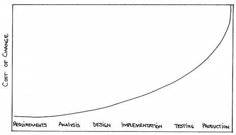
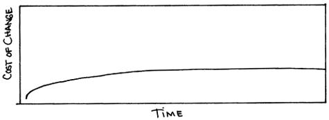

:canonical-base-url: https://dckms.github.io/system-architecture

.. index:: Agile Development
   :name: emacsway-agile-development

===========================
Что такое Agile Development
===========================

.. sectionauthor:: Ivan Zakrevsky

.. contents:: Содержание

Определение
===========

    📝 "Agile development - software development approach based on :ref:`iterative development <emacsway-iterative-development>`, frequent inspection and adaptation, and incremental deliveries, in which requirements and solutions evolve through collaboration in cross‐functional teams and through continual stakeholder feedback."

    -- "ISO/IEC/IEEE 12207:2017 Systems and software engineering - Software life cycle processes"

..

    📝 ""Agile" methods actually can be applied within a variety of models.
    While Agile methods are common in executing an evolutionary lifecycle model, they can be used in other lifecycle models at various stages.
    What the methods have in common is an emphasis on continuous inspection and collaboration in the rapid production of working software in an environment where changes, including changes to requirements, are expected."

    -- "ISO/IEC/IEEE 12207:2017 Systems and software engineering - Software life cycle processes"

..

    📝 "As discussed in 5.4.2, the life cycle models used in agile projects are often highly :ref:`incremental <emacsway-incremental-development>` and :ref:`evolutionary <emacsway-evolutionary-development>`."

    -- "ISO/IEC/IEEE 12207:2017 Systems and software engineering - Software life cycle processes"

История
=======

Agile является естественным следствием эволюции итеративной разработки, краткий обзор которой можно посмотреть в превосходной статье Craig Larman "`Iterative and Incremental Development: A Brief History <https://www.craiglarman.com/wiki/downloads/misc/history-of-iterative-larman-and-basili-ieee-computer.pdf>`__".

Как уже говорилось ранее, итеративная модель разработки открывает широкие возможности для :ref:`удешевления обработки неопределенности <emacsway-adaptation>`.
Однако долгое время эти возможности оставались экономически нецелесообразными по причине быстрорастущего характера роста стоимости :ref:`Adaptation <emacsway-adaptation>`, приближющегося к экспоненциальному.
При таком характере роста возникает экономическая целесообразность принимать решения в момент наименьшей стоимости их реализации, вплоть до заблаговременного проектирования (BDUF).

   Figure 1. The cost of change rising exponentially over time. The image source is "Extreme Programming Explained" 1st edition by Kent Beck, "Chapter 5. Cost of Change".

Однако, в конце 1990-х - начале 2000-х, в архитектурном мире произошли существенные изменения - обрели массовую популярность высокоуровневые объектно-ориентированные языки, появились :ref:`шаблоны <emacsway-agile-patterns>` и принципы проектирования, методики управления сложностью (ROM, POSA, GOF, OOAD, SOLID, Use Case Driven Approach, Object-Oriented Software Construction etc.), появились TDD, Refactoring и т.п.

Унификация знаний в области архитектуры, переход ментального оперирования на элементы унифицированных шаблонных конструкций более высокого уровня абстракции, позволили сократить когнитивную и коммуникативную нагрузку на разработчика, уменьшить порог вхождения в новый проект, смягчить негативное воздействие Закона Брукса.

Рост количественных изменений привел к изменениям качественным - ведущим умам архитектуры своего времени удалось снизить характер роста стоимости адаптации вплоть до пологого графика, максимально приближенного к горизонтальной асимптоте.
Это означало, что стоимость реализации решения больше не зависело от момента его принятия, что позволило отказаться от заблаговременного проектирования и откладывать принятие решения до момента наибольшей полноты информированности, даже после частичной реализации продукта.

    📝 "What would we do if all that investment paid off?
    What if all that work on languages and databases and whatnot actually got somewhere?
    What if the cost of change didn't rise exponentially overtime, but rose much more slowly, **eventually reaching an asymptote**?
    What if tomorrow's software engineering professor draws Figure 3 on the board?"

    -- "Extreme Programming Explained" 1st edition by Kent Beck, "Chapter 5. Cost of Change"

   Figure 3. The cost of change may not rise dramatically over time. The image source is "Extreme Programming Explained" 1st edition by Kent Beck, "Chapter 5. Cost of Change".

Что такое асимтота, можно посмотреть в "§284 Асимтоты" Справочника по высшей математике / М.Я. Выгодский:

    📝 "Прямая АВ называется асимптотой линии L, если расстояние МК (черт. 297) от точки М линии L до прямой АВ стремится к нулю при удалении точки М в бесконечность."

    -- "Справочник по высшей математике" / М.Я. Выгодский

В нашем случае, нас интересует Асимптоты, параллельная оси абсцисс (там же):

    📝 "Для разыскания горизонтальных асимптот линии y = f(х) ищем пределы f(х) при х -> +∞ и при х -> -∞. Если lim х->∞ f(x) = b, то прямая у = b - асимптота (при бесконечном удалении вправо; черт. 299)."

    -- "Справочник по высшей математике" / М.Я. Выгодский

Суть
====

Вся суть Agile (итеративной) модели разработки была лаконично и метко выражена Кент Беком всего одним предложением:

    📝 "Сделайте изменение легким, а потом делай легко изменение.

    **Make the change easy then make the easy change.**"

    -- Kent Beck, dddeu 20

Невероятный талант Kent Beck объяснять сложные вещи простым языком.
Именно об этом я говорил в статье ":ref:`emacsway-learning-in-psychology`".
И это при необычайной эрудированности Kent Beck. Cписок использованной литературы в его книгах просто ошеломляет.

Thanks to Vladik Khononov for https://youtu.be/ybYtgII151g?t=9808

Более развернутый вариант его фразы:

    📝 "At the core of understanding this argument is the software change curve.
    The change curve says that as the project runs, it becomes exponentially more expensive to make changes.
    The change curve is usually expressed in terms of phases "a change made in analysis for $1 would cost thousands to fix in production".
    This is ironic as most projects still work in an ad-hoc process that doesn't have an analysis phase, but the exponentiation is still there.
    **The exponential change curve means that evolutionary design cannot possibly work.**
    It also conveys why planned design must be done carefully because any mistakes in planned design face the same exponentiation.

    **The fundamental assumption underlying XP is that it is possible to flatten the change curve enough to make evolutionary design work.**
    This flattening is both enabled by XP and exploited by XP.
    This is part of the coupling of the XP practices: specifically **you can't do those parts of XP that exploit the flattened curve without doing those things that enable the flattening.**
    This is a common source of the controversy over XP.
    Many people criticize the exploitation without understanding the enabling.
    Often the criticisms stem from critics' own experience where they didn't do the enabling practices that allow the exploiting practices to work.
    As a result they got burned and when they see XP they remember the fire."

    -- "`Is Design Dead? <https://martinfowler.com/articles/designDead.html>`__" by M.Fowler

..

    📝 "**This is one of the premises of XP. It is the technical premise of XP.**
    If the cost of change rose slowly over time, you would act completely differently from how you do under the assumption that costs rise exponentially.
    You would make big decisions as late in the process as possible, to defer the cost of making the decisions and to have the greatest possible chance that they would be right.
    You would only implement what you had to, in hopes that the needs you anticipate for tomorrow wouldn't come true.
    You would introduce elements to the design only as they simplified existing code or made writing the next bit of code simpler.

    **If a flattened change cost curve makes XP possible, a steep change cost curve makes XP impossible.**
    If change is ruinously expensive, you would be crazy to charge ahead without careful forethought.
    But if change stays cheap, the additional value and reduced risk of early concrete feedback outweighs the additional cost of early change."

    -- "Extreme Programming Explained" 1st edition by Kent Beck

Поскольку это было произнесено еще до встречи 2001 года и принятия Agile Manifesto, то под XP следует понимать Agile (или даже любую итератиную модель разработки) в принципе, поскольку XP - это частный случай Agile.

Иными словами, внутреннее качество программы является первичным условием в Agile и в любой другой итеративной разработке.

    📝 "Engineers who don't understand exponential growth and the cost curve as economies of scale kick in come to wildly incorrect conclusions."

    -- Kent Beck, https://twitter.com/KentBeck/status/1402276528910704655?s=19

..

    📝 "The incremental and iterative nature of Agile development can facilitate **efficient technical and management processes and practices to reduce the cost associated with change**.
    In comparison, projects managed at the waterfall end of the continuum seek to reduce total rework cost by minimizing the number of changes, limiting the number of control points, and baselining detailed specifications which are reviewed and traced throughout the project."

    -- "ISO/IEC/IEEE 12207:2017 Systems and software engineering - Software life cycle processes"

О том, почему я обратился к высказываю Kent Beck в этом вопросе, неплохо поясняет Martin Fowler:

    📝 "Extreme Programming (XP) is a software development methodology developed primarily by Kent Beck.
    XP was one of the first agile methods, indeed XP was the dominant agile method in the late 90s and early 00s before Scrum became dominant as the noughties passed.
    Many people (including myself) consider XP to be the primary catalyst that got attention to agile methods, and superior to Scrum as a base for starting out in agile development."

    -- "`Extreme Programming <https://martinfowler.com/bliki/ExtremeProgramming.html>`__" by Martin Fowler

.. _emacsway-agile-development-difficulties:

О сложностях
============

Вернемся еще раз к выражению Kent Beck "*сделайте изменение легким, а потом делай легко изменение*".
Оно состоит из двух частей, причем, первая из них предшествует второй.
Как раз именно первую часть нередко забывают сделать на современном рынке, а без первой части вторая часть работает не будет, как это нетрудно догадаться.
Так недалеко и до полного Уроборос.

    📝 "Scrum is ok if you do it right."

    -- `OOP 2015 Keynote - Robert C. Martin ("Uncle Bob"): Agility and Architecture at 15:21 <https://youtu.be/0oGpWmS0aYQ?t=921>`__

..

    📝 "One pattern I see time and time again on software teams is that they adopt Scrum, pay little attention to technical practices, and they're able to consistently increase their velocity for the first few years.
    But after about three or four years the technical debt they've accumulated in their code is so great that their velocity starts to grind to a halt and they find it difficult to even get simple features implemented.
    This is a place you do not want to get to, though I see it far too often in the software community—teams stuck there without a clue how to get out."

    -- "`How to Increase Velocity <https://www.agilealliance.org/how-to-increase-velocity/>`__" by David Bernstein

Происходит это во многом потому, что:

    📝 "Я узнал от Jeff Sutherland, что первый Scrum на самом деле использовал все XP практики.
    Но Ken Schwaber убедил его оставить инженерные практики за рамками Scrum, чтобы упростить модель и позволить командам брать на себя ответственность за выбор тех или иных практик.
    Возможно, это ускорило распространение Scrum, но с другой стороны многие команды страдают из-за отсутствия технических практик, позволяющих поддерживать постоянный темп гибкой разработки.

    I learned from Jeff Sutherland that the first Scrum actually did all the XP practices.
    But Ken Schwaber convinced him to leave the engineering practices out of Scrum, to keep the model simple and let the teams take responsibility for the tech practices themselves.
    Perhaps this helped spread Scrum faster, but the downside is that a lot of teams suffer because they lack the technical practices that enable sustainable agile development."

    -- "Scrum and XP from the Trenches: How We Do Scrum" 2nd edition by Henrik Kniberg, перевод под редакцией Алексея Кривицкого

Последнее предложение приведенной выше цитаты выражает то же самое, но другими словами.
А ведь еще в 2004 г., в книге "Agile Project Management with Scrum" by Ken Schwaber, Scrum назывался методологий.

Позвольте еще раз повторить слова Kent Beck:

    📝 "If a flattened change cost curve makes XP possible, a steep change cost curve makes XP impossible."

    -- "Extreme Programming Explained" 1st edition by Kent Beck

Impossible. Точка.

Если говорить более развернуто, то, конечно же, это не совсем "Impossible", просто это становится экономически нецелесообразным, поскольку при быстрорастущем графике изменения кода возникает экономическая целесообразность принимать решения в момент наименьшей стоимости их реализации, вплоть до заблаговременного проектирования.

    📝 "To make agile work, you need solid technical practices.
    A lot of agile education under-emphasizes these, but if you skimp on this you won't gain the productivity and responsiveness benefits that agile development can give you (stranding you at level 1 of the agile fluency model.)
    This is one of the reasons that I still think that Extreme Programming is the most valuable of the named agile methods as a core and starting point."

    -- "`Agile Software Development <https://martinfowler.com/agile.html>`__" by Martin Fowler

Этому вопросу посвящена статья "`Is Design Dead? <https://martinfowler.com/articles/designDead.html>`__" by Martin Fowler.

    📝 "In its common usage, evolutionary design is a disaster.
    The design ends up being the aggregation of a bunch of ad-hoc tactical decisions, each of which makes the code harder to alter.
    In many ways you might argue this is no design, certainly it usually leads to a poor design.
    As Kent puts it, **design is there to enable you to keep changing the software easily in the long term.**
    **As design deteriorates, so does your ability to make changes effectively.**
    You have the state of software entropy, over time the design gets worse and worse.
    Not only does this make the software harder to change, it also makes bugs both easier to breed and harder to find and safely kill.
    This is the "code and fix" nightmare, where the bugs become exponentially more expensive to fix as the project goes on."

    -- "`Is Design Dead? <https://martinfowler.com/articles/designDead.html>`__" by Martin Fowler

..

    📝 "If you're a manager or customer how can you tell if the software is well designed?
    It matters to you because poorly designed software will be more expensive to modify in the future."

    -- "`Is Design Dead? <https://martinfowler.com/articles/designDead.html>`__" by Martin Fowler

И очень удачно по этому вопросу высказался Grady Booch:

    📝 "Grady Booch has also provided a set of guidelines for an agile architecture (which in turn imply some duties for the agile architect).
    Booch claims that all good software-intensive architectures are agile.
    What does he mean by this? He means that a successful architecture is resilient and loosely coupled.
    It is composed of a core set of well-reasoned design decisions but still contains some "wiggle room" that allows modifications to be made and refactorings to be done, without ruining the original structure.

    Booch also notes that an effective agile process will allow the architecture to grow incrementally as the system is developed and matures.
    The key to success is to have decomposability, separation of concerns, and near-independence of the parts.
    (Sound familiar? These are all modifiability tactics.)

    Finally, Booch notes that to be agile, the architecture should be visible and self-evident in the code; this means making the design patterns, cross-cutting concerns, and other important decisions obvious, well communicated, and defended.
    This may, in turn, require documentation.
    But whatever architectural decisions are made, the architect must make an effort to "socialize" the architecture."

    -- "Software Architecture in Practice" 3d edition by Len Bass, Paul Clements, Rick Kazman

..

    📝 "After all software is supposed to be soft."

    -- "`The New Methodology <https://www.martinfowler.com/articles/newMethodology.html>`__" by Martin Fowler

.. seealso::

   - ":ref:`emacsway-adaptation`"
   - ":ref:`emacsway-prediction`"
   - ":ref:`emacsway-balancing-prediction-adaptation`"
   - ":doc:`../../uncertainty-management/adaptation/software-design/software-design`"
   - ":doc:`../../uncertainty-management/adaptation/crash-course-in-software-development-economics`"
