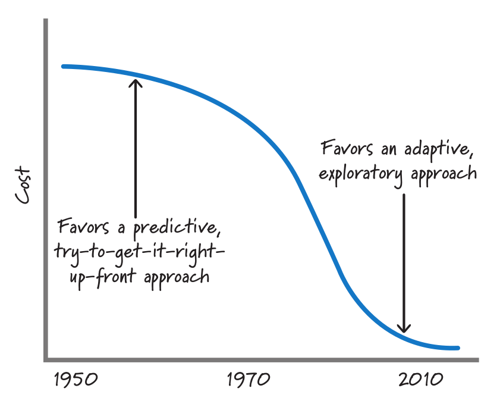

:canonical-base-url: https://dckms.github.io/system-architecture

.. index:: Agile Development
   :name: emacsway-agile-development

===========================
Что такое Agile Development
===========================

.. sectionauthor:: Ivan Zakrevsky

.. contents:: Содержание

Определение
===========

    💬 "Agile development - software development approach based on :ref:`iterative <emacsway-iterative-development>` development, frequent inspection and :ref:`adaptation <emacsway-adaptation>`, and :ref:`incremental <emacsway-incremental-development>` deliveries, in which requirements and solutions evolve through collaboration in cross‐functional teams and through continual stakeholder feedback."

    -- "ISO/IEC/IEEE 12207:2017 Systems and software engineering - Software life cycle processes"

..

    💬 "Scrum is, as the reader supposedly knows, an agile method.
    The agile family of development methods evolved from the old and well-known :ref:`iterative <emacsway-iterative-development>` and :ref:`incremental <emacsway-incremental-development>` life-cycle approaches.
    They were born out of a belief that an approach more grounded in human reality – and the product development reality of learning, innovation, and change – would yield better results."

    -- "Jeff Sutherland's Scrum Handbook" by Jeff Sutherland

..

    💬 "\"Agile\" methods actually can be applied within a variety of models.
    While Agile methods are common in executing an evolutionary lifecycle model, they can be used in other lifecycle models at various stages.
    What the methods have in common is an emphasis on continuous inspection and collaboration in the rapid production of working software in an environment where changes, including changes to requirements, are expected."

    -- "ISO/IEC/IEEE 12207:2017 Systems and software engineering - Software life cycle processes"

..

    💬 "As discussed in 5.4.2, the life cycle models used in agile projects are often highly :ref:`incremental <emacsway-incremental-development>` and :ref:`evolutionary <emacsway-evolutionary-development>`."

    -- "ISO/IEC/IEEE 12207:2017 Systems and software engineering - Software life cycle processes"

..

    💬 "Unlike Waterfall, Agile emphasizes iterative development, or building software in pieces.
    Agile teams typically work in short cycles—which are called \"sprints\" in Scrum, today one of the most widely used forms of Agile—that usually last two weeks each."

    -- "`The Winter Getaway That Turned the Software World Upside Down <https://www.theatlantic.com/technology/archive/2017/12/agile-manifesto-a-history/547715/>`__" by Caroline Mimbs Nyce

..

    💬 "Certainly agile processes require an iterative approach and cannot work in a waterfall style."

    -- "`Waterfall Process <https://martinfowler.com/bliki/WaterfallProcess.html>`__" by Martin Fowler

История
=======

В заметке ":ref:`emacsway-prediction`" было сформировано противоречие, которое заключается в том, что для того, чтобы снизить стоимость разработки, нам необходимо повысить точность прогнозирования (повысить полноту требований), но повышение точности прогнозирования, в свою очередь, повышает стоимость разработки (возникает отрицательная обратная связь).
Причем, повышает её экспоненциально, в то время как бизнес-выгоды от этой точности возрастают логарифмически.
Иными словами, точность прогнозирования всегда имеет предел экономической целесообразности, который определяется пересечением этих двух графиков (за вычетом стоимости реализации, разумеется).

Мы не можем повышать точность прогнозирования, т.к. она превысит предел экономической целесообразности, но мы вынуждены её повысить для того, чтобы принимать решения в момент наименьшей стоимости их реализации.

Как можно разрешить этот "`Catch-22 <https://ru.wikipedia.org/wiki/%D0%A3%D0%BB%D0%BE%D0%B2%D0%BA%D0%B0-22>`__"?
Согласно "Первому закону диалектики", противоречие должно привести к синтезу, т.е. к качественному изменению.

И решение этого противоречия схоже с решением противоречия ":ref:`Закона Брукса <emacsway-brooks's-law>`", в виде автономных команд.
Или же с решением в виде Bounded Context, которое разрешает противоречие, заключающееся в том, что при стремлении выровнять язык по всей модели, он стремится к противоречивости (и неоднозначности).
Т.е. стремление следовать предметной области вынуждает отступать от неё.
В нашем случае решение так же заключается в разбиении целого (процесса разработки) на части (итерации), только вместо согласованности единого языка здесь критерием разделения выступает достаточность полноты требований.

Agile является естественным следствием эволюции итеративной разработки, краткий обзор которой можно посмотреть в превосходной статье Craig Larman "`Iterative and Incremental Development: A Brief History <https://www.craiglarman.com/wiki/downloads/misc/history-of-iterative-larman-and-basili-ieee-computer.pdf>`__".
В ней говорится о том, что цикл PDSA известен еще с 1930 года, в 1957 году впервые была применена :ref:`инкрементальная <emacsway-incremental-development>` модель разработки, а в 1968  году - :ref:`итеративная <emacsway-iterative-development>`.

Как уже говорилось ранее, итеративная модель разработки открывает широкие возможности для :ref:`удешевления обработки неопределенности <emacsway-adaptation>`.
Однако долгое время эти возможности оставались экономически нецелесообразными по причине быстрорастущего характера роста стоимости :ref:`Adaptation <emacsway-adaptation>`, приближющегося к экспоненциальному.
При таком характере роста возникает экономическая целесообразность принимать решения в момент наименьшей стоимости их реализации, вплоть до заблаговременного проектирования (BDUF).

    💬 "WaterFall is based on the empirical observation of 30 years ago (ref: BarryBoehm, Software Engineering Economics, Prentice Hall, 1981.) that the cost of change rises exponentially (base 10) by phases. The conclusion is that you should make the big decisions up front, because changing them is so expensive."

    -- "`Water Fall <https://wiki.c2.com/?WaterFall>`__" at c2.com

.. figure:: _media/agile/exponential-cost-of-change.png
   :alt: Figure 1. The cost of change rising exponentially over time. The image source is "Extreme Programming Explained" 1st edition by Kent Beck, "Chapter 5. Cost of Change".
   :align: left
   :width: 90%

   Figure 1. The cost of change rising exponentially over time. The image source is "Extreme Programming Explained" 1st edition by Kent Beck, "Chapter 5. Cost of Change".

Однако, в конце 1990-х - начале 2000-х, в архитектурном мире произошли существенные изменения - обрели массовую популярность высокоуровневые объектно-ориентированные языки, появились :ref:`шаблоны <emacsway-agile-patterns>` и принципы проектирования, методики управления сложностью (ROM, POSA, GOF, OOAD, :ref:`SOLID <emacsway-agile-solid>`, Use Case Driven Approach, Object-Oriented Software Construction etc.), появились :ref:`TDD <emacsway-tdd>`, Refactoring и т.п.

Унификация знаний в области архитектуры, переход ментального оперирования на элементы унифицированных шаблонных конструкций более высокого уровня абстракции, позволили сократить когнитивную и коммуникативную нагрузку на разработчика, уменьшить порог вхождения в новый проект, смягчить негативное воздействие :ref:`Закона Брукса <emacsway-brooks's-law>`.

   FIGURE 3.8 Historical cost of exploration. The image source is "Essential Scrum: A Practical Guide to the Most Popular Agile Process" by Kenneth Rubin, "Chapter 3 Agile Principles :: Prediction and Adaptation".

Рост количественных изменений привел к изменениям качественным ("Второй закон диалектики") - ведущим умам архитектуры своего времени удалось снизить характер роста стоимости адаптации вплоть до пологого графика, максимально приближенного к горизонтальной асимптоте.
Это означало, что стоимость реализации решения больше не зависело от момента его принятия, что позволило отказаться от заблаговременного проектирования и откладывать принятие решения до момента наибольшей полноты информированности, даже после частичной реализации продукта.

    💬 "What would we do if all that investment paid off?
    What if all that work on languages and databases and whatnot actually got somewhere?
    What if the cost of change didn't rise exponentially overtime, but rose much more slowly, **eventually reaching an asymptote**?
    What if tomorrow's software engineering professor draws Figure 3 on the board?"

    -- "Extreme Programming Explained" 1st edition by Kent Beck, "Chapter 5. Cost of Change"

.. figure:: _media/agile/flatten-cost-of-change.png
   :alt: Figure 3. The cost of change may not rise dramatically over time. The image source is "Extreme Programming Explained" 1st edition by Kent Beck, "Chapter 5. Cost of Change".
   :align: left
   :width: 90%

   Figure 3. The cost of change may not rise dramatically over time. The image source is "Extreme Programming Explained" 1st edition by Kent Beck, "Chapter 5. Cost of Change".

Что такое асимтота, можно посмотреть в "§284 Асимтоты" Справочника по высшей математике / М.Я. Выгодский:

    💬 "Прямая АВ называется асимптотой линии L, если расстояние МК (черт. 297) от точки М линии L до прямой АВ стремится к нулю при удалении точки М в бесконечность."

    -- "Справочник по высшей математике" / М.Я. Выгодский

В нашем случае, нас интересует Асимптоты, параллельная оси абсцисс (там же):

    💬 "Для разыскания горизонтальных асимптот линии y = f(х) ищем пределы f(х) при х -> +∞ и при х -> -∞. Если lim х->∞ f(x) = b, то прямая у = b - асимптота (при бесконечном удалении вправо; черт. 299)."

    -- "Справочник по высшей математике" / М.Я. Выгодский

.. index::
   single: Agile Development; the essence
   :name: emacsway-agile-development-essence

Суть
====

Коротко говоря, Agile модель является итеративно-инкрементальной моделью разработки, на которую наложен ряд филосовско-психологических принципов с целью снизить напряжение между техническими специалистами и представителями бизнеса.
Морально-психологический климат в ИТ-индустрии того времени был, мягко говоря, напряженным:

    💬 "For example, I think that ultimately, Extreme Programming has mushroomed in use and interest, not because of pair-programming or refactoring, but because, taken as a whole, the practices define a developer community freed from the baggage of Dilbertesque corporations.
    Kent Beck tells the story of an early job in which he estimated a programming effort of six weeks for two people.
    After his manager reassigned the other programmer at the beginning of the project, he completed the project in twelve weeks—and felt terrible about himself!
    The boss—of course—harangued Kent about how slow he was throughout the second six weeks.
    Kent, somewhat despondent because he was such a \"failure\" as a programmer, finally realized that his original estimate of 6 weeks was extremely accurate—for 2 people—and that his \"failure\" was really the manager's failure, indeed, the failure of the standard \"fixed\" process mindset that so frequently plagues our industry.

    This type of situation goes on every day—marketing, or management, or external customers, internal customers, and, yes, even developers — don't want to make hard trade-off decisions, so they impose irrational demands through the imposition of corporate power structures.
    This isn't merely a software development problem, it runs throughout Dilbertesque organizations.

    In order to succeed in the new economy, to move aggressively into the era of e-business, e-commerce, and the web, companies have to rid themselves of their Dilbert manifestations of make-work and arcane policies.
    This freedom from the inanities of corporate life attracts proponents of Agile Methodologies, and scares the begeebers (you can't use the word 'shit' in a professional paper) out of traditionalists.
    Quite frankly, the Agile approaches scare corporate bureaucrats — at least those that are happy pushing process for process' sake versus trying to do the best for the \"customer\" and deliver something timely and tangible and \"as promised\" — because they run out of places to hide.

    The Agile movement is not anti-methodology, in fact, many of us want to restore credibility to the word methodology.
    We want to restore a balance. We embrace modeling, but not in order to file some diagram in a dusty corporate repository.
    We embrace documentation, but not hundreds of pages of never-maintained and rarely-used tomes. We plan, but recognize the limits of planning in a turbulent environment.
    Those who would brand proponents of XP or SCRUM or any of the other Agile Methodologies as \"hackers\" are ignorant of both the methodologies and the original definition of the term hacker."

    -- "`History: The Agile Manifesto <http://agilemanifesto.org/history.html>`__"

..

    💬 "I think the Agile Manifesto has helped teams around the world rethink their priorities, and in the process has helped re-humanize software development."

    -- "`Some Agile History <https://pragdave.me/blog/2007/02/24/some-agile-history.html>`__" by Dave Thomas

Основой этой филосовско-психологической прослойки `стал <https://www.informit.com/articles/article.aspx?p=2990402&seqNum=3>`__ документ "`Bill of Rights <http://www.agilenutshell.com/bill_of_rights>`__", который является результатом глубокого аналитического труда Kent Beck в области психологии.
Дело в том, что Kent Beck имел превосходную эрудированность в области психологии, философии и менеджмента.

    💬 "**Customer Bill of Rights**

    - You have the right to an overall plan, to know what can be accomplished when and at what cost.
    - You have the right to get the most possible value out of every programming week.
    - You have the right to see progress in a running system, proven to work by passing repeatable tests that you specify.
    - You have the right to change your mind, to substitute functionality, and to change priorities without paying exorbitant costs.
    - You have the right to be informed of schedule changes, in time to choose how to reduce the scope to restore the original date. You can cancel at any time and be left with a useful working system reflecting investment to date.

    **Programmer Bill of Rights**

    - You have the right to know what is needed, with clear declarations of priority.
    - You have the right to produce quality work at all times.
    - You have the right to ask for and receive help from peers, managers, and customers.
    - You have the right to make and update your own estimates.
    - You have the right to accept your responsibilities instead of having them assigned to you."

    -- "Planning Extreme Programming" by Kent Beck, Martin Fowler

..

    💬 "During the `Snowbird meeting <https://martinfowler.com/articles/agileStory.html>`__, Kent Beck said that the goal of Agile was to heal the divide between business and development.
    To that end, the following \"bill of rights\" was developed by Kent, Ward Cunningham, and Ron Jeffries, among others."

    -- "Clean Agile: Back to Basics" by Robert C. Martin

Kent Beck выяснил, что напряжение являлось ни чем иным, как упреждающими защитным механизмом, спровоцированным страхами участников процесса разработки.

Идея Bill of Rights возникла на основе идеи Declaration of Independence (`перевод <http://www.hist.msu.ru/ER/Etext/indpndnc.htm>`__):

    💬 "Software development is risky. People involved have many fears of what may go wrong.

    To develop effectively we must acknowledge these fears. Why do we need a software process? For the same reason that we need laws, governments, and taxes: fear.

    The Declaration of Independence says:

        That among these [rights] are life, liberty, and the pursuit of happiness. That to secure these rights, governments are instituted among men, deriving their just powers from the consent of the governed.

    Though the profundity of these words may distract us, consider the word secure. We institute governments because we are afraid of losing our rights. By the same token, we institute software processes because we are afraid.

    **Customers are afraid that**

    - They won't get what they asked for.
    - They'll ask for the wrong thing.
    - They'll pay too much for too little.
    - They must surrender control of their career to techies who don't care.
    - They won't ever see a meaningful plan.
    - The plans they do see will be fairy tales.
    - They won't know what's going on.
    - They'll be held to their first decisions and won't be able to react to changes in the business.
    - No one will tell them the truth.

    **Developers are afraid, too. They fear that**

    - They will be told to do more than they know how to do.
    - They will be told to do things that don't make sense.
    - They are too stupid.
    - They are falling behind technically.
    - They will be given responsibility without authority.
    - They won't be given clear definitions of what needs to be done.
    - They'll have to sacrifice quality for deadlines.
    - They'll have to solve hard problems without help.
    - They won't have enough time to succeed."

    -- "Planning Extreme Programming" by Kent Beck, Martin Fowler

..

    💬 "But it was here, nestled in the white-capped mountains at a ski resort, that a group of software rebels gathered in 2001 to frame and sign one of the most important documents in its industry's history, a sort of Declaration of Independence for the coding set."

    -- "`The Winter Getaway That Turned the Software World Upside Down <https://www.theatlantic.com/technology/archive/2017/12/agile-manifesto-a-history/547715/>`__" by Caroline Mimbs Nyce

Вся суть Agile (итеративной) модели разработки была лаконично и метко выражена Кент Беком всего одним предложением:

.. make change easy then make easy change

..

    💬 "Сделайте изменение легким, а потом делай легко изменение.

    **Make the change easy then make the easy change.**"

    -- Kent Beck, "`Continued Learning: The Beauty of Maintenance - Kent Beck - DDD Europe 2020 <https://youtu.be/3gib0hKYjB0?t=2662>`__"

    Thanks to Vladik Khononov for https://youtu.be/ybYtgII151g?t=9808

Невероятный талант Kent Beck объяснять сложные вещи простым языком.
Именно об этом я говорил в статье ":ref:`emacsway-learning-in-psychology`".
И это при необычайной эрудированности Kent Beck. Cписок использованной литературы в его книгах просто ошеломляет.

Более развернутый вариант его фразы:

    💬 "At the core of understanding this argument is the software change curve.
    The change curve says that as the project runs, it becomes exponentially more expensive to make changes.
    The change curve is usually expressed in terms of phases \"a change made in analysis for $1 would cost thousands to fix in production\".
    This is ironic as most projects still work in an ad-hoc process that doesn't have an analysis phase, but the exponentiation is still there.
    **The exponential change curve means that evolutionary design cannot possibly work.**
    It also conveys why planned design must be done carefully because any mistakes in planned design face the same exponentiation.

    **The fundamental assumption underlying XP is that it is possible to flatten the change curve enough to make evolutionary design work.**
    This flattening is both enabled by XP and exploited by XP.
    This is part of the coupling of the XP practices: specifically **you can't do those parts of XP that exploit the flattened curve without doing those things that enable the flattening.**
    This is a common source of the controversy over XP.
    Many people criticize the exploitation without understanding the enabling.
    Often the criticisms stem from critics' own experience where they didn't do the enabling practices that allow the exploiting practices to work.
    As a result they got burned and when they see XP they remember the fire."

    -- "`Is Design Dead? <https://martinfowler.com/articles/designDead.html>`__" by M.Fowler

..

    💬 "**Именно это является одной из предпосылок ХР**.
    **Это техническая предпосылка ХР.**
    [в оригинальном переводе: *Именно это является одним из основных предположений ХР. Это техническое предположение ХР.*]
    Если стоимость внесения в систему изменений со временем растет достаточно медленно, стратегия разработки программы должна быть совершенно другой, отличной от той, которая используется в случае, если стоимость внесения в систему изменений со временем растет экспоненциально.
    В подобной ситуации вы можете откладывать решение важных задач на более поздние сроки.
    Вы получаете возможность принимать важные решения настолько поздно, насколько это возможно.
    Это делается для того, чтобы осуществлять связанные с этим затраты как можно позже.
    Кроме того, если вы откладываете решение важных вопросов на более поздний срок, тем самым вы повышаете вероятность того, что выбранное вами решение окажется правильным.
    Другими словами, сегодня вы должны реализовать только то, без чего сегодня не обойтись, при этом вы можете рассчитывать на то, что проблемы, решение которых вы отложили до завтра, развеются сами собой, то есть перестанут быть актуальными.
    Вы можете добавлять в дизайн новые элементы только в случае, если эти новые элементы упрощают код или делают написание следующего фрагмента кода более простым.

    **Если пологая кривая роста затрат делает ХР возможным, то экспоненциальная кривая роста затрат делает ХР невозможным.**
    Если изменение обойдется вам в кругленькую сумму, вы сойдете с ума, пытаясь предугадать, каким образом это изменение повлияет на работу системы.
    Если же изменение обходится вам дешево, вы всегда можете рискнуть и проверить, что будет, если вы тем или иным образом измените код, — позже вы всегда можете изменить систему так, как это будет лучше.

    **This is one of the premises of XP. It is the technical premise of XP.**
    If the cost of change rose slowly over time, you would act completely differently from how you do under the assumption that costs rise exponentially.
    You would make big decisions as late in the process as possible, to defer the cost of making the decisions and to have the greatest possible chance that they would be right.
    You would only implement what you had to, in hopes that the needs you anticipate for tomorrow wouldn't come true.
    You would introduce elements to the design only as they simplified existing code or made writing the next bit of code simpler.

    **If a flattened change cost curve makes XP possible, a steep change cost curve makes XP impossible.**
    If change is ruinously expensive, you would be crazy to charge ahead without careful forethought.
    But if change stays cheap, the additional value and reduced risk of early concrete feedback outweighs the additional cost of early change."

    -- "Extreme Programming Explained" 1st edition by Kent Beck, "Chapter 5. Cost of Change", перевод ООО Издательство "Питер"

Поскольку это было произнесено еще до встречи 2001 года и принятия Agile Manifesto, то под XP следует понимать Agile (или даже любую итератиную модель разработки) в принципе, поскольку XP - это частный случай Agile.

Иными словами, внутреннее качество программы является первичным условием в Agile, как и в любой другой итеративной разработке.

    💬 "Engineers who don't understand exponential growth and the cost curve as economies of scale kick in come to wildly incorrect conclusions."

    -- `Kent Beck <https://twitter.com/KentBeck/status/1402276528910704655?s=19>`__

..

    💬 "Continuous attention to technical excellence and good design enhances agility."

    -- "`Principles behind the Agile Manifesto <http://agilemanifesto.org/principles.html>`__"

..

    💬 "The incremental and iterative nature of Agile development can facilitate **efficient technical and management processes and practices to reduce the cost associated with change**.
    In comparison, projects managed at the waterfall end of the continuum seek to reduce total rework cost by minimizing the number of changes, limiting the number of control points, and baselining detailed specifications which are reviewed and traced throughout the project."

    -- "ISO/IEC/IEEE 12207:2017 Systems and software engineering - Software life cycle processes"

При соблюдении этого условия, использование :ref:`Adaptation <emacsway-adaptation>` обретает экономическую целесообразность:

    💬 "Responding to change over following a plan"

    -- "`Manifesto for Agile Software Development <http://agilemanifesto.org/>`__"

..

    💬 "Welcome changing requirements, even late in development. Agile processes harness change for the customer's competitive advantage."

    -- "`Principles behind the Agile Manifesto <http://agilemanifesto.org/principles.html>`__"

..

    💬️ "We considered a bunch of names, and agreed eventually on \"agile\" as we felt that captured the adaptiveness and response to change which we felt was so important to our approach."

    -- "`Writing The Agile Manifesto <https://martinfowler.com/articles/agileStory.html>`__" by Martin Fowler

О том, почему я обратился к высказываю Kent Beck в этом вопросе, неплохо поясняет Martin Fowler:

    💬 "Extreme Programming (XP) is a software development methodology developed primarily by Kent Beck.
    XP was one of the first agile methods, indeed XP was the dominant agile method in the late 90s and early 00s before Scrum became dominant as the noughties passed.
    Many people (including myself) consider XP to be the primary catalyst that got attention to agile methods, and superior to Scrum as a base for starting out in agile development."

    -- "`Extreme Programming <https://martinfowler.com/bliki/ExtremeProgramming.html>`__" by Martin Fowler

.. index::
   single: Agile Development; difficulties
   :name: emacsway-agile-development-difficulties

О сложностях
============

Вернемся еще раз к выражению Kent Beck "*сделайте изменение легким, а потом делай легко изменение*".
Оно состоит из двух частей, причем, первая из них предшествует второй.
Как раз именно первую часть нередко забывают сделать на современном рынке, а без первой части вторая часть работает не будет, как это нетрудно догадаться.
Так недалеко и до полного Уроборос.

    💬 "Scrum is ok if you do it right."

    -- `OOP 2015 Keynote - Robert C. Martin ("Uncle Bob"): Agility and Architecture at 15:21 <https://youtu.be/0oGpWmS0aYQ?t=921>`__

..

    💬 "One pattern I see time and time again on software teams is that they adopt Scrum, pay little attention to technical practices, and they're able to consistently increase their velocity for the first few years.
    But after about three or four years the technical debt they've accumulated in their code is so great that their velocity starts to grind to a halt and they find it difficult to even get simple features implemented.
    This is a place you do not want to get to, though I see it far too often in the software community—teams stuck there without a clue how to get out."

    -- "`How to Increase Velocity <https://www.agilealliance.org/how-to-increase-velocity/>`__" by David Bernstein

Происходит это во многом потому, что:

    💬 "Я узнал от Jeff Sutherland, что первый Scrum на самом деле использовал все XP практики.
    Но Ken Schwaber убедил его оставить инженерные практики за рамками Scrum, чтобы упростить модель и позволить командам брать на себя ответственность за выбор тех или иных практик.
    Возможно, это ускорило распространение Scrum, но с другой стороны многие команды страдают из-за отсутствия технических практик, позволяющих поддерживать постоянный темп гибкой разработки.

    I learned from Jeff Sutherland that the first Scrum actually did all the XP practices.
    But Ken Schwaber convinced him to leave the engineering practices out of Scrum, to keep the model simple and let the teams take responsibility for the tech practices themselves.
    Perhaps this helped spread Scrum faster, but the downside is that a lot of teams suffer because they lack the technical practices that enable sustainable agile development."

    -- "Scrum and XP from the Trenches: How We Do Scrum" 2nd edition by Henrik Kniberg, перевод под редакцией Алексея Кривицкого

Последнее предложение приведенной выше цитаты выражает то же самое, но другими словами.
А ведь еще в 2004 г., в книге "Agile Project Management with Scrum" by Ken Schwaber, Scrum назывался методологий.

Позвольте еще раз повторить слова Kent Beck:

    💬 "If a flattened change cost curve makes XP possible, a steep change cost curve makes XP impossible."

    -- "Extreme Programming Explained" 1st edition by Kent Beck

Impossible. Точка.

Если говорить более развернуто, то, конечно же, это не совсем "Impossible", просто это становится экономически нецелесообразным, поскольку при быстрорастущем графике изменения кода возникает экономическая целесообразность принимать решения в момент наименьшей стоимости их реализации, вплоть до заблаговременного проектирования.

    💬 "To make agile work, you need solid technical practices.
    A lot of agile education under-emphasizes these, but if you skimp on this you won't gain the productivity and responsiveness benefits that agile development can give you (stranding you at level 1 of the agile fluency model.)
    This is one of the reasons that I still think that Extreme Programming is the most valuable of the named agile methods as a core and starting point."

    -- "`Agile Software Development <https://martinfowler.com/agile.html>`__" by Martin Fowler

..

    💬 "We need to stress that you shouldn't worry too much about the issue of reworking.
    **XP's practices are all about reducing the cost of reworking to manageable levels.**
    If you find yourself in a situation **where the cost of reworking is prohibitive, then you should either not use XP or you should use an environment that makes rework easier**."

    -- "Planning Extreme Programming" by Kent Beck, Martin Fowler

Этому вопросу посвящена статья "`Is Design Dead? <https://martinfowler.com/articles/designDead.html>`__" by Martin Fowler.

    💬 "In its common usage, evolutionary design is a disaster.
    The design ends up being the aggregation of a bunch of ad-hoc tactical decisions, each of which makes the code harder to alter.
    In many ways you might argue this is no design, certainly it usually leads to a poor design.
    As Kent puts it, **design is there to enable you to keep changing the software easily in the long term.**
    **As design deteriorates, so does your ability to make changes effectively.**
    You have the state of software entropy, over time the design gets worse and worse.
    Not only does this make the software harder to change, it also makes bugs both easier to breed and harder to find and safely kill.
    This is the "code and fix" nightmare, where the bugs become exponentially more expensive to fix as the project goes on."

    -- "`Is Design Dead? <https://martinfowler.com/articles/designDead.html>`__" by Martin Fowler

..

    💬 "If you're a manager or customer how can you tell if the software is well designed?
    It matters to you because poorly designed software will be more expensive to modify in the future."

    -- "`Is Design Dead? <https://martinfowler.com/articles/designDead.html>`__" by Martin Fowler

И очень удачно по этому вопросу высказался Grady Booch:

    💬 "Grady Booch has also provided a set of guidelines for an agile architecture (which in turn imply some duties for the agile architect).
    Booch claims that all good software-intensive architectures are agile.
    What does he mean by this? He means that a successful architecture is resilient and loosely coupled.
    It is composed of a core set of well-reasoned design decisions but still contains some \"wiggle room\" that allows modifications to be made and refactorings to be done, without ruining the original structure.

    Booch also notes that an effective agile process will allow the architecture to grow incrementally as the system is developed and matures.
    The key to success is to have decomposability, separation of concerns, and near-independence of the parts.
    (Sound familiar? These are all modifiability tactics.)

    Finally, Booch notes that to be agile, the architecture should be visible and self-evident in the code; this means making the design patterns, cross-cutting concerns, and other important decisions obvious, well communicated, and defended.
    This may, in turn, require documentation.
    But whatever architectural decisions are made, the architect must make an effort to \"socialize\" the architecture."

    -- "Software Architecture in Practice" 3d edition by Len Bass, Paul Clements, Rick Kazman

..

    💬 "After all software is supposed to be soft."

    -- "`The New Methodology <https://www.martinfowler.com/articles/newMethodology.html>`__" by Martin Fowler

Cм. также:

    - "`Writing The Agile Manifesto <https://martinfowler.com/articles/agileStory.html>`__" by Martin Fowler
    - "`The Reasons for Agile <https://www.informit.com/articles/article.aspx?p=2990402>`__" by Robert C. Martin
    - "`The Winter Getaway That Turned the Software World Upside Down <https://www.theatlantic.com/technology/archive/2017/12/agile-manifesto-a-history/547715/>`__" by Caroline Mimbs Nyce
    - "`Some Agile History <https://pragdave.me/blog/2007/02/24/some-agile-history.html>`__" by Dave Thomas
    - "`The New Methodology <https://www.martinfowler.com/articles/newMethodology.html>`__" by Martin Fowler
    - "`History: The Agile Manifesto <http://agilemanifesto.org/history.html>`__"

.. seealso::

   - ":ref:`emacsway-adaptation`"
   - ":ref:`emacsway-prediction`"
   - ":ref:`emacsway-balancing-prediction-adaptation`"
   - ":ref:`emacsway-agile-business-concerns-predominance`"
   - ":doc:`../../uncertainty-management/adaptation/software-design/software-design`"
   - ":doc:`../../uncertainty-management/adaptation/crash-course-in-software-development-economics`"
