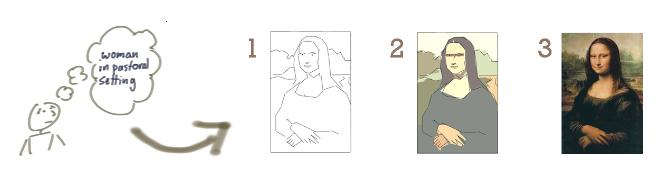

:canonical-base-url: https://dckms.github.io/system-architecture

.. index:: Iterative Development
   :name: emacsway-iterative-development

=====================
Iterative Development
=====================

.. sectionauthor:: Ivan Zakrevsky

..

    📝 "The "iterative development" model performs initial planning and then consists of a cyclic process of prototyping, testing, analyzing and refining the requirements and the solution.
    "Iterative" models repeatedly perform the life cycle processes to deliver prioritized system functions sooner, with refined or more complex elements of the system coming in later iterations."

    -- "ISO/IEC/IEEE 12207:2017 Systems and software engineering - Software life cycle processes"

   Iterative Development. The image source is "`Don't Know What I Want, But I Know How to Get It <https://www.jpattonassociates.com/dont_know_what_i_want/>`__" by Jeff Patton & Associates 
