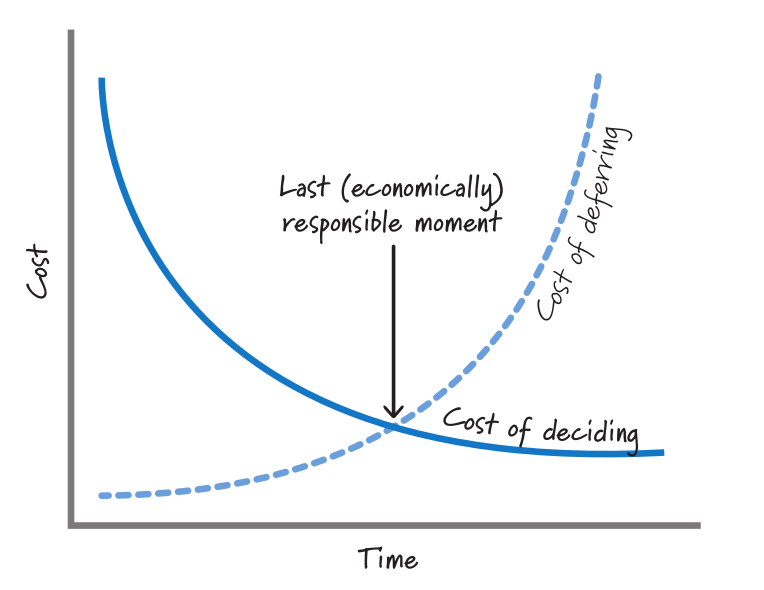
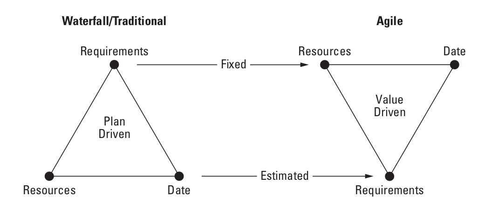

:canonical-base-url: https://dckms.github.io/system-architecture

.. index:: Adaptation
   :name: emacsway-adaptation

====================
Что такое Adaptation
====================

.. contents:: Содержание

Суть Адаптации
==============

    📝 "No crystal balls.
    Humans are not able to predict the future.
    For example, your competition makes an announcement that was not expected.
    Unanticipated technical problems crop up that force a change in direction.
    Furthermore, people are particularly bad at planning uncertain things far into the future – guessing today how you will be spending your week eight months from now is something of a fantasy.
    It has been the downfall of many a carefully constructed Gantt chart."

    -- "Jeff Sutherland's Scrum Handbook" by Jeff Sutherland

..

    📝 "Глаза боятся - руки делают."

    -- Народная пословица.

Суть Adaptation (Адаптации) заключается в том, что мы не пытаемся разрешить неопределенность заблаговременно путем логического вывода, а, в противовес :ref:`Prediction <emacsway-prediction>`, разрешаем неопределенность опытным, экспериментальным путем.
Выдвигаем гипотезу, вносим её в план, реализуем Системный Инкремент, инспектируем результат на практике, и адаптируем план на следующую итерацию.
Этот цикл образует :ref:`итерацию <emacsway-iterative-development>`.

Полученные практическим способом знания, снижающие неопределенность, являются входными аргументами для следующей :ref:`итерации <emacsway-iterative-development>`.

    📝 ""Iteration" here means applying a function to itself."

    -- "Concrete Mathematics: A Foundation for Computer Science" 2nd edition by Ronald L. Graham, Donald E. Knuth, Oren Patashnik

Назначение Адаптации
====================

Рость неопределенности приводит к росту стоимости Prediction по мере роста его точности.
Предел экономической целесообразности Prediction определяется пересечением графика роста стоимости Prediction (в зависимости от его точности) с графиком роста бизнес-выгод от точности Прогнозирования.

Там, где сумма произведений количества Адаптаций Системного Инкремента на стоимость Адаптации системного инкремена для каждой итерации пересечет сумму экономически целесообразной стоимости Prediction на горизонте планирования, возникает предел экономической целесообразности эмпирического способа обработки неопределенности Проекта при допущении, что остаточная стоимость самой реализации (которая не имеет отношения к разрешению неопределенности) остается неизменной в обоих случаях.
Обратите внимание, в данном случае речь идет о стоимости Адаптации Системного Инкремента, а не Плана.
Т.е. речь идет о стоимости экспериментального разрешения неопределенности (цикл ошибка - исправление).

Prediction при этом не исчезает полностью, а понижает свою точность и дополняется Адаптацией.
Для наилучшего совокупного экономического эффекта важно правильно находить :ref:`баланс между Prediction и Adaptation <emacsway-balancing-prediction-adaptation>`, а также обеспечивать :ref:`характер роста стоимости Adaptation максимально приближенный к горизонтальной асимптоте <emacsway-agile-development>`, поскольку, чем больше Адаптаций Системного Инкремента возникает на горизонте планирования, тем дороже становится экспериментальный способ разрешения неопределенности по сравнению с логическим.

При этом нужно учитывать, что стоимость Prediction также не константна по отношению к жизненному циклу системы, а имеет тенденцию к понижению.
Т.е. чем большая часть системы уже реализована, тем больше баланс экономической целесообразности смещается от Adaptation к Prediction.

   FIGURE 3.6 Make decisions at the last responsible moment. The image source is "Essential Scrum: A Practical Guide to the Most Popular Agile Process" by Kenneth Rubin, "Chapter 3 Agile Principles :: Prediction and Adaptation".

    📝 "Most of us would prefer to wait until we have more information so that we can make a more informed decision.
    When dealing with important or irreversible decisions, if we decide too early and are wrong, we will be on the exponential part of the cost-of-deciding curve in Figure 3.6.
    As we acquire a better understanding regarding the decision, the cost of deciding declines (the likelihood of making a bad
    decision declines because of increasing market or technical certainty).
    That's why we should wait until we have better information before committing to a decision."

    -- "Essential Scrum: A Practical Guide to the Most Popular Agile Process" by Kenneth Rubin, "Chapter 3 Agile Principles :: Prediction and Adaptation"

Это и есть та самая причина, по которой выбор SDLC-модели является неотъемлемой частью процесса проектирования, и изучается архитектурой.
Ведь различные SDLC-модели (итеративные, инкрементальные, спиральные, гибридные, каскадные), реализованные в виде Scrum, RUP, SAFe, BDUF etc., обладают различным соотношением Prediction vs. Adaptation, имеют разные подходы к масштабированию команд и различные ограничения.
Выбор SDLC-модели сильно зависит от ситуативного контекста проектирования.
Повторюсь, основная цель итеративной разработки - удешевить стоимость проектирования в условиях неопределенности.

Об этом Брукс писал в Мифическом человеко-месяце еще до появления Agile Manifesto:

    📝 "Therefore the most important function that software builders do for their clients is the :ref:`iterative <emacsway-iterative-development>` **extraction and refinement of the product requirements**...

    I would go a step further and assert that it is really impossible for clients, even those working with software engineers, to specify completely, precisely, and correctly the exact requirements of a modern software product before having built and tried some versions of the product they are specifying.

    Therefore one of the most promising of the current technological efforts, and one which attacks the essence, not the accidents, of the software problem, is the development of approaches and tools for rapid prototyping of systems as part of the :ref:`iterative <emacsway-iterative-development>` **specification of requirements**."

    -- "The Mythical Man-Month Essays on Software Engineering Anniversary Edition" by Frederick P. Brooks, Jr.

Конечно, сугубо семантически, термин ":ref:`requirements <emacsway-agile-requirements>`" немного вводит в заблуждение в Agile, ведь заранее требования к продукту неизвестны полностью, и они изменяются по мере реализации продукта.
А в таком случае, как они могут что-то требовать?
Вы, наверное, встречали картинку с треугольником "`Iron Triangle <https://www.atlassian.com/agile/agile-at-scale/agile-iron-triangle>`__" (Requirements/Scope, Cost, Time), где в waterfall он обращен вершиной Requirements вниз (константная область), а в Agile - вверх (переменная область). The iron triangle of planning:

   Iron Triangle. Agile fixes the date and resources and varies the scope. The image source is "Agile Software Requirements: Lean Requirements Practices for Teams, Programs, and the Enterprise" by Dean Leffingwell

Итеративная разработка востребована, когда невозможно достигнуть полноты (Complete) требований (set of :ref:`requirements <emacsway-agile-requirements>`).

..
    📝 "Complete.
    The set of requirements needs no further amplification because it contains everything pertinent to the definition of the system or system element being specified.
    In addition, the set contains no To Be Defined (TBD), To Be Specified (TBS), or To Be Resolved (TBR) clauses.
    Resolution of the TBx designations may be iterative and there is an acceptable timeframe for TBx items, determined by risks and dependencies."

    -- "ISO/IEC/IEEE 29148:2011 Systems and software engineering - Life cycle processes - Requirements engineering"

..

    📝 "Complete.
    The set of requirements stands alone such that it sufficiently describes the necessary capabilities, characteristics, constraints or quality factors to meet entity needs without needing further information.
    In addition, the set does not contain any To Be Defined (TBD), To Be Specified (TBS), or To Be Resolved (TBR) clauses.
    Resolution of the TBx designations may be iterative and there is an acceptable timeframe for TBx items, determined by risks and dependencies."

    -- "ISO/IEC/IEEE 29148:2018 Systems and software engineering - Life cycle processes - Requirements engineering"

Но это и не требуется стандартом по SDLC:

    📝 "To deal with the **issues of incompletely known requirements** and inaccurate estimates, a number of other types of models have been proposed: :ref:`incremental <emacsway-incremental-development>`, :ref:`spiral <emacsway-spiral-development>`, :ref:`iterative <emacsway-iterative-development>`, and :ref:`evolutionary (adaptive) <emacsway-evolutionary-development>`.

    <...>

    The ":ref:`evolutionary model <emacsway-evolutionary-development>`" is intended to deal with **incomplete knowledge of requirements**."

    -- "ISO/IEC/IEEE 12207:2017 Systems and software engineering - Software life cycle processes"

Как можно заметить, неполнота требований здесь первична, и именно для её разрешения и применяются такие SDLC-модели, как :ref:`incremental <emacsway-incremental-development>`, :ref:`spiral <emacsway-spiral-development>`, :ref:`iterative <emacsway-iterative-development>`, and :ref:`evolutionary (adaptive) <emacsway-evolutionary-development>`.

Интересно, что, во времена появления термина User Story, полнота требований так же не требовалась старым стандартом:

    📝 "The SRS may need to evolve as the development of the software product progresses. It may be impossible to specify some details at the time the project is initiated.

    <...>

    Requirements should be specified as completely and thoroughly as is known at the time, even if evolutionary revisions can be foreseen as inevitable. The fact that they are incomplete should be noted."

    -- "IEEE Std 830-1998, IEEE Std 830-1993 IEEE Recommended Practice for Software Requirements Specifications"

Таким образом, использование термина :ref:`requirements <emacsway-agile-requirements>`, несмотря на то, что вызывает вопросы относительно семантики, никоим образом не противоречит использованию его в Agile SDLC-моделе, которая, кстати, описана тем же стандартом - ISO/IEC/IEEE 12207:2017, в разделах "5.4.2. Life cycle model for the software system" и "Annex H".

См. также:

- "`The New Methodology :: Predictive versus Adaptive <https://www.martinfowler.com/articles/newMethodology.html#PredictiveVersusAdaptive>`__" by Martin Fowler

.. seealso::

   - ":ref:`emacsway-iterative-development`"
   - ":ref:`emacsway-agile-development`"
   - ":doc:`../../models/agile/index`"
   - ":ref:`emacsway-agile-requirements`"
