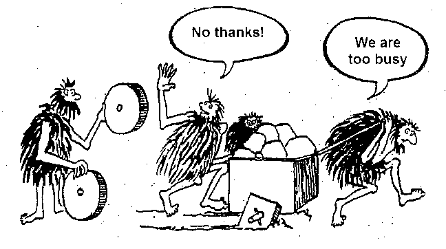

:canonical-base-url: https://dckms.github.io/system-architecture

.. index::
   single: Software Design; in Agile
   :name: emacsway-agile-software-design

================================
Role of Software Design in Agile
================================

.. sectionauthor:: Ivan Zakrevsky

.. contents:: Содержание

Кто читает код?
===============

Среди малоопытных разработчиков иногда можно услышать, что им некогда писать качественный код, так как у них мало времени, а этот код все равно читать никто не будет.

Истина в том, что в процессе конструирования кода, 91% времени занимает именно чтение кода и борьба со сложностью, и только 9% времени времени занимает ввод символов с клавиатуры.
И это соотношение дано еще для качественного кода.

Причем, разработчик пишет код в одиночку и лишь единожды.
Зато читают код все разработчики команды и по много раз.

Таким образом, плохо написанный код более чем на 91% (т.е. более чем на порядок!) влияет на снижение темпов разработки всей команды.

Кстати, этот момент хорошо объясняет то, почему при TDD разработка осуществляется быстрее, хотя объема кода пишется больше.
TDD является эффективным :ref:`средством управления сложностью и снижения когнитивной нагрузки <emacsway-tdd>`.
А поскольку борьба со сложностью занимает более 91% времени конструирования кода, то время на написание тестов полностью перекрывается повышением темпов разработки, т.е. разработка с тестами получается даже быстрей.
Пальцы работают больше, а голова меньше.
Происходит перераспределение составляющих разработки.
К тому же, время на написание тестов можно прогнозировать, в отличии от отладки.

    📝 "You might ask: How much is code really read? Doesn’t most of the effort go into
    writing it?

    Have you ever played back an edit session? In the 80s and 90s we had editors like Emacs that kept track of every keystroke.
    You could work for an hour and then play back your whole edit session like a high-speed movie.
    When I did this, the results were fascinating.

    The vast majority of the playback was scrolling and navigating to other modules!

    - Bob enters the module.
    - He scrolls down to the function needing change.
    - He pauses, considering his options.
    - Oh, he’s scrolling up to the top of the module to check the initialization of a variable.
    - Now he scrolls back down and begins to type.
    - Ooops, he’s erasing what he typed!
    - He types it again.
    - He erases it again!
    - He types half of something else but then erases that!
    - He scrolls down to another function that calls the function he’s changing to see how it is called.
    - He scrolls back up and types the same code he just erased.
    - He pauses.
    - He erases that code again!
    - He pops up another window and looks at a subclass. Is that function overridden?

    <...>

    You get the drift. Indeed, the ratio of time spent reading vs. writing is well over 10:1.
    We are constantly reading old code as part of the effort to write new code.

    Because this ratio is so high, we want the reading of code to be easy, even if it makes the writing harder.
    Of course there’s no way to write code without reading it, so making it easy to read actually makes it easier to write.

    There is no escape from this logic.
    You cannot write code if you cannot read the surrounding code.
    The code you are trying to write today will be hard or easy to write depending on how hard or easy the surrounding code is to read.
    So if you want to go fast, if you want to get done quickly, if you want your code to be easy to write, make it easy to read."

    -- "Clean Code: A Handbook of Agile Software Craftsmanship" by Robert C. Martin

Primary Technical Imperative
============================

    📝 "There are two ways of constructing a software design: one way is to make it so simple that there are obviously no deficiencies, and the other is to make it so complicated that there are no obvious deficiencies."

    -- C. A. R. Hoare

..

    📝 "Managing complexity is the most important technical topic in software development.
    In my view, it's so important that Software's Primary Technical Imperative has to be managing complexity."

    -- "Code Complete" by Steve McConnell

..

    📝 "Dijkstra pointed out that no one's skull is really big enough to contain a modern
    computer program (Dijkstra 1972), which means that we as software developers
    shouldn't try to cram whole programs into our skulls at once; we should try to organize
    our programs in such a way that we can safely focus on one part of it at a time.
    The goal is to minimize the amount of a program you have to think about at any one time.
    You might think of this as mental juggling—the more mental balls the program requires you
    to keep in the air at once, the more likely you'll drop one of the balls, leading to a design
    or coding error.

    At the software-architecture level, the complexity of a problem is reduced by dividing the system into subsystems.
    Humans have an easier time comprehending several simple pieces of information than one complicated piece.
    The goal of all software-design techniques is to break a complicated problem into simple pieces.
    The more independent the subsystems are, the more you make it safe to focus on one bit of complexity at a time.
    Carefully defined objects separate concerns so that you can focus on one thing at a time.
    Packages provide the same benefit at a higher level of aggregation.

    Keeping routines short helps reduce your mental workload.
    Writing programs in terms of the problem domain, rather than in terms of low-level implementation details, and
    working at the highest level of abstraction reduce the load on your brain.

    The bottom line is that programmers who compensate for inherent human limitations
    write code that's easier for themselves and others to understand and that has fewer errors."

    -- "Code Complete" by Steve McConnell

..

    📝 "Software's Primary Technical Imperative is managing complexity.
    This is greatly aided by a design focus on simplicity.
    Simplicity is achieved in two general ways: minimizing the amount of essential
    complexity that anyone's brain has to deal with at any one time, and keeping
    accidental complexity from proliferating needlessly."

    -- "Code Complete" by Steve McConnell

..

    "The number \"7±2\" has been found to be a number of discrete items a person can remember while performing other tasks (Miller 1956).
    If a class contains more than about seven data members, consider whether the class should be decomposed into multiple smaller classes (Riel 1996)."

    -- "Code Complete" by Steve McConnell

.. _emacsway-kent-beck-constantine's-law:

    📝 "These were elucidated in the mid-70s by Yourdon & Constantine in Structured Design and haven’t changed.
    Their argument goes like this:

    #. We design software to reduce its cost.
    #. The cost of software is ≈ the cost of changing the software.
    #. The cost of changing the software is ≈ the cost of the expensive changes (power laws and all that).
    #. The cost of the expensive changes is generated by cascading changes — if I change this then I have to change that and that, and if I change that then…
    #. Coupling between elements of a design is this propensity for a change to propagate.
    #. So, design ≈ cost ≈ change ≈ big change ≈ coupling. Transitively, software design ≈ managing coupling.

    (This skips loads of interesting stuff, but I’m just trying to set up the argument for why rapid decomposition of a monolith into micro-services is counter-productive.)"

    -- "`Monolith -> Services: Theory & Practice <https://medium.com/@kentbeck_7670/monolith-services-theory-practice-617e4546a879>`__" by Kent Beck

Оправдано ли качество?
======================

Martin Fowler
-------------

    📝 "In most contexts higher quality ⇒ expensive. But high internal quality of software allows us to develop features faster and cheaper."

    -- "`Tradable Quality Hypothesis <https://martinfowler.com/bliki/TradableQualityHypothesis.html>`__" by Martin Fowler

.. _emacsway-design-stamina-graph:

.. figure:: _media/software-design/design-stamina-graph.png
   :alt: The pseudo-graph plots delivered functionality (cumulative) versus time for two imaginary stereotypical projects: one with good design and one with no design. The image from "Design Stamina Hypothesis" by Martin Fowler. https://martinfowler.com/bliki/DesignStaminaHypothesis.html
   :align: left
   :width: 90%

   The pseudo-graph plots delivered functionality (cumulative) versus time for two imaginary stereotypical projects: one with good design and one with no design. The image from "`Design Stamina Hypothesis <https://martinfowler.com/bliki/DesignStaminaHypothesis.html>`__" by Martin Fowler.

..

    📝 "... the true value of internal quality - that it's the enabler to speed. The purpose of internal quality is to go faster."

    -- "`Tradable Quality Hypothesis <https://martinfowler.com/bliki/TradableQualityHypothesis.html>`__" by Martin Fowler

..

    📝 "The value of good software design is economic: you can continue to add new functionality quickly even as the code-base grows in size."

    -- "`Design Stamina Hypothesis <https://martinfowler.com/bliki/DesignStaminaHypothesis.html>`__" by Martin Fowler

..

    📝 "We usually perceive that it costs more to get higher quality, but software internal quality actually reduces costs."

    -- "`Is High Quality Software Worth the Cost? <https://martinfowler.com/articles/is-quality-worth-cost.html>`__" by Martin Fowler

..

    📝 "The fundamental role of internal quality is that it lowers the cost of future change.
    But there is some extra effort required to write good software, which does impose some cost in the short term."

    -- "`Is High Quality Software Worth the Cost? <https://martinfowler.com/articles/is-quality-worth-cost.html>`__" by Martin Fowler

..

    📝 "The whole point of good design and clean code is to make you go faster - if it didn't people like Uncle Bob, Kent Beck, and Ward Cunningham wouldn't be spending time talking about it."

    -- "`Technical Debt Quadrant <https://martinfowler.com/bliki/TechnicalDebtQuadrant.html>`__" by Martin Fowler

..

    📝 "Sadly, software developers usually don't do a good job of explaining this situation.
    Countless times I've talked to development teams who say "they (management) won't let us write good quality code because it takes too long".
    Developers often justify attention to quality by justifying through the need for proper professionalism.
    But this moralistic argument implies that this quality comes at a cost - dooming their argument.
    The annoying thing is that the resulting crufty code both makes developers' lives harder, and costs the customer money.
    When thinking about internal quality, I stress that we should only approach it as an economic argument.
    High internal quality reduces the cost of future features, meaning that putting the time into writing good code actually reduces cost.

    This is why the question that heads this article misses the point.
    The "cost" of high internal quality software is negative.
    The usual trade-off between cost and quality, one that we are used to for most decisions in our life, does not make sense with the internal quality of software.
    (It does for external quality, such as a carefully crafted user-experience.)
    Because the relationship between cost and internal quality is an unusual and counter-intuitive relationship, it's usually hard to absorb.
    But understanding it is critical to developing software at maximum efficiency."

    -- "`Is High Quality Software Worth the Cost? <https://martinfowler.com/articles/is-quality-worth-cost.html>`__" by Martin Fowler

..

    📝 "Refactoring Helps Me Program Faster

    In the end, all the earlier points come down to this: Refactoring helps me develop code more quickly.

    This sounds counterintuitive.
    When I talk about refactoring, people can easily see that it improves quality.
    Better internal design, readability, reducing bugs—all theseimprove quality.
    But doesn’t the time I spend on refactoring reduce the speed of development?

    When I talk to software developers who have been working on a system for a while, I often hear that they were able to make progress rapidly at first, but now it takes much longer to add new features.
    Every new feature requires more and more time to understand how to fit it into the existing code base, and once it’s added, bugs often crop up that take even longer to fix.
    The code base starts looking like a series of patches covering patches, and it takes an exercise in archaeology to figure out how things work.
    This burden slows down adding new features — to the point that developers wish they could start again from a blank slate.

    I can visualize this state of affairs with :ref:`the following pseudograph <emacsway-design-stamina-graph>`.

    But some teams report a different experience.
    They find they can add new features faster because they can leverage the existing things by quickly building on what’s already there.

    The difference between these two is the internal quality of the software.
    Software with a good internal design allows me to easily find how and where I need to make changes to add a new feature.
    Good modularity allows me to only have to understand a small subset of the code base to make a change.
    If the code is clear, I’m less likely to introduce a bug, and if I do, the debugging effort is much easier.
    Done well, my code base turns into a platform for building new features for its domain.

    I refer to this effect as the `Design Stamina Hypothesis <https://martinfowler.com/bliki/DesignStaminaHypothesis.html>`__:
    By putting our effort into a good internal design, we increase the stamina of the software effort, allowing us to go faster for longer.
    I can’t prove that this is the case, which is why I refer to it as a hypothesis.
    But it explains my experience, together with the experience of hundreds of great programmers that I’ve got to know over my career.

    Twenty years ago, the conventional wisdom was that to get this kind of good design, it had to be completed before starting to program — because once we wrote the code, we could only face decay.
    Refactoring changes this picture.
    We now know we can improve the design of existing code—so we can form and improve a design over time, even as the needs of the program change.
    Since it is very difficult to do a good design up front, refactoring becomes vital to achieving that virtuous path of rapid functionality."

    -- "Refactoring: Improving the Design of Existing Code" 2nd edition by Martin Fowler, Kent Beck, John Brant, William Opdyke, Don Roberts

Kent Beck
---------

    📝 "Nothing kills speed more effectively than poor internal quality."

    -- "Planning Extreme Programming" by Kent Beck, Martin Fowler

..

    📝 "... the activity of design is not an option. It must be given serious thought for software development to be effective."

    -- "Extreme Programming Explained" by Kent Beck

..

    📝 "Quality is another strange variable.
    Often, by insisting on better quality you can get projects done sooner, or you can get more done in a given amount of time.
    This happened to me when I started writing unit tests (as described in Chapter 2, A Development Episode, page 7).
    As soon as I had my tests, I had so much more confidence in my code that I wrote faster, without stress.
    I could clean up my system more easily, which made further development easier.
    I've also seen this happen with teams.
    As soon as they start testing, or as soon as they agree on coding standards, they start going faster.

    There is a strange relationship between internal and external quality.
    External quality is quality as measured by the customer.
    Internal quality is quality as measured by the programmers.
    Temporarily sacrificing internal quality to reduce time to market in hopes that external quality won't suffer too much is a tempting short-term play.
    And you can often get away with making a mess for a matter of weeks or months.
    Eventually, though, internal quality problems will catch up with you and make your software prohibitively expensive to maintain, or unable to reach a competitive level of external quality."

    -- "Extreme Programming Explained" by Kent Beck

..

    📝 "Why can't you just listen, write a test case, make it run, listen, write a test case, make it run indefinitely?
    Because we know it doesn't work that way.
    You can do that for a while.
    In a forgiving language you may even be able to do that for a long while.
    Eventually, though, you get stuck.
    The only way to make the next test case run is to break another.
    Or the only way to make the test case run is far more trouble than it is worth.
    Entropy claims another victim.

    The only way to avoid this is to design.
    Designing is creating a structure that organizes the logic in the system.
    Good design organizes the logic so that a change 45 in one part of the system doesn't always require a change in another part of the system.
    Good design ensures that every piece of logic in the system has one and only one home.
    Good design puts the logic near the data it operates allows the extension of the system with changes in only one place."

    -- "Extreme Programming Explained" by Kent Beck

Robert Martin
-------------

    📝 "The way to go fast, and to keep the deadlines at bay, is to stay clean.
    Professionals do not succumb to the temptation to create a mess in order to move quickly.
    Professionals realize that "quick and dirty" is an oxymoron.
    Dirty always means slow!"

    -- "Clean Coder" by Robert Martin

..

    📝 "The goal of good software design? That goal is nothing less than my utopian description:

        The goal of software architecture is to minimize the human resources required to build and maintain the required system.

    The measure of design quality is simply the measure of the effort required to meet the needs of the customer.
    If that effort is low, and stays low throughout the lifetime of the system, the design is good.
    If that effort grows with each new release, the design is bad.
    It’s as simple as that."

    -- "Clean Architecture: A Craftsman’s Guide to Software Structure and Design" by Robert C. Martin

..

    📝 "Напомню, что целью архитектора является минимизация трудозатрат на создание и сопровождение системы.
    Что может помешать достижению этой цели?
    Зависимость — и особенно зависимость от преждевременных решений.

    Recall that the goal of an architect is to minimize the human resources required to build and maintain the required system.
    What it is that saps this kind of peoplepower?
    Coupling—and especially coupling to premature decisions."

    -- "Clean Architecture: A Craftsman’s Guide to Software Structure and Design" by Robert C. Martin, перевод ООО Издательство "Питер"

Ralph Johnson
-------------

    📝 "In most successful software projects, the expert developers working on that project have
    a shared understanding of the system design.
    **This shared understanding is called ‘architecture.’**
    This understanding includes how the system is divided into components and how the components interact through interfaces.
    These components are usually composed of smaller components, but the architecture only
    includes the components and interfaces that are understood by all the developers."

    -- `Ralph Johnson <https://martinfowler.com/ieeeSoftware/whoNeedsArchitect.pdf>`__

Steve McConnell
---------------

    📝 "The General Principle of Software Quality is that improving quality reduces development costs.

    Understanding this principle depends on understanding a key observation: the best way
    to improve productivity and quality is to reduce the time spent reworking code, whether
    the rework arises from changes in requirements, changes in design, or debugging.
    The industry-average productivity for a software product is about 10 to 50 of lines of
    delivered code per person per day (including all noncoding overhead).
    It takes only a matter of minutes to type in 10 to 50 lines of code, so how is the rest of the day spent?
    Part of the reason for these seemingly low productivity figures is that industry average
    numbers like these factor nonprogrammer time into the lines-of-code-per-day figure.
    Tester time, project manager time, and administrative support time are all included.
    Noncoding activities, such as requirements development and architecture work, are also
    typically factored into those lines-of-code-per-day figures.
    But none of that is what takes up so much time.

    The single biggest activity on most projects is debugging and correcting code that
    doesn't work properly.
    Debugging and associated refactoring and other rework consume
    about 50 percent of the time on a traditional, naive software-development cycle.
    (See Section 3.1, "Importance of Prerequisites," for more details.) Reducing debugging by
    preventing errors improves productivity.
    Therefore, the most obvious method of shortening a development schedule is to improve the quality of the product and decrease
    the amount of time spent debugging and reworking the software.
    This analysis is confirmed by field data.
    In a review of 50 development projects involving over 400 work-years of effort and
    almost 3 million lines of code, a study at NASA's Software
    Engineering Laboratory found that increased quality assurance was
    associated with decreased error rate but did not increase overalldevelopment cost (Card 1987).

    A study at IBM produced similar findings:

        Software projects with the lowest levels of defects had the shortest development
        schedules and the highest development productivity.... software defect removal is
        actually the most expensive and time-consuming form of work for software (Jones 2000).

        -- Jones, Capers. 2000. Software Assessments, Benchmarks, and Best Practices. Reading, MA: Addison-Wesley.

    The same effect holds true at the small end of the scale.
    In a 1985 study, 166 professional programmers wrote programs from the
    same specification.
    The resulting programs averaged 220 lines of
    code and a little under five hours to write.
    The fascinating result was that programmers who took the median time to complete their
    programs produced programs with the greatest number of errors.
    The programmers who took more or less than the median time
    produced programs with significantly fewer errors (DeMarco and Lister 1985).

    The two slowest groups took about five times as long to achieve roughly the same
    defect rate as the fastest group.
    It's not necessarily the case that writing software without
    defects takes more time than writing software with defects.
    As the graph shows, it can take less."

    -- "Code Complete" by Steve McConnell

..

    📝 "Watts Humphrey reports that teams using the Team Software Process
    (TSP) have achieved defect levels of about 0.06 defects per 1000 lines of code.
    TSP focuses on training developers not to create defects in the first place (Weber 2003).
    [Morales, Alexandra Weber. 2003. \"The Consummate Coach: Watts Humphrey, Father of Cmm and Author of Winning with Software, Explains How to Get Better at What You Do,\" SD Show Daily, September 16, 2003.]

    The results of the TSP and cleanroom projects confirm another version of the General
    Principle of Software Quality: it's cheaper to build high-quality software than it is to build and fix low-quality software.
    Productivity for a fully checked-out, 80,000-line cleanroom project was 740 lines of code per work-month.
    The industry average rate for fully checked-out code is closer to 250–300 lines per work-month, including all noncoding overhead (Cusumano et al 2003).
    [Cusumano, Michael , et al. 2003. \"Software Development Worldwide: The State of the Practice,\" IEEE Software, November/ December 2003, 28–34.]
    The cost savings and productivity come from the fact that virtually no time is devoted to debugging on TSP or cleanroom projects.
    No time spent on debugging?
    That is truly a worthy goal!"

    -- "Code Complete" by Steve McConnell

..

    📝 "A six-month study conducted by IBM found that maintenance programmers \"most often said that **understanding the original programmer's intent was the most difficult problem**\" (Fjelstad and Hamlen 1979).
    [Fjelstad, R. K. , and W. T. Hamlen. 1979. \"Applications Program Maintenance Study: Report to our Respondents.\" Proceedings Guide 48, Philadelphia. Reprinted in Tutorial on Software Maintenance, G. Parikh and N. Zvegintzov eds. Los Alamitos, CA: CS Press, 1983: 13–27.]"

    -- "Code Complete" by Steve McConnell

Randy Shoup
-----------

    | \- We don't have time to do it right!
    | \- Do you have time to do it twice?

    -- `Randy Shoup <https://www.infoq.com/presentations/microservices-data-centric>`_, VP Engineering at Stitch Fix in San Francisco

   Do it right! Иллюстрация из открытых источников неизвестного автора.

.. seealso::

   - ":doc:`../crash-course-in-software-development-economics`"
