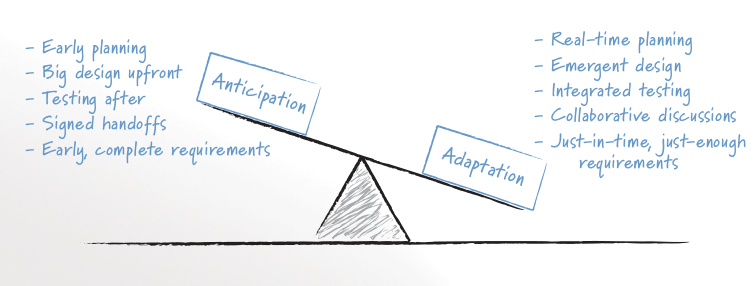

:canonical-base-url: https://dckms.github.io/system-architecture

.. index::
   single: Prediction; in balancing
   single: Adaptation; in balancing
   :name: emacsway-balancing-prediction-adaptation

===============================
Balancing Prediction/Adaptation
===============================

.. sectionauthor:: Ivan Zakrevsky

.. contents:: Содержание

..

    💬 "Scrum projects do not have an up-front analysis or design phase; all work occurs within the repeated cycle of sprints.
    This does not mean, however, that design on a Scrum project is not intentional.
    An intentional design process is one in which the design is guided through deliberate, conscious decision making.
    The difference on a Scrum project is not that intentional design is thrown out, but that it is done (like everything else on a Scrum project) incrementally.
    Scrum teams acknowledge that as nice as it might be to make all design decisions up front, doing so is impossible.
    This means that on a Scrum project, design is both intentional and emergent.

    A big part of an organization's becoming agile is finding the appropriate balance between anticipation and adaptation (Highsmith 2002).
    Figure 9.2 shows this balance along with activities and artifacts that influence the balance.
    When doing up-front analysis or design, we are attempting to anticipate users' needs.
    Because we cannot perfectly anticipate these, we will make some mistakes; some work will need to be redone.
    When we forgo analysis and design and jump immediately into coding and testing with no forethought at all, we are trying to adapt to users' needs.
    All projects of interest will be positioned somewhere between anticipation and adaptation based on their own unique characteristics; no application will be all the way to either extreme.
    A life-critical, medical safety application may be far to the anticipation side.
    A three-person startup company building a website of information on kayak racing may be far toward the side of adaptation.

    Foretelling the agile preference for simplicity, in 1990, was speaker and author Do-While Jones. 

        I'm not against planning for the future.
        Some thought should be given to future expansion of capability.
        But when the entire design process gets bogged down in an attempt to satisfy future requirements that may never materialize, then it is time to stop and see if there isn't a simpler way to solve the immediate problem.

        -- Jones' 1990 article, "The Breakfast Food Cooker," remains a classic parable of what can go wrong when software developers over-design a solution. I highly recommended reading it at http://www.ridgecrest.ca.us/~do_while/toaster.htm

    Scrum teams avoid this "bogging down" by realizing that not all future needs are worth worrying about today. Many future needs may be best handled by planning to adapt as they arise."

    -- "Succeeding with Agile: Software Development Using Scrum" by Mike Cohn

   FIGURE 9.2 Achieving a balance between anticipation and adaptation involves balancing the influence of the activities and artifacts on each side. The image source is "Succeeding with Agile: Software Development Using Scrum" by Mike Cohn

..

    💬 McConnell writes, "In ten years the pendulum has swung from 'design everything' to 'design nothing.'
    But the alternative to BDUF [Big Design Up Front] isn't no design up front, it's a Little Design Up Front (LDUF) or Enough Design Up Front (ENUF)."
    This is a strawman argument.
    The alternative to designing before implementing is designing after implementing.
    Some design up-front is necessary, but just enough to get the initial implementation.
    Further design takes place once the implementation is in place and the real constraints on the design are obvious.
    Far from "design nothing," the XP strategy is "design always."

    -- "Extreme Programming Explained" 2nd edition by Kent Beck

..

    💬 "From the very earliest days of agile methods, people have asked what role there is for architectural or design thinking.
    A common misconception is that since agile methods drop the notion of a detailed up-front design artifact, that there is no room for architecture in an agile project.
    In my keynote at the first-ever agile conference, I pointed out that design was every bit as important for agile projects, but it manifests itself differently, becoming an evolutionary approach."

    -- "`Agile Software Development <https://martinfowler.com/agile.html>`__" by Martin Fowler

..

    💬 "Though BDUF is an Agile anti-pattern, does it mean architecture should solely be a product from emergence? As James Coplien argues [Coplien 2010], some intentional architecture saves waste and accelerates the decision process.

    Agile Architecture shall seek a balance between intentional and emerging. Intentional architecture provides value if it is done differently. Intentional architecture represents a set of assumptions that must be verified. It should not slow down the integration of new requirements.

    [Coplien 2010] Lean Architecture, by James Coplien and Gertrud Bjørnvig, July 2010, published by Wiley"

    -- "Open Agile Architecture™" by The Open Group, Chapter "`9.14. Axiom 14. Bias for Change <https://pubs.opengroup.org/architecture/o-aa-standard-single/#_axiom_14_bias_for_change>`__"

..

    💬 "The incremental and iterative nature of Agile development can facilitate efficient technical and management processes and practices to reduce the cost associated with change.
    In comparison, projects managed at the waterfall end of the continuum seek to reduce total rework cost by minimizing the number of changes, limiting the number of control points, and baselining detailed specifications which are reviewed and traced throughout the project."

    -- "ISO/IEC/IEEE 12207:2017 Systems and software engineering - Software life cycle processes"

..

    💬 "Agile" methods actually can be applied within a variety of models.
    While Agile methods are common in executing an evolutionary lifecycle model, they can be used in other lifecycle models at various stages.
    What the methods have in common is an emphasis on continuous inspection and collaboration in the rapid production of working software in an environment where changes, including changes to requirements, are expected.

    -- "ISO/IEC/IEEE 12207:2017 Systems and software engineering - Software life cycle processes"

    💬 Waterfalls and iterations may nest inside each other.
    A six year project might consist of two 3 year projects, where each of the two projects are structured in a waterfall style, but the second project adds additional features.
    You can think of this as a two-iteration project at the top level with each iteration as a waterfall. Due to the large size and small number of iterations, I'd regard that as primarily a waterfall projecta
    In contrast you might see a project with 16 iterations of one month each, where each iteration is planned in a waterfall style.
    That I'd see as primarily iterative.
    While in theory there's potential for a middle ground projects that are hard to classify, in practice it's usually easy to tell that one style predominates.

    -- "`Waterfall Process <https://martinfowler.com/bliki/WaterfallProcess.html>`" by Martin Fowler

Стоимость гибкости
==================

Изменяемость тоже имеет свою стоимость. Нельзя создавать бесконечно гибкое решение. Важен баланс.

    💬 "One trade-off that's often overlooked is between the number of options you have and the resulting complexity. More options are desirable, but wanting to have all options all the time will result in unnecessary complexity, as is often the case with overly elaborate abstraction layers or massive configuration frameworks. I captured this effect into Gregor's Law:

        Excessive complexity is nature's punishment for organizations that are unable to make decisions."

    -- "`Gregor's Law. Excessive complexity is nature's punishment for organizations that are unable to make decisions <https://architectelevator.com/gregors-law/>`__" by Gregor Hohpe

..

    💬 "If you pick any one aspect of software then you can make it easy to change, but we don't know how to make everything easy to change. Making something easy to change makes the overall system a little more complex, and making everything easy to change makes the entire system very complex. Complexity is what makes software hard to change. That, and duplication."

    -- Ralf Johnson at "`Who Needs an Architect? <https://martinfowler.com/ieeeSoftware/whoNeedsArchitect.pdf>`__" by Martin Fowler

Open Agile Architecture™ Standard by The Open Group
===================================================

Глава "`4.5. Architecture Development Styles <https://pubs.opengroup.org/architecture/o-aa-standard/architecture-development.html#_architecture_development_styles>`__" стандарта посвящена поиску баланса между "`4.5.2. Intentional Architecture <https://pubs.opengroup.org/architecture/o-aa-standard/architecture-development.html#_intentional_architecture_2>`__" и "`4.5.1. Emergence Architecture <https://pubs.opengroup.org/architecture/o-aa-standard/architecture-development.html#emergence>`__".

.. index::
   single: Prediction; in evolution
   single: Adaptation; in evolution
   :name: emacsway-balancing-prediction-adaptation-pendulum-swinging

Эволюционный маятник баланса Prediction/Adaptation
==================================================

В 2021 году большую популярность обрела статья, освещавшая назревшие в индустрии вопросы относительно поиска баланса Prediction/Adaptation:

- "`Software Dark Ages <https://threedots.tech/post/software-dark-ages/>`__" by Robert Laszczak
- "`Темные века разработки программного обеспечения <https://habr.com/ru/company/cian/blog/569940/>`__" by Robert Laszczak, перевод Евгения Пешкова

Simon Brown тоже обратил внимание на тот факт, что на современном рынке маятник Prediction/Adaptation качнулся в сторону Prediction (анализ и проектирование) от Adaptation (преобладающий принцип Single-Team Agile):

    💬 "Even just a few years ago, "software architecture" was not a topic that people were interested in ... "because agile". Times are changing?"

    -- 2021-12-23, https://t.co/ipu5HpS1C4

В 2000-м Tom DeMarco и Camden, Maine писали:

    💬 "In On War, Carl von Clausewitz tells us that military history is a pendulum swinging back and forth between the relative advantages of armor and of mobility.
    The knights in shining armor were able to dominate any knight without, but they were no match for the quick, nearly naked pony warriors that swept across the plains with Genghis Kahn and his Mongols.
    Light cavalry itself was doomed as soon as there were tanks, and tanks were no match for fleet-footed Palestinian teenagers with Sagger missiles.
    With the Maginot Line, the French were gambling that the pendulum had swung again toward armor, but it hadn't, and the Germans simply went around it.

    In the field of IT, we are just emerging from a time in which armor (process) has been king.
    And now we are moving into a time when only mobility matters.
    Building a product the right way still sounds like a laudable goal, but—let's face it—what really matters today is building it fast.
    Because we are process-obsessed in our field, we have tended to react to this new imperative as we reacted to the imperatives thrust upon us in the 1980s and 1990s.
    We have asked, "What shall we add to our process to deal with this new situation?"

    -- Foreword of "Planning Extreme Programming" by Kent Beck, Martin Fowler

Занос маятника Prediction/Adaptation в сторону Adaptation
^^^^^^^^^^^^^^^^^^^^^^^^^^^^^^^^^^^^^^^^^^^^^^^^^^^^^^^^^

Можно заметить, что на рубеже 2000 года, :ref:`маятник Prediction/Adaptation максимально отклонился в сторону Adaptation <emacsway-agile-development>`, зачастую минимизируя долю Prediction до минималистичного набора практик - PBR, Spike, Planning.
Этому способствовало радикальное снижение стоимости Adaptation в те годы, благодаря росту популярности OOP, :ref:`шаблонов <emacsway-agile-patterns>` проектирования и принципов проектирования, методик управления сложностью (ROM, POSA, GOF, OOAD, :ref:`SOLID <emacsway-agile-solid>`, Use Case Driven Approach, Object-Oriented Software Construction etc.), :ref:`TDD <emacsway-tdd>`, Refactoring и т.д.

В конце 90-х -- в начале 2000-х, когда ведущим умам архитектуры своего времени удалось достигнуть :ref:`пологого графика роста стоимости изменения (адаптации) кода, максимально приближенного к горизонтальной асимтоте <emacsway-agile-development>`, что открыло широкие возможности по удешевлению разработки путем :ref:`эмпирического (т.е. опытным путем) разрешения неопределенности <emacsway-adaptation>` (т.е. итеративно).
Это означало, что стоимость реализации решения больше не зависело от момента его принятия, что позволило отказаться от заблаговременного проектирования и откладывать принятие решения до момента наибольшей полноты информированности, даже после частичной реализации продукта.

Основной фокус архитектуры сместился с

    💬 "Architecture is the decisions that you wish you could get right early in a project, but that you are not necessarily more likely to get them right than any other." -- Ralph Johnson

на

    💬 "A good architect pretends that the decision has not been made, and shapes the system such that those decisions can still be deferred or changed for as long as possible. 

    A good architect maximizes the number of decisions not made."

    -- "Clean Architecture: A Craftsman's Guide to Software Structure and Design" by Robert C. Martin

..

    💬️ "Ah, interesting!
    Both architecture and agile methods thrive under high levels of uncertainty!
    And isn't that exactly the environment we mostly face today with rapid changes in technology and short-lived business models?
    So, agile and architecture are addressing the same problem from different angles: **architecture gives you the options to sustain velocity when the unexpected happens**.
    And agile gives you the attitude to always be learning and to quickly adapt to changing circumstances."

    -- "`Agile and Architecture: Friend, not Foe <https://architectelevator.com/transformation/agile_architecture/>`__" by Gregor Hohpe

..

    💬️ "Grady Booch has also provided a set of guidelines for an agile architecture (which in turn imply some duties for the agile architect).
    Booch claims that all good software-intensive architectures are agile.
    What does he mean by this? He means that a successful architecture is resilient and loosely coupled.
    It is composed of a core set of well-reasoned design decisions but still contains some \"wiggle room\" that allows modifications to be made and refactorings to be done, without ruining the original structure.

    Booch also notes that an effective agile process will allow the architecture to grow incrementally as the system is developed and matures.
    The key to success is to have decomposability, separation of concerns, and near-independence of the parts.
    (Sound familiar? These are all modifiability tactics.)

    Finally, Booch notes that to be agile, the architecture should be visible and self-evident in the code; this means making the design patterns, cross-cutting concerns, and other important decisions obvious, well communicated, and defended.
    This may, in turn, require documentation.
    But whatever architectural decisions are made, the architect must make an effort to \"socialize\" the architecture."

    -- "Software Architecture in Practice" 3d edition by Len Bass, Paul Clements, Rick Kazman

Маятник отклонился от Prediction к Adaptation с большим заносом.
Хотя в то время уже были модели разработки того, что мы сегодня называем моделями масштабируемого Agile (RUP, MSF, RAD, FDD, Crystal Clear etc.), но они не занимали значительной части рынка.

Так же, как во времена роста популярности OOP, "Switch-Case Statement" считался Code Smell, дабы стимулировать продвижение OOP в массы (об этом признается M.Fowler во втором издании книги Refactoring), в начале 2000-х значение заблаговременного анализа и проектирования (Prediction) нередко принебрегалось, дабы подчеркнуть превосходство эмпирического способа разрешения неопределенности (Adaptation) и стимулировать продвижение этой идеи в массы.

    💬️ "We decided to call it a manifesto since it was a call to arms and a statement of our beliefs."

    -- "`Writing The Agile Manifesto <https://martinfowler.com/articles/agileStory.html>`__" by Martin Fowler

..

    💬️ "The Agile movement is not anti-methodology, in fact, many of us want to restore credibility to the word methodology.
    We want to restore a balance. We embrace modeling, but not in order to file some diagram in a dusty corporate repository.
    We embrace documentation, but not hundreds of pages of never-maintained and rarely-used tomes.
    We plan, but recognize the limits of planning in a turbulent environment.
    Those who would brand proponents of XP or SCRUM or any of the other Agile Methodologies as \"hackers\" are ignorant of both the methodologies and the original definition of the term hacker."

    -- "`History: The Agile Manifesto <http://agilemanifesto.org/history.html>`__"

Отскок маятника Prediction/Adaptation назад к Prediction
^^^^^^^^^^^^^^^^^^^^^^^^^^^^^^^^^^^^^^^^^^^^^^^^^^^^^^^^

Однако, в статье мы наблюдаем, что маятник пошел в обратном направлении:

    💬 "пять дней кодинга может сэкономить день планирования

    With 5 days of coding, you can save 1 day of planning"

    -- "`Software Dark Ages <https://threedots.tech/post/software-dark-ages/>`__" by Robert Laszczak, перевод Евгения Пешкова

При этом, в статье очень вяло и вскользь говорится о снижении стоимости Adaptation:

    💬 "Если вам нужно реализовать что-то "на будущее", потому что позже будет сложнее добавить это, – это очень плохой знак.
    Вам следует подумать о том, как упростить позднее добавление.

    If you need to implement something "for the future" because it will be harder to add it later – that's a very bad sign.
    You should think about how to make it easy to add it later."

    -- "`Software Dark Ages <https://threedots.tech/post/software-dark-ages/>`__" by Robert Laszczak, перевод Евгения Пешкова

Что это? Бунт против Agile? Против заветов Eric Evans?

Причин здесь две.

1. Проекты стали сложнее, а команды стали больше, нежели они были 20 лет назад.
   Cредний проект стал слишком большим для Single-Team Agile, а стоимость Adaptation нарастает со значительным опережением роста численности коллектива.

   Это вынуждает :ref:`сместить баланс Prediction/Adaptation назад, в сторону Prediction <emacsway-harlan-mills'-proposal>`.
   Интерес к Prediction-методам обработки неопределенности начал возвращаться.
   На первое место вышли вопросы достижения автономности команд и интеграции производимых ими системных инкрементов.
   Архитектура стала обретать социальное значение.

   И здесь мы наблюдаем воскрешение старых принципов, которые были хорошо известны в RUP, MSF, RAD, FDD, Crystal Clear etc.
   На базе старых моделей масштабируемой итеративной разработки появились новые (SAFe, DAD, LESS etc.).
   Дело в том, что в старые времена Scaled Agile хоть и был не таким частым явлением, как сегодня, да и не назывался вовсе Agile, но он все-таки существовал в немногочисленных крупных корпорациях, т.к. они уже тогда столкнулись с теми проблемами, которые обрели массовость примерно к 2010 году.
   Например, многие идеи популярной книги "Team Topologies", которые сегодня создают "вау-эффект", были описаны, еще в RAD.

   Обратите внимание на тот факт, что это совпало хронологически со взрывным ростом интереса к микросервисной архитектурой и DDD, поскольку они также отвечали на главный вызов своего времени - стремительной рост размера среднего проекта и среднего коллектива.

2. Начали появляться новые, более легковесные и экономичные методики анализа и проектирования (Event Storming/Modeling, Domain Storytelling, Impact Mapping, Example Mapping, Design Thinking etc.).
   Prediction стал дешевле, что позволило увеличить его долю, оставаясь в прежних пределах его экономической целесообразности.

Изменился контекст разработки, и сегодня в индустрии принципы Single-Team Agile зачастую стали не ускорять, а замедлять разработку.
Это качнуло маятник назад, в сторону Prediction.

Многие старые идеи Scaled Agile реинкарнировали в современные итеративные модели разработки, такие как DAD и SAFe.

Начали появляться способы интеграции :ref:`Program Management <emacsway-program-management>` (т.е. организации процессов Prediction) в даже самые легковесные Scaled Agile Frameworks, такие как Nexus by Ken Schwaber.

А в основе лежит все та же идея ":ref:`Метода Хирурга <emacsway-harlan-mills'-proposal>`" Харлана Миллза, который младше Закона Конвея всего на три года.

Разные реализации разных SDLC-моделей отличаются прежде всего различным горизонтом видения Prediction и его долей в балансе Prediction/Adaptation, например, в SAFe доля Prediction больше, чем в Nexus, а в RUP - еще больше. Важно уметь грамотно выбирать модель под потребности конкретного проекта.
Grady Booch даже назвал :ref:`качество управления моделью жизненного цикла разработки критическим условием успешности проекта <emacsway-sdlc-literature>`.
А поскольку модель SDLC призвана решать проблему управления неопределенностью требований, то `выбор модели становится архитектурной задачей <https://itabok.iasaglobal.org/itabok3_0/architecture-methodologies-and-frameworks/>`__.

Здесь Prediction сфокусирован, главным образом, на разрешении неопределенности в problem-space (т.е. требований), что влияет на выбор SDLC-модели.
За разрешение неопределенности в solution-space на уровне Implementation и Software Design отвечает принцип :ref:`YAGNI <emacsway-yagni>`, целью которого является само снижение стоимости Adaptation.

О том, как интегрировать активности по анализу и проектированию в Agile-модель разработки, см. также в разделе :ref:`emacsway-program-management`.

Новый исторический контекст выдвинул новые проблемы и новые способы их решения.
Agile модель разработки изменилась.

    💬 "Despite discussions over whether the Manifesto itself should be amended, many of the original signers see the document as a historical—not a living—document.
    \"It's like a Declaration of Independence in U.S. history,\" says Cockburn.
    \"You don't go back and rewrite that.\""

    -- "`The Winter Getaway That Turned the Software World Upside Down <https://www.theatlantic.com/technology/archive/2017/12/agile-manifesto-a-history/547715/>`__" by Caroline Mimbs Nyce

В своем докладе "`Kent Beck talks beyond Agile Programming @ Startup Lessons Learned Conference 2010 <https://youtu.be/d4qldY0g_dI?t=16m57s>`__" Kent Beck говорит, что по прошествии 10 лет принципа  "Individuals and interactions over processes and tools" of "Agile Manifesto" уже недостаточно, и он добавил бы к нему еще и "Team vision and discipline".

Ценность "Individuals and interactions over processes and tools" of "Agile Manifesto" нередко воспринимается в отрасли как противопоставление проектным практикам и всей Prediction-активности.

    💬 "I see some teams that use the word \"agile\" when they really mean \"chaotic\""

    -- "`Some Agile History <https://pragdave.me/blog/2007/02/24/some-agile-history.html>`__" by Dave Thomas

На самом деле, у этого пункта были конкретные причины, и они не ставили цели "исключить" Prediction-активности из процессов разработки.

    💬 "For example, I think that ultimately, Extreme Programming has mushroomed in use and interest, not because of pair-programming or refactoring, but because, taken as a whole, the practices define a developer community freed from the baggage of Dilbertesque corporations.
    Kent Beck tells the story of an early job in which he estimated a programming effort of six weeks for two people.
    After his manager reassigned the other programmer at the beginning of the project, he completed the project in twelve weeks—and felt terrible about himself!
    The boss—of course—harangued Kent about how slow he was throughout the second six weeks.
    **Kent, somewhat despondent because he was such a \"failure\" as a programmer, finally realized that his original estimate of 6 weeks was extremely accurate—for 2 people—and that his \"failure\" was really the manager's failure, indeed, the failure of the standard \"fixed\" process mindset that so frequently plagues our industry.**

    **This type of situation goes on every day—marketing, or management, or external customers, internal customers, and, yes, even developers — don't want to make hard trade-off decisions, so they impose irrational demands through the imposition of corporate power structures.**
    This isn't merely a software development problem, it runs throughout Dilbertesque organizations.

    **In order to succeed in the new economy, to move aggressively into the era of e-business, e-commerce, and the web, companies have to rid themselves of their Dilbert manifestations of make-work and arcane policies.**
    This freedom from the inanities of corporate life attracts proponents of Agile Methodologies, and scares the begeebers (you can't use the word 'shit' in a professional paper) out of traditionalists.
    Quite frankly, the Agile approaches scare corporate bureaucrats — at least those that are happy pushing process for process' sake versus trying to do the best for the \"customer\" and deliver something timely and tangible and \"as promised\" — because they run out of places to hide.

    **The Agile movement is not anti-methodology, in fact, many of us want to restore credibility to the word methodology.**
    **We want to restore a balance.**
    **We embrace modeling, but not in order to file some diagram in a dusty corporate repository.**
    **We embrace documentation, but not hundreds of pages of never-maintained and rarely-used tomes.**
    **We plan, but recognize the limits of planning in a turbulent environment.**
    Those who would brand proponents of XP or SCRUM or any of the other Agile Methodologies as \"hackers\" are ignorant of both the methodologies and the original definition of the term hacker."

    -- "`History: The Agile Manifesto <http://agilemanifesto.org/history.html>`__"

Alberto Brandolini about Prediction/Adaptation
==============================================

.. sectionauthor:: Андрей Ганичев

Андрей Ганичев, contributor of "`Full Modular Monolith application with Domain-Driven Design approach <https://github.com/kgrzybek/modular-monolith-with-ddd>`__", на тему поиска баланса Prediction/Adaptation:

Когда читал книгу Брандолини про "`Introducing EventStorming: An act of Deliberate Collective Learning <https://leanpub.com/introducing_eventstorming>`__" by Alberto Brandolini (та которая недописанная), обратил внимание что и он вскользь проходит по этой теме.

Глава Pretending to solve the problem writing software, раздел Embrace Change:

    💬 "...iterative development is expensive. It is the best approach for developing software in very complex, and lean-demanding domains. However, the initial starting point matters, a lot. A big refactoring will cost a lot more than iterative fine tuning (think splitting a database, vs renaming a variable). So I'll do everything possible to start iterating from the most reasonable starting point."

    -- "`Introducing EventStorming: An act of Deliberate Collective Learning <https://leanpub.com/introducing_eventstorming>`__" by Alberto Brandolini

..

    💬 "Upfront is a terrible word in the agile jargon. It recalls memories the old times analysis phase in the worst corporate waterfall. Given this infamous legacy, the word has been banned from agile environments like blasphemy. But unfortunately ...there's always something upfront. Even the worst developer thinks before typing the firs line of code."

    -- "`Introducing EventStorming: An act of Deliberate Collective Learning <https://leanpub.com/introducing_eventstorming>`__" by Alberto Brandolini

Cм. также:

- "Essential Scrum: A Practical Guide to the Most Popular Agile Process" by Kenneth Rubin

  - "Chapter 3 Agile Principles :: Prediction and Adaptation"
  - "Chapter 3 Agile Principles :: Balance Predictive Up-Front Work with Adaptive Just-in-Time Work"

- "Succeeding with Agile: Software Development Using Scrum" by Mike Cohn, "Chapter 9 Technical Practices :: Design: intentional yet Emergent"

- "`Software Architecture Guide <https://martinfowler.com/architecture/>`__" by Martin Fowler
- "`Agile Software Guide <https://martinfowler.com/agile.html>`__" by Martin Fowler
- "`The New Methodology :: Predictive versus Adaptive <https://www.martinfowler.com/articles/newMethodology.html#PredictiveVersusAdaptive>`__" by Martin Fowler
- "`Waterfall Process <https://martinfowler.com/bliki/WaterfallProcess.html>`" by Martin Fowler

.. seealso::
   - ":ref:`emacsway-adaptation`"
   - ":ref:`emacsway-prediction`"
   - ":ref:`emacsway-yagni`"
   - ":ref:`emacsway-borrowing-trouble`"
