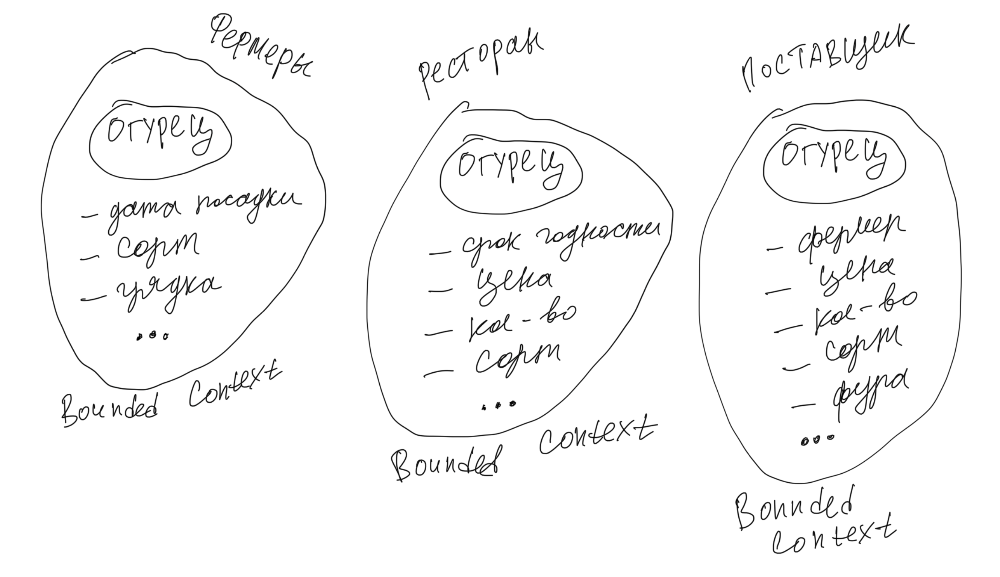
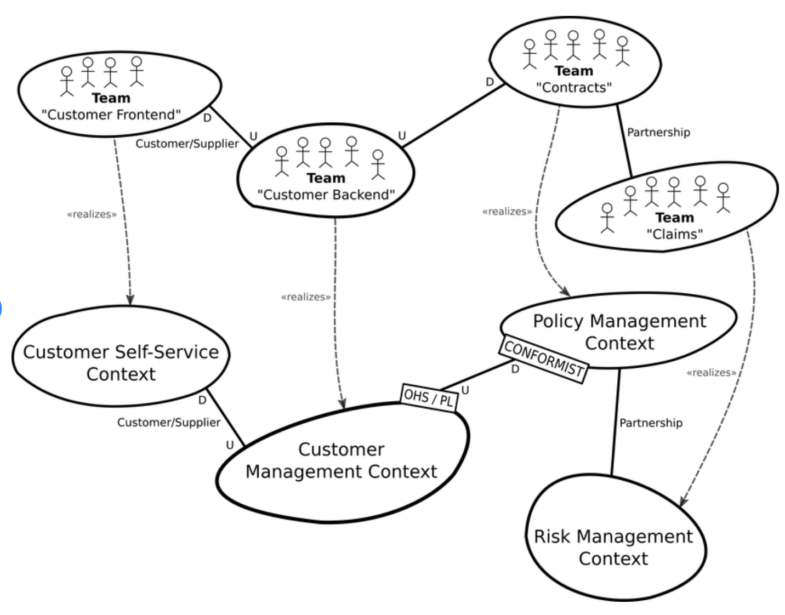

:canonical-base-url: https://dckms.github.io/system-architecture

.. index:: Domain Model
   :name: stanislav3316-domain-model-definition

=======================
Domain Model Definition
=======================

.. sectionauthor:: Stanislav Bolsun

Как показывает моя практика, понимание таких фундаментальных основ как доменная модель, границы доменной модели и ограниченный
контекст, могут кардинальным образом влиять на эффективность команды разработки (скорость разработки).

.. contents:: Содержание

Доменная модель
===============

Начнем с основной задачи модели - решение задач с помощью упрощения реального объекта моделирования.
Доменная модель является упрощенной интерпретацией реальности.

Каждая модель имеет свой контекст применимости, без контекста применимости мы не сможем создать модель,
так как не знаем какую проблему решаем (то есть какие свойства и поведение нужны для конкретной проблемы).

Из этого следует, что ограниченный контекст является границей применимости модели.

На изображении выше, мы видим реализацию упрощенной модели процессов Земли для решения конкретных задач.

На это и делают акцент Эванс, Вернон и Зимарев в определениях модели:

    📝 "every model represents some aspect of reality or an idea that is of interest.
    A model is a simplification. It is an interpretation of reality that abstracts the aspects relevant to solving
    the problem at hand and ignores extraneous detail..."

    -- "Domain-Driven Design: Tackling Complexity in the Heart of Software" by Eric Evans

..

    📝 "So, models represent some artifact of the real world, but with a narrow purpose.
    How much space the building will occupy and how high the whole complex will be, for example,
    are often just enough for a rough model, during the first review stage of the building project.
    Models do not intend to replicate real life. Instead, they represent some particular aspects of real life at a certain level of detail,
    depending on the purpose of the model...

    Going back to Chapter 1, Why Domain-Driven Design?, if the business domain and the particular problems we have to
    solve are in our problem space, the domain model is purely in our solution space.
    We will be modeling our solution, and those models will be our domain models."

    -- "Hands-On Domain-Driven Design with .NET Core: Tackling complexity in the heart of software by putting DDD principles into practice" by Alexey Zimarev

..

    📝 "What’s a Domain Model?
    It’s a software model of the very specific business domain you are working in. Often it’s implemented as an object model,
    where those objects have both data and behavior with literal and accurate business meaning.
    Creating a unique, carefully crafted domain model at the heart of a core, strategic application or subsystem is essential to
    practicing DDD. With DDD your domain models will tend to be smallish, very focused.
    Using DDD, you never try to model the whole business enterprise with a single, large domain model. Phew, that’s good!""

    -- "Implementing Domain-Driven Design" by Vaughn Vernon

Важное уточнение: Модель - это абстракция, которая формирует реализацию, но не является реализацией,
хотя реализация и может осуществлять (реализовать) эту модель. Модель - это solution space (см следующую цитату).

    📝 "A domain model is not a particular diagram; it is the idea that the diagram is intended to convey.
    It is not just the knowledge in a domain expert's head;
    it is a rigorously organized and selective abstraction of that knowledge.
    A diagram can represent and communicate a model, as can carefully written code, as can an English sentence...

    The model and the heart of the design shape each other. It is the intimate link between the model and the implementation that
    makes the model relevant and ensures that the analysis that went into it applies to the final product, a running program.
    This binding of model and implementation also helps during maintenance and continuing development, because the code can be interpreted
    based on understanding the model. (See Chapter 3.)"

    -- "Domain-Driven Design: Tackling Complexity in the Heart of Software" by Eric Evans

А что если система будет реализовывать одну единственную модель предметной области?
-----------------------------------------------------------------------------------

Если контекста применимости нет или он неизвестен (это то, что нужно решить), то у нас есть два возможных пути:

1. модель не создавать вообще

2. создать модель на все случаи жизни, но тогда придется полностью воспроизвести объект моделирования,
   что не позволит эффективно решать задачи (например, осуществление навигации судна по точной копии Земли).

    📝 "Because the term domain model includes the word domain, we might get the idea that we should create a single,
    cohesive, all-inclusive model of an organization’s entire business domain—you know, like an enterprise model. However,
    when using DDD, that is not our goal. DDD places emphasis on just the opposite. The whole Domain of the organization is composed of Subdomains.
    Using DDD, models are developed in Bounded Contexts. In fact, developing a Domain Model is actually one way that we focus on only one specific area of the whole business domain.
    Any attempt to define the business of even a moderately complex organization in a single, all-encompassing model will be at best extremely difficult and will usually fail.
    As is made clear in this chapter, vigorously separating distinct areas of the whole business domain will help us succeed.

    So, if a domain model shouldn’t be all-inclusive of what the organization does and how it does it, what should it be, exactly?

    Almost every software Domain has multiple Subdomains. It really doesn’t matter whether the organization is huge and extremely complex or consists of just a few people and the software they use.
    There are different functions that make any business successful, so it’s advantageous to think about each of those business functions separately."

    -- "Implementing Domain-Driven Design" by Vaughn Vernon

В качестве иллюстрации того, что модель создается для решения конкретных задач (работает в строго определенном контексте) с помощью упрощения объектов реально мира,
рассмотрим примеры из доклада Эрика Эванса (Eric Evans — Tackling Complexity in the Heart of Software,
Domain-Driven Design Europe 2016 - Brussels, January 26-29, 2016).

1. Карта морского ориентирования (цилиндрическая проекция Меркатора)

.. figure:: _media/mercator_projection.png
   :alt: Mercator projection
   :align: center
   :width: 100%

Такие карты используют относительное искажение размеров объектов относительно друг друга, но помогают направлять компас
в сторону нужной конечной точки (направление на карте полностью совпадет со стрелкой компаса). На этой карте Африка и
Гренландия выглядят равными по площади, но в действительности, Африка в 14 раз больше Гренландии, то есть у карты есть
четкое предназначение, задача для которой она нужна, и только для нее - навигация судов.

2. Картографическая проекция земного шара на поверхность многогранника (проекция Димаксион (Фуллера))

.. figure:: _media/fuller_projection.png
   :alt: Fuller projection
   :align: center
   :width: 100%

Данная проекция имеет меньшие искажения относительных размеров объектов, особенно в сравнении с проекцией Меркатора,
то есть, она может служить более точным инструментом определения относительных размеров объектов земли.

.. seealso:: `Vaughn Vernon объясняет, почему построение канонической всеобъемлющей модели предприятия и единой предметной области на основе единой модели деятельности - миф <https://www.infoq.com/articles/modeling-uncertainty-reactive-ddd/>`_

Важное уточнение: модель по Тарасенко
-------------------------------------

    📝 "Мы уже сформулировали два определения модели. Первое: модель есть средство осуществления любой деятельности субъекта. Второе: модель есть форма существования знаний.
    Можно несколько дополнить каждое из этих определений указанием на то, что модель — тоже система, со всеми описанными в главе 2 общесистемными свойствами.
    Отличительная особенность моделей от других систем состоит (в дополнение к тому, что говорят два определения) в их предназначенности отображать моделируемый оригинал, заменять его в определенном отношении,
    т.е. содержать и представлять информацию об оригинале. Выразим эту мысль в виде еще одного общего определения: модель есть системное отображение оригинала.
    Все три определения носят очень общий, можно сказать, философский характер. Для дальнейшего нам понадобится конкретизация типов моделей и их характерных свойств.
    Как мы уже знаем, уточнение описания модели можно сделать с помощью анализа и синтеза."

    -- "Прикладной системный анализ" by Felix Tarasenko

.. figure:: _media/tarasenko_model.png
   :alt: Tarasenko model
   :align: center
   :width: 100%

и следует:
    📝 "Продолжая рассмотрение отношений между моделью и оригиналом, остановимся на содержании информации в модели. Оригинал и модель — разные вещи.
    В оригинале есть много такого, чего нет в модели, по двум причинам: во-первых, не все из того, что известно об оригинале, понадобится включить в модель, предназначенную для достижения конкретной цели (зона А на рис. 3.13 изображает известное, но ненужное, в том числе ошибочно сочтенное ненужным и невключенное в модель);
    во-вторых, в оригинале есть всегда нечто непознанное, поэтому не могущее быть включенным в модель (зона В на рис. 3.13).

    Зона 2 на рисунке изображает информацию об оригинале, включенную в модель. Это истинная информация, то общее, что имеется у модели и оригинала, благодаря чему модель может служить его (частным, специальным) заменителем, представителем.
    Обратим внимание на зону 3. Она отображает тот факт, что у модели всегда есть собственные свойства, не имеющие никакого отношения к оригиналу, т.е. ложное содержание.
    Важно подчеркнуть, что это относится к любой модели, как бы ни старался создатель модели включать в нее только истину."

    -- "Прикладной системный анализ" by Felix Tarasenko

Доменная модель, ограниченный контекст и единый язык
----------------------------------------------------

Ограниченный контекст - это рассмотрение объекта моделирования с определенной точки зрения, с определенного ракурса, решаемой проблемы (см. пример с огурцом далее).
Основным назначением ограниченного контекста является поиск баланса между простой модели и ее достаточностью для решения проблемы.

Количество слов используемых человеком в лексиконе ограничено, это около 3000 слов (в зависимости от языка), а количство явлений окружающего мира - безгранично.
Это и есть та самая причина того, что если один термин обозначает несколько явлений окружающего мира, либо наоборот, одно явление мы
называем различными терминами, - это обозначает лингвистический конфликт.

И при поиске ограниченных контекстов мы можем ориентироваться на эти лингвистические конфликты в процессе коммуникации (эти конфликты
и является основными маркерами контекстов).

    📝 "The Language of a team in an explicit Bounded Context expressed as a domain model adds true business value
    and gives us certainty that we are implementing the correct software."

    -- "Implementing Domain-Driven Design" by Vaughn Vernon

Если внутри своего ограниченно контекста мы встречаем языковой конфликт, то это может являться симптомом того, что мы решаем сразу несколько задач
одновременно. То есть, если мы называем одно явление разными терминами, то скорее всего это явление используется в разных контекстах,
и наш контекст служит нескольким целям. Это сигнал о том, что наша модель переусложнена и при решении одной задачи мы вынуждены работать с теми деталями модели,
которые нерелевантны для нас в нашем контексте проблемы. Это все отбирает ресурс внимания у команды и может удорожать процесс разработки для бизнеса.

Поэтому, внутри каждого ограниченного контекста существует строгий единый (согласованный) язык. Единый (согласованный) язык не просто словарь внутри компании,
это подразумевает, в первую очередь, согласованный язык внутри границ применимости модели. Мы в рамках модели ограничены ограниченным контекстом,
где каждый термин обозначает строго одно явление.

    📝 "The model is a set of concepts built up in the heads of people on the project, with terms and relationships that reflect domain insight.
    These terms and interrelationships provide the semantics of a language that is tailored to the domain while being precise enough for technical development.
    This is a crucial cord that weaves the model into development activity and binds it with the code."

    -- "Domain-Driven Design: Tackling Complexity in the Heart of Software" by Eric Evans

В качестве примера можно привести модель обыкновенного огурца, где термин "огурец" в каждом ограниченном контексте имеет строгое и однозначное толкование: плод, ингредиент, груз ...

Про профессиональные языки от Тарасенко:
    📝 "Главная для нас особенность — то, что язык является универсальным средством моделирования: говорить можно о чем угодно. Из многих свойств языка, обеспечивающих ему это свойство, обратим
    внимание на расплывчатость смысла слов.

    Приведем пример словесной модели некоторой ситуации. «В комнату вошел высокий красивый молодой человек, неся тяжелый сверток». Так и видится реальная картина. Но «высокий» — какого именно роста? «Молодой» — а сколько ему лет?
    Не говоря уж о том, что такое «красивый». «Тяжелый» — какого веса? Практически ни одно слово естественного языка не имеет точного смысла. Можно привести аналогию: «смысл» конкретной ситуации — точка, «смысл» слова — облако.
    Описывая конкретную ситуацию, мы как бы обволакиваем точку облаками, понимая, что истина гдето в середине этого скопления. В большинстве случаев, особенно в быту, такого приблизительного, расплывчатого описания бывает достаточно для действий, часто успешных.
    В некоторых видах деятельности такая расплывчатость сознательно используется как важный позитивный фактор: поэзия, юмор, политика, дипломатия, мошенничество…

    Однако в случаях, когда необходимо произвести конкретный продукт, достичь конкретного результата, этой конкретности начинает мешать расплывчатость бытового языка. И тогда те, кто занимается
    конкретной деятельностью, изживают мешающую неопределенность, вводя в язык более точные термины. У всякой группы с ее общими целями вырабатывается свой, специфический язык, обеспечивающий нужной точностью эту деятельность.
    У скотоводческого африканского племени масаев есть сотни терминов для характеристики коров; у северных народов — множество терминов, определяющих состояние снега;
    на своих языках разговаривают физики, медики, юристы; уголовники «ботают по фене»; молодежь говорит на слэнге, не понятном для взрослых; лондонские «низы» разговаривают на «кокни».
    Общий вывод: всякая групповая деятельность требует выработки специального, более точного, чем разговорный, языка; условно назовем его профессиональным.

    Профессиональные языки более точны, чем разговорный, за счет большей определенности их терминов. Важно осознать, что снятие неопределенности может быть осуществлено только за счет новой, дополнительной информации.

    Таким образом, увеличение точности смысла языковых моделей идет за счет добывания и включения в язык все новой и новой информации о предмете интереса.

    Есть ли предел этому процессу уточнения? Есть, и это язык математики, в котором термины максимально точны, однозначны. Правда, полностью изжить неопределенность невозможно, иначе было бы невозможно о бесконечности мира говорить конечными фразами.
    Есть несколько (и не только вспомогательных, но и базовых) понятий в математике, имеющих расплывчатый смысл: «приблизительно равно», «значительно больше (меньше)», «бесконечно мало (велико)», «неопределенно» и т.д.
    И все же математический язык является крайним, самым точным справа в спектре языков описания реальности (рис. 3.7)."

    -- "Прикладной системный анализ" by Felix Tarasenko

.. seealso::

    - ":ref:`stanislav3316-language-context`"

Ограниченный контекст и команды разработки
------------------------------------------

Для того чтобы реализовать модель, команда должна ее понимать, соответственно, набольшей эффективностью команда будет обладать тогда,
когда граница ответственности команды совпадает с границей модели. Это и можно назвать границей автономности рабочей команды, что позволяет команде
фокусироваться на решении конкретной задачи. В ограниченном контексте команды модель обладает наибольшей
внутренней связанностью (cohesion) и наименьшим сопряжением (coupling) с другими частями системы.

В таком случае решается проблема Брукса, а именно, достижение автономности команды, - рост коммуникационных связей внутри команды и уменьшение коммуникационных связей между командами.

.. seealso::

    - ":ref:`emacsway-team-topologies-at-scale`"

Если же модель поделить неправильно, допустим, разрезать полноценную модель на две разные части, то резко возрастет количество коммуникационных путей между командами,
и этим мы ухудшаем параллелизм задач. Аналогично, если свалим в один ограниченный контекст две модели которые служат двум разным целям,
то мы увеличим когнитивную нагрузку команды.

Таким образом, единственный способ достигнуть наибольшего уровня параллелизма команд, обеспечить их автономность и независимость друг от друга - это правильно найти и поделить ограниченные контексты.

Классическая ошибка моделирования ограниченного контекста
---------------------------------------------------------

Классическая ошибка при моделировании Bounded Context (BC) заключается в том, что при неправильном понимании модели возникает желание "запихнуть" модель объекта моделирования в какой-то один BC.
Существует два самых неправильных вопроса - в какой BC поместить сущность и как мне получить из другого BC нужную сущность.

Моделирование BC - это не кройка. Плод, груз, ингредиент, блюдо - это все модели одного и того же объекта моделирования - огурца, только в разных BC.
Можно рассмотреть BC как одну из плоскостей додека‌эдра (когда один и тот же элемент виден под разными углами с разных плоскостей додека‌эдра),
а не как о фрагменте пазла (когда один элемент может принадлежать только одному фрагменту полотна).
Задача не в том, в какой BC "запихнуть", и не в том, как разрезать, а в том, какие именно аспекты поведения объекта моделирования релевантны в контексте решаемой проблемы текущего BC.
Посетитель, пользователь, клиент, покупатель, плательщик, получатель, адресат - это все тоже модели одного и того же объекта моделирования.

.. figure:: _media/bc_perspective.png
   :alt: Different pespectives are matter
   :align: center
   :width: 100%

Владик отлично выводит противоречие, как опытный диалектик:

    📝 "However, it is more difficult to represent such a divergent model of the business domain in software. Source code doesn’t cope well with ambiguity. If we were to bring the sales department’s complicated model into marketing,
    it would introduce complexity where it’s not needed— far more detail and behavior than marketing people need for optimizing advertising campaigns. But if we were to try to simplify the sales model according to the marketing world view,
    it wouldn’t fit the sales subdomain’s needs, because it’s too simplistic for managing and optimizing the sales process.
    We’d have an overengineered solution in the first case and an under-engineered one in the second."

Источники информации
------------------------------------------------------------------

1. Ivan Zakrevskii
2. Группа тг-канала объединения ИТ-архитекторов (@ru_arc)
3. DDDevotion chat (tg https://t.me/iDDDqd)
4. Группа тг-канала (@emacsway_log) о Software Design/Architecture, DDD, Microservice Architecture, Distributed Systems, SDLC, Agile, Team Topology etc.
5. интерпретация собственного опыта
