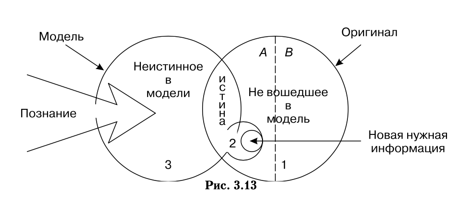
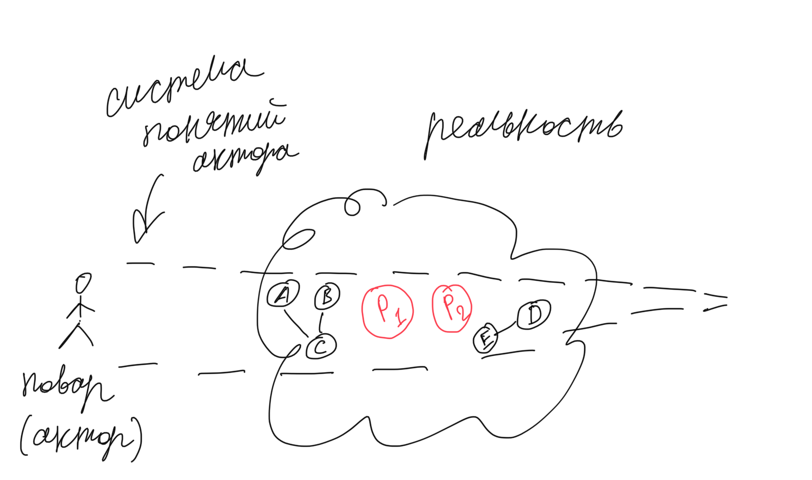
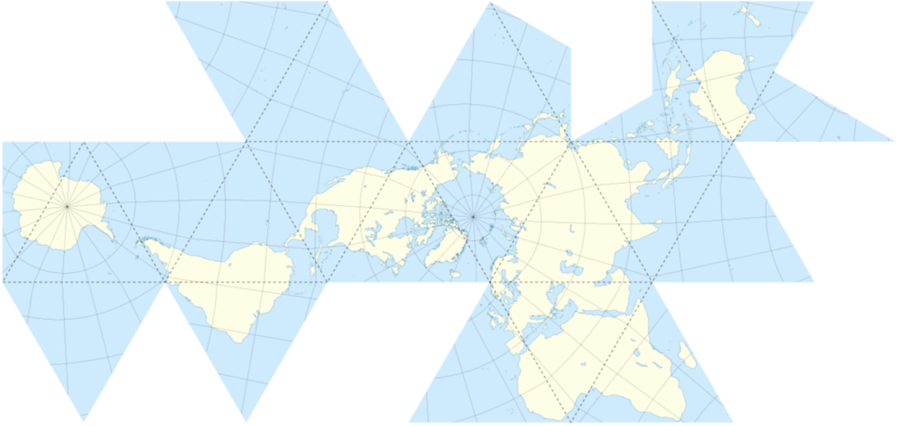
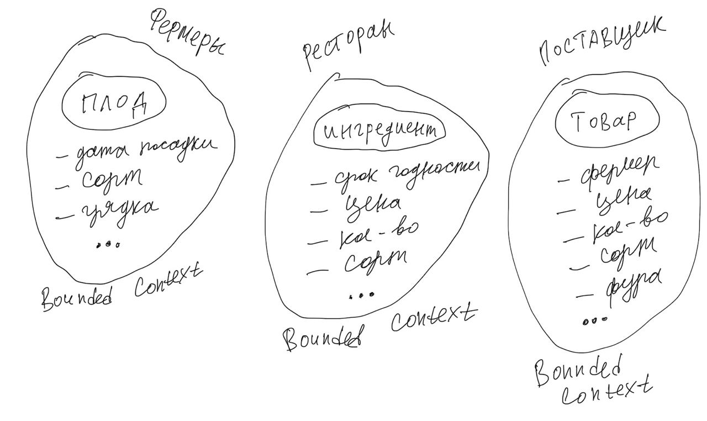
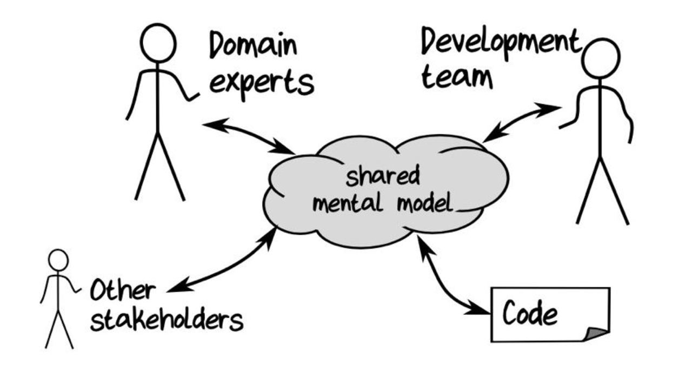
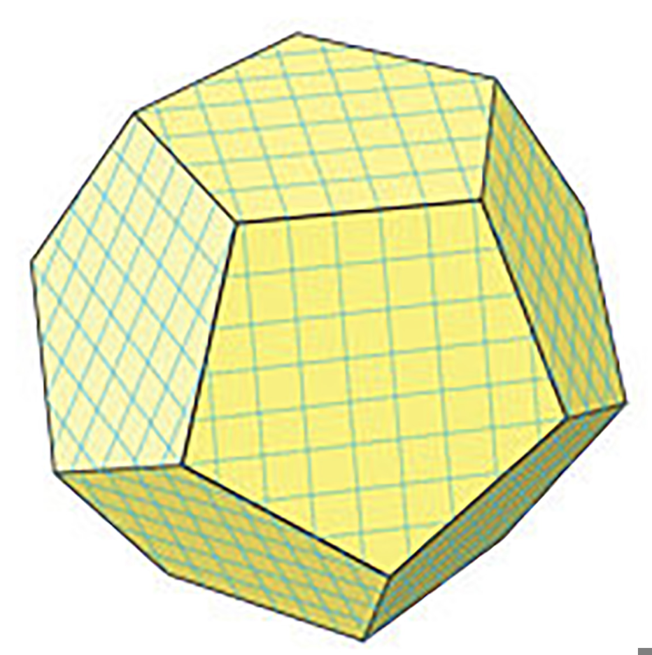

:canonical-base-url: https://dckms.github.io/system-architecture

.. index:: Domain Model
   :name: stanislav3316-domain-model-definition

=======================
Domain Model Definition
=======================

.. sectionauthor:: Stanislav Bolsun

Как показывает моя практика, понимание таких фундаментальных основ как доменная модель, границы доменной модели (ограниченный контекст), могут заметно повысить эффективность (скорость) команд разработки.

.. contents:: Содержание

Доменная модель
===============

Прежде чем перейти к тому, что такое доменная модель нам желательно разобраться еще с несколькими понятиями, которые я описываю далее.

Что такое модель
----------------

Рассмотрим понятие модели из различных источников, начиная с модели по Эвансу:

    💬 "every model represents some aspect of reality or an idea that is of interest.
    A model is a simplification.
    It is an interpretation of reality that abstracts the aspects relevant to solving the problem at hand and ignores extraneous detail..."

    -- "Domain-Driven Design: Tackling Complexity in the Heart of Software" by Eric Evans

..

    💬 "Модель - это упрощение; это такая интерпретация реальности, при которой из явления извлекаются существенные для решения задачи аспекты, а лишние детали игнорируются."

    -- "Domain-Driven Design: Tackling Complexity in the Heart of Software" by Eric Evans, перевод В.Л. Бродового

..

    💬 "So, models represent some artifact of the real world, but with a narrow purpose.
    How much space the building will occupy and how high the whole complex will be, for example,
    are often just enough for a rough model, during the first review stage of the building project.
    Models do not intend to replicate real life. Instead, they represent some particular aspects of real life at a certain level of detail,
    depending on the purpose of the model..."

    -- "Hands-On Domain-Driven Design with .NET Core: Tackling complexity in the heart of software by putting DDD principles into practice" by Alexey Zimarev

..

    💬 Model (glossary)

    (1) A physical, mathematical, or otherwise logical representation of a system, entity, phenomenon, or process. (DoD 1998)

    (2) A representation of one or more concepts that may be realized in the physical world. (Friedenthal, Moore, Steiner 2009)

    (3) A simplified representation of a system at some particular point in time or space intended to promote understanding of the real system. (Bellinger 2004)

    (4) An abstraction of a system, aimed at understanding, communicating, explaining, or designing aspects of interest of that system (Dori 2002)

    (5) A selective representation of some system whose form and content are chosen based on a specific set of concerns. The model is related to the system by an explicit or implicit mapping. (Object Management Group 2010)

    -- "SEBoK Model (glossary)" https://sebokwiki.org/wiki/Model_(glossary)

Из определений следует, что каждая модель имеет свой контекст применимости, без контекста применимости мы не можем создать модель, так как не знаем какую проблему необходимо решить (то есть какие свойства и поведение нужно выразить в модели).
Контекст применимости модели выражается ограниченным контектом (DDD), который и является границей модели.

.. figure:: _media/model_perspectives.jpeg
   :alt: The model's perspective matters
   :align: center
   :width: 85%

   The model's perspective matters

   -- `Источник <https://ru.pinterest.com/pin/298222806578985943/>`__

[Дополнение] Модель по Тарасенко
---------------------------------

    💬 "Мы уже сформулировали два определения модели. Первое: модель есть средство осуществления любой деятельности субъекта. Второе: модель есть форма существования знаний.
    Можно несколько дополнить каждое из этих определений указанием на то, что модель — тоже система, со всеми описанными в главе 2 общесистемными свойствами.
    Отличительная особенность моделей от других систем состоит (в дополнение к тому, что говорят два определения) в их предназначенности отображать моделируемый оригинал, заменять его в определенном отношении, т.е. содержать и представлять информацию об оригинале.
    Выразим эту мысль в виде еще одного общего определения: модель есть системное отображение оригинала.
    Все три определения носят очень общий, можно сказать, философский характер. Для дальнейшего нам понадобится конкретизация типов моделей и их характерных свойств.
    Как мы уже знаем, уточнение описания модели можно сделать с помощью анализа и синтеза."

    -- "Прикладной системный анализ" Ф.П. Тарасенко

   'Прикладной системный анализ' Ф.П. Тарасенко, глава '3.8. Синтетический подход к понятию модели'

и следует за этим:

    💬 "Продолжая рассмотрение отношений между моделью и оригиналом, остановимся на содержании информации в модели. Оригинал и модель — разные вещи.
    В оригинале есть много такого, чего нет в модели, по двум причинам: во-первых, не все из того, что известно об оригинале, понадобится включить в модель, предназначенную для достижения конкретной цели (зона А на рис. 3.13 изображает известное, но ненужное, в том числе ошибочно сочтенное ненужным и невключенное в модель);
    во-вторых, в оригинале есть всегда нечто непознанное, поэтому не могущее быть включенным в модель (зона В на рис. 3.13).

    Зона 2 на рисунке изображает информацию об оригинале, включенную в модель. Это истинная информация, то общее, что имеется у модели и оригинала, благодаря чему модель может служить его (частным, специальным) заменителем, представителем.
    Обратим внимание на зону 3. Она отображает тот факт, что у модели всегда есть собственные свойства, не имеющие никакого отношения к оригиналу, т.е. ложное содержание.
    Важно подчеркнуть, что это относится к любой модели, как бы ни старался создатель модели включать в нее только истину."

    -- "Прикладной системный анализ" Ф.П. Тарасенко

Концепнуальная (ментальная) модель предметной области
-----------------------------------------------------

В каждый конкретный момент времени человек смотрит на мир через призму определенной системы понятий, и прежде чем начать формулировать какую-либо проблему, нам придется принять какую-то модель.
Для этого нам нужно прийти к единому набору понятий, терминов для описания текущей реальности (ведь в зависимости от разных точек зрения акторов (viewpoint) реальность может описываться разными системами понятий, система глазами повара будет состоять из одних элементов, и эта же система глазами бухгалтера будет состоять из других).

Для выражения этой мысли приведу пример из чата по дискуссии о текущей статье, где Михаила Андронов четко описал этот момент:

    💬 "Пока ты призму не принял, у тебя терминов нет, чтобы проблему выразить.
    Другое дело, что люди в большинстве своём не осознают что всегда через призму какой-то модели смотрят на мир.
    Считают, что то, что видят - это и есть реальность.
    Например, чтобы сказать, что в комнате грязно (такая у нас проблема), у тебя должны быть понятия "комната" и "мусор".
    То есть ты уже смотришь на комнату как помещение с полезными и бесполезными предметами (такая модель).
    А представь, что ты при этом разговариваешь с кем-то, для кого эта комната - это место, где он был молод, счастлив и где его дети выросли.
    Он на неё смотрит как на копилку счастливых воспоминаний.
    В его модели невозможно выразить проблему "в комнате грязно".
    И так будет до тех пор, пока он свою модель не сменит на твою."

    -- "Domain Model tg group (обсуждение статьи, https://t.me/emacsway_log/1194)" - Михаил Андронов

Чтобы задать систему понятий и терминов, можно использовать разные подходы, такие как задание определенного viewpoint актора (бухгалтер, повар, аналитик, ...), либо же применение Big Picture воркшопа из Event Storming для построения общей ментальной модели (через выравнивание доменных знаний участников).

    💬 "Big Picture workshop tried hard not to focus but to embrace the whole complexity and maximize learning.
    Now the starting point is different: we can assume we have a shared better understanding of the underlying domain here the focus is on implementing software features that are solving a specific problem.

    .. the big picture was a model of our current level of understanding, by digging deeper into key interaction we are already making it obsolete.

    .. Gather all the key people in the same room and build together a model of the current understanding of the system"

    -- "Introducing EventStorming" by Alberto Brandolini

   На этом изображении пример того, как текущая реальность может рассматриваться под системой понятий актора-повара - этим мы задаем терминологию и смыслы (концептуальную модель) для описания реальности и найденных проблем.
   A, B, C, D, E - существующие элементы реальности в перспективе актора-повара и связи между ними, P1 и P2 - найденные проблемы, которые будут описаны в терминах текущей системы понятий.

..

    💬 "Conceptual Model - A conceptual model is a representation of a system, made of the composition of concepts that are used to help people know, understand, or simulate a subject the model represents."

    -- "Modular Monolith with DDD, Chapter 2.2 Conceptual Model" by Kamil Grzybek

..

    💬 "Знание замещает в нашем мышлении объект или его составные части. Изучая какую-то реальную вещь или системное образование мы чаще всего не можем работать непосредственно с ними. Что в устной речи, что в мышлении мы оперируем назывными конструкциями, каждая из которых относится к какому-то объективному содержанию.

    Например, говоря «стол» любому представителю современной культуры мы надеемся, что он нас поймёт не двусмысленно. Но куда указывает обозначающее слово «стол», на какой объект в каждой из ситуаций? Вероятно большинство сойдётся на том, что речь идёт о конструкции, главная функция которой — удерживать вещи с помощью горизонтальной поверхности. Но при этом читатель легко может представить себе стол, стоящий на четёрых ногах, в то время как говорящий мог представлять стол с центральной и единственной ножкой. Очевидно, что такое различие составленных представлений в ряде ситуаций может привести к конфузу.

    В нашем примере при отсутствии конкретного стола в непосредственном созерцании может возникнуть коммуникационная катастрофа — потеря содержания. Чтобы этого не произошло оба участника коммуникации должны обладать общим знанием о том какими столы бывают вообще, а также потрудиться выполнить мысленно этот перебор, когда обнаружены противоречия, чтобы выявить различие объектов у участника обсуждения."

    -- "Замещение объектов знанием" (Знания - системы понятий и утверждений), https://ashapiro.ru/articles/system-episteme

Отражение концептуальной (ментальной) модели также можно обнаружить, например, в спецификации ArchiMate: "Layers – the three levels at which an enterprise can be modeled in ArchiMate – Business, Application, and Technology".

.. seealso::

    - `Types of Models <https://sebokwiki.org/wiki/Types_of_Models/>`_

    - `Concept (glossary) <https://sebokwiki.org/wiki/Concept_(glossary)/>`_

    - `Conceptual_Model <https://sebokwiki.org/wiki/System_Modeling_Concepts#Conceptual_Model/>`_

Дополнение: Концептуальная (ментальная) модель является часть Problem Space.

Теперь, когда мы поняли текущую реальность с помощью концептуальной (ментальной) модели, мы в состонии найти и описать проблему в терминах модели, и начать искать решение и способы интеграции его в уже новую (будущую) реальность (с обеспечением целостности решения).

Доменная модель
---------------

На следующем этапе нам нужно найти решение для найденной и описанной проблемы (из Problem Space) в виде доменной модели (в Solution Space), базируясь на концептуальной (ментальной) модели.

    💬 "When you are just getting started in your software modeling efforts, your Bounded Context is
    somewhat conceptual. You could think of it as part of your problem space. However, as your model
    starts to take on deeper meaning and clarity, your Bounded Context will quickly transition to your
    solution space , with your software model being reflected as project source code. (The problem
    space and solution space are better explained in the box.) Remember that a Bounded Context is
    where a model is implemented, and you will have separate software artifacts for each Bounded
    Context."

    -- "Domain-Driven Design Distilled" by Vaughn Vernon

Начнем также с определения доменной модели из различных источников:

    💬 "Going back to Chapter 1, Why Domain-Driven Design?, if the business domain and the particular problems we have to
    solve are in our problem space, the domain model is purely in our solution space.
    We will be modeling our solution, and those models will be our domain models."

    -- "Hands-On Domain-Driven Design with .NET Core: Tackling complexity in the heart of software by putting DDD principles into practice" by Alexey Zimarev

..

    💬 "What’s a Domain Model?
    It’s a software model of the very specific business domain you are working in. Often it’s implemented as an object model,
    where those objects have both data and behavior with literal and accurate business meaning.
    Creating a unique, carefully crafted domain model at the heart of a core, strategic application or subsystem is essential to
    practicing DDD. With DDD your domain models will tend to be smallish, very focused.
    Using DDD, you never try to model the whole business enterprise with a single, large domain model. Phew, that’s good!"

    -- "Implementing Domain-Driven Design" by Vaughn Vernon

Модель является абстракцией, которая формирует реализацию, но не является реализацией, хотя реализация и может осуществлять (реализовывать) эту модель.

    💬 "A domain model is not a particular diagram; it is the idea that the diagram is intended to convey.
    It is not just the knowledge in a domain expert's head;
    it is a rigorously organized and selective abstraction of that knowledge.
    A diagram can represent and communicate a model, as can carefully written code, as can an English sentence...

    The model and the heart of the design shape each other.
    It is the intimate link between the model and the implementation that makes the model relevant and ensures that the analysis that went into it applies to the final product, a running program.
    This binding of model and implementation also helps during maintenance and continuing development, because the code can be interpreted based on understanding the model. (See Chapter 3.)"

    -- "Domain-Driven Design: Tackling Complexity in the Heart of Software" by Eric Evans

Доменная модель существует в определеном контексте решаемой проблемы (в ограниченном контексте), и служит для описания решения и интеграции его с другими ограниченными контекстами (другими элементами системы).
Доменная и концептуальная модели образуют единое целое (в DDD), ведь первая получается путем "доуточнения и дорисовки" деталей из второй, обе модели используют единую и согласованную терминологию и систему понятий.

    💬 "A Domain Model in Software Engineering can be thought of as a conceptual model of a system which describes the various entities involved in that system and their relations."

    -- "A Brief Introduction to Domain Modeling" article by Oleg Chursin (https://olegchursin.medium.com/a-brief-introduction-to-domain-modeling-862a30b38353)

.. figure:: _media/domain_model_uml.jpg
   :alt: Domain model UML example
   :align: center
   :width: 100%

   Domain model UML example.
   Доменная модель выводится из концептуальной модели путем "дорисовывания" деталей и связей, формирующих решение для новой реальности.

   -- `Источник <https://olegchursin.medium.com/a-brief-introduction-to-domain-modeling-862a30b38353>`__

.. figure:: _media/ddd_model_and_reality.png
   :alt: Integrating solution into new reality
   :align: center
   :width: 100%

   Integrating solution into new reality

А что если попытаться реализовать единственную всеобъемливающую модель предметной области?
------------------------------------------------------------------------------------------

Если решаемой проблемы не существует или она неизвестена, то и модель под решение у нас построить не получится, но если попробовать создать модель на все случаи жизни, то тогда придется полностью воспроизвести объект моделирования, что не позволит эффективно решать задачи (например, осуществление навигации судна по точной копии планеты Земля).

    💬 "Because the term domain model includes the word domain, we might get the idea that we should create a single, cohesive, all-inclusive model of an organization’s entire business domain—you know, like an enterprise model.
    However, when using DDD, that is not our goal. DDD places emphasis on just the opposite. The whole Domain of the organization is composed of Subdomains.
    Using DDD, models are developed in Bounded Contexts. In fact, developing a Domain Model is actually one way that we focus on only one specific area of the whole business domain.
    Any attempt to define the business of even a moderately complex organization in a single, all-encompassing model will be at best extremely difficult and will usually fail.
    As is made clear in this chapter, vigorously separating distinct areas of the whole business domain will help us succeed.

    So, if a domain model shouldn’t be all-inclusive of what the organization does and how it does it, what should it be, exactly?

    Almost every software Domain has multiple Subdomains. It really doesn’t matter whether the organization is huge and extremely complex or consists of just a few people and the software they use.
    There are different functions that make any business successful, so it’s advantageous to think about each of those business functions separately."

    -- "Implementing Domain-Driven Design" by Vaughn Vernon

В качестве иллюстрации того, что модель создается для решения конкретных задач (имеет определенный контекст применимости), рассмотрим примеры из доклада Эрика Эванса (Eric Evans — Tackling Complexity in the Heart of Software, Domain-Driven Design Europe 2016 - Brussels, January 26-29, 2016).

1. Карта морского ориентирования (цилиндрическая проекция Меркатора)

   Mercator projection

   -- `Источник <https://www.youtube.com/watch?v=dnUFEg68ESM&ab_channel=Domain-DrivenDesignEurope>`__

Такие карты используют относительное искажение размеров объектов относительно друг друга, но помогают направлять компас в сторону нужной конечной точки (направление на карте полностью совпадет со стрелкой компаса).
На этой карте Африка и Гренландия выглядят равными по площади, но в действительности, Африка в 14 раз больше Гренландии, то есть у карты есть четкое предназначение, задача для которой она нужна, и только для нее - навигация судов.

2. Картографическая проекция земного шара на поверхность многогранника (проекция Димаксион (Фуллера))

   Fuller projection

   -- `Источник <https://ru.m.wikipedia.org/wiki/%D0%A4%D0%B0%D0%B9%D0%BB:Fuller_projection_rotated.svg>`__

Данная проекция имеет меньшие искажения относительных размеров объектов, особенно в сравнении с проекцией Меркатора, то есть, она может служить более точным инструментом определения относительных размеров объектов земли.

.. seealso::

    💬 "We're making an effort with DDD to recognize that there is no practical way to have a canonical, enterprise data model where every single element in the model is representative of how every team in the enterprise would want to use it.
    It just doesn't happen. There's always some difference, and many times there are many differences that make it very painful for one team to try to use the model that another team has created.
    That's why we're focused on the bounded context with a ubiquitous language."

   `Vaughn Vernon объясняет, почему построение канонической всеобъемлющей модели предприятия и единой предметной области на основе единой модели деятельности - миф <https://www.infoq.com/articles/modeling-uncertainty-reactive-ddd/>`_

Концептуальная, Доменная модели, ограниченный контекст и единый язык
-------------------------------------------------------------------

Ограниченный контекст - это рассмотрение объекта моделирования с определенной точки зрения, с определенного ракурса решаемой проблемы (см. пример с огурцом далее).
Основным назначением ограниченного контекста является поиск баланса между простой модели и ее достаточностью для решения проблемы (и концептуальной, и доменной модели).

    💬 "When you are just getting started in your software modeling efforts, your Bounded Context is
    somewhat conceptual. You could think of it as part of your problem space. However, as your model
    starts to take on deeper meaning and clarity, your Bounded Context will quickly transition to your
    solution space, with your software model being reflected as project source code. (The problem
    space and solution space are better explained in the box.) Remember that a Bounded Context is
    where a model is implemented, and you will have separate software artifacts for each Bounded
    Context."

    -- "Domain-Driven Design Distilled" by Vaughn Vernon

Количество слов используемых человеком в лексиконе ограничено, это около 6000 слов (в зависимости от языка), а количство явлений окружающего мира - безгранично.
Это и есть та самая причина того, что если один термин обозначает несколько явлений окружающего мира, либо наоборот, одно явление мы называем различными терминами, - это обозначает лингвистический конфликт.

.. seealso:: `Википедия: Словарный запас <https://ru.m.wikipedia.org/wiki/%D0%A1%D0%BB%D0%BE%D0%B2%D0%B0%D1%80%D0%BD%D1%8B%D0%B9_%D0%B7%D0%B0%D0%BF%D0%B0%D1%81/>`_

И при поиске ограниченных контекстов мы можем ориентироваться на эти лингвистические конфликты в процессе коммуникации (эти конфликты и являются первыми маркерами/границами ограниченнных контекстов).

    💬 "The Language of a team in an explicit Bounded Context expressed as a domain model adds true business value
    and gives us certainty that we are implementing the correct software."

    -- "Implementing Domain-Driven Design" by Vaughn Vernon

Если внутри своего ограниченно контекста мы встречаем языковой конфликт, то это может являться симптомом того, что мы решаем сразу несколько задач одновременно.
То есть, если мы называем одно явление разными терминами, то скорее всего это явление используется в разных контекстах, и наш контекст служит нескольким целям.
Это сигнал о том, что наша модель переусложнена и при решении одной задачи мы вынуждены работать с теми деталями модели, которые нерелевантны для нас в момент рассмотрения. Это все отбирает ресурс внимания у команды и может удорожать процесс разработки для бизнеса.

Поэтому, внутри каждого ограниченного контекста существует строгий единый (согласованный) язык (система понятий).
Единый (согласованный) язык не просто словарь внутри компании, это подразумевает, в первую очередь, согласованный язык внутри границ применимости модели.
Мы, в рамках модели, ограничены ограниченным контекстом, где каждый термин обозначает строго одно явление.

    💬 "The model is a set of concepts built up in the heads of people on the project, with terms and relationships that reflect domain insight.
    These terms and interrelationships provide the semantics of a language that is tailored to the domain while being precise enough for technical development.
    This is a crucial cord that weaves the model into development activity and binds it with the code."

    -- "Domain-Driven Design: Tackling Complexity in the Heart of Software" by Eric Evans

В качестве примера можно привести модель обыкновенного огурца, где термин "огурец" в каждом ограниченном контексте имеет строгое и однозначное толкование (но разное): плод, ингредиент, груз ...

   Сucumber in diffent Bounded Contexts

Единый (согласованный) язык охватывает и концептуальную (ментальную) модель, и доменную модель, являясь языком выражения этих моделей.
Отличительной чертой DDD является то, что в нем концептуальная (ментальная) модель и доменная модель - совпадают и выполняют одну и ту же функцию (именно поэтому всегда в литературе говорится явно только о доменной модели).

   (What DDD is).
   What if the domain experts, the development team, other stakeholders, and (most importantly) the source code itself all share the same model?
   In this case, there is no translation from the domain expert's requirements to the code.
   Rather, the code is designed to reflect the shared mental model directly. And that is the goal of domain-driven design.

.. seealso::

    - ":ref:`stanislav3316-system-complexity`"

[Дополнение] Про профессиональные языки от Тарасенко:

    💬 "Главная для нас особенность — то, что язык является универсальным средством моделирования: говорить можно о чем угодно. Из многих свойств языка, обеспечивающих ему это свойство, обратим внимание на расплывчатость смысла слов.

    Приведем пример словесной модели некоторой ситуации. «В комнату вошел высокий красивый молодой человек, неся тяжелый сверток». Так и видится реальная картина. Но «высокий» — какого именно роста? «Молодой» — а сколько ему лет?
    Не говоря уж о том, что такое «красивый». «Тяжелый» — какого веса? Практически ни одно слово естественного языка не имеет точного смысла. Можно привести аналогию: «смысл» конкретной ситуации — точка, «смысл» слова — облако.
    Описывая конкретную ситуацию, мы как бы обволакиваем точку облаками, понимая, что истина гдето в середине этого скопления. В большинстве случаев, особенно в быту, такого приблизительного, расплывчатого описания бывает достаточно для действий, часто успешных.
    В некоторых видах деятельности такая расплывчатость сознательно используется как важный позитивный фактор: поэзия, юмор, политика, дипломатия, мошенничество…

    Однако в случаях, когда необходимо произвести конкретный продукт, достичь конкретного результата, этой конкретности начинает мешать расплывчатость бытового языка.
    И тогда те, кто занимается конкретной деятельностью, изживают мешающую неопределенность, вводя в язык более точные термины.
    У всякой группы с ее общими целями вырабатывается свой, специфический язык, обеспечивающий нужной точностью эту деятельность.
    У скотоводческого африканского племени масаев есть сотни терминов для характеристики коров; у северных народов — множество терминов, определяющих состояние снега;
    на своих языках разговаривают физики, медики, юристы; уголовники «ботают по фене»; молодежь говорит на слэнге, не понятном для взрослых; лондонские «низы» разговаривают на «кокни».
    Общий вывод: всякая групповая деятельность требует выработки специального, более точного, чем разговорный, языка; условно назовем его профессиональным.

    Профессиональные языки более точны, чем разговорный, за счет большей определенности их терминов. Важно осознать, что снятие неопределенности может быть осуществлено только за счет новой, дополнительной информации.

    Таким образом, увеличение точности смысла языковых моделей идет за счет добывания и включения в язык все новой и новой информации о предмете интереса.

    Есть ли предел этому процессу уточнения? Есть, и это язык математики, в котором термины максимально точны, однозначны. Правда, полностью изжить неопределенность невозможно, иначе было бы невозможно о бесконечности мира говорить конечными фразами.
    Есть несколько (и не только вспомогательных, но и базовых) понятий в математике, имеющих расплывчатый смысл: «приблизительно равно», «значительно больше (меньше)», «бесконечно мало (велико)», «неопределенно» и т.д.
    И все же математический язык является крайним, самым точным справа в спектре языков описания реальности (рис. 3.7)."

    -- "Прикладной системный анализ" Ф.П. Тарасенко

.. seealso::

    - ":ref:`stanislav3316-language-context`"

Ограниченный контекст и команды разработки
------------------------------------------

Для того чтобы реализовать модель, команда должна ее понимать, соответственно, набольшей эффективностью команда будет обладать тогда, когда граница ответственности команды совпадает с границей модели.
Это и можно назвать границей автономности рабочей команды, что позволяет команде фокусироваться на решении конкретной задачи.
В ограниченном контексте команды модель обладает наибольшей внутренней связанностью (cohesion) и наименьшим сопряжением (coupling) с другими ограниченными контекстами.

В таком случае решается проблема Брукса, а именно, достижение автономности команды, - рост коммуникационных связей внутри команды и уменьшение коммуникационных связей между командами.

.. seealso::

    - ":ref:`emacsway-team-topologies-at-scale`"

Если же модель поделить неправильно, допустим, разрезать полноценную модель на две разные части, то резко возрастет количество коммуникационных путей между командами (для сохранения и поддержки инвариантов модели), и этим мы ухудшаем параллелизм задач.
Аналогично, если свалим в один ограниченный контекст две модели которые служат двум разным целям, то мы увеличим когнитивную нагрузку команды (путем введения информации нерелеватной в момент рассмотрения, тем самым отнимая когнитивные ресурсы у человека).
И чтобы достичь наибольшего уровня автономности команд, обеспечить их независимость друг от друга нужно правильно определить ограниченные контексты.

Таким образом, можно прийти к выводу, что ограниченный контекст помогает решить две проблемы:

1. Снижение когнитивной нагрузки на команду (путем исключения из рассмотрения нерелевантных деталей)

2. Снижение коммуникативной нагрузки между командами (путем концентрации релевантных деталей)

Классическая ошибка моделирования ограниченного контекста
---------------------------------------------------------

Классическая ошибка при моделировании ограниченного контекста заключается в том, что при неправильном понимании модели возникает желание "запихнуть" модель объекта моделирования в какой-то один ограниченный контекст.
Существует два самых неправильных вопроса - в какой ограниченный контекст поместить сущность и как мне получить из другого ограниченного контекста нужную сущность.

Моделирование ограниченного контекста - это не кройка. Плод, груз, ингредиент, блюдо - это все модели одного и того же объекта моделирования - огурца, только в разных ограниченных контекстах.
Можно рассмотреть ограниченный контекст как одну из плоскостей додека‌эдра (когда один и тот же элемент виден под разными ракурсами), а не как фрагмент пазла (когда один элемент может принадлежать только одному фрагменту полотна).

Задача не в том, в какой ограниченный контекст "запихнуть", и не в том, как разрезать, а в том, какие именно аспекты поведения объекта моделирования релевантны в контексте решаемой проблемы.
Посетитель, пользователь, клиент, покупатель, плательщик, получатель, адресат - это все тоже модели одного и того же объекта моделирования.

   Different pespectives are matter

   -- `Источник <https://mnogogranniki.ru/dodekaedr.html>`__

Владик отлично подчеркивает это в своем примере:

    💬 "However, it is more difficult to represent such a divergent model of the business domain in software. Source code doesn’t cope well with ambiguity. If we were to bring the sales department’s complicated model into marketing,
    it would introduce complexity where it’s not needed— far more detail and behavior than marketing people need for optimizing advertising campaigns. But if we were to try to simplify the sales model according to the marketing world view,
    it wouldn’t fit the sales subdomain’s needs, because it’s too simplistic for managing and optimizing the sales process.
    We’d have an overengineered solution in the first case and an under-engineered one in the second."

Краткие выводы:
---------------

1. чтобы описать проблему, нужно сначала принять какую-то модель, систему понятий (концептуальная (ментальная) модель)
2. далее, мы можем приступать к поиску решения в виде доменой модели и способах интеграции решения в новую реальность
3. ограниченный контекст модели - это области применения модели в контексте решаемой проблемы ("заказ" для бухгалтера и "заказ" для повара имеют совершенно разные контексты и соотвествтенно это разные модели для разных задач)
4. в DDD концептуальная (ментальная) и доменная модель - сходятся, и выражаются через единый согласованный язык

Источники информации
--------------------

1. Ivan Zakrevskii
2. Mikhail Andronov
3. Группа тг-канала объединения ИТ-архитекторов (@ru_arc)
4. DDDevotion chat (tg https://t.me/iDDDqd)
5. Группа тг-канала (@emacsway_log) о Software Design/Architecture, DDD, Microservice Architecture, Distributed Systems, SDLC, Agile, Team Topology etc.
6. рефлексия собственного опыта
